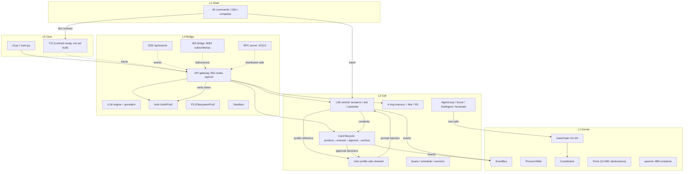

# Praxis Architecture — Layer Reference

Five-layer Agent Operating System. Each layer document covers responsibility
boundaries, module inventory, core mechanisms, and contract surfaces.

> **Numbers below are generated** — run `python scripts/gen-doc-stats.py`
> to refresh; never hand-edit them.

## System overview



## Layer documents

| Layer | Document | Responsibility |
|-------|----------|----------------|
| L5 | [l5-user.md](l5-user.md) | CLI entry, user-facing contract, TUI surface |
| L4 | [l4-bridge.md](l4-bridge.md) | API gateway (263 routes), LLM engine, WS/SSE/RPC channels, sandbox, auth, fs |
| L3 | [l3-card-lifecycle.md](l3-card-lifecycle.md) | Card end-to-end: produce → execute → approve → archive |
| L3 | [l3-memory.md](l3-memory.md) | 4-ring memory + side-channels (Mer / R5 / User Profile) + injection |
| L3 | [l3a-central.md](l3a-central.md) | L3A decision layer: the central office (sessions, ask, cardwrite, profile) |
| L3 | [l3-tools.md](l3-tools.md) | 19 tool implementations + tool system (spec/registry/policy/pipeline) |
| L3 | [l3-cell-os.md](l3-cell-os.md) | Cell SoC components (ICache/MMU/PMU/Watchdog/…), boot, lifecycle |
| L3 | [l3-scheduler.md](l3-scheduler.md) | 5D scheduler (route/pool/time/rate/scope) + safety layers |
| L3 | [l3-convention.md](l3-convention.md) | cross-cell deliberation (orchestrator/answers/aggregate/report) |
| L2 | [l2-shell.md](l2-shell.md) | 46-command shell, i18n, completer, agent selector |
| L1 | [l1-kernel.md](l1-kernel.md) | Process table, sync, event bus, constitution, GateChain, ports, params |
| — | [cross-cutting.md](cross-cutting.md) | Governance, events, injection switches, testing/QA, skills, collaboration |

## Numbers snapshot

| Metric | Value |
|--------|-------|
| L1 Kernel | 46 files / 12,390 lines |
| L2 Shell | 18 files / 2,636 lines |
| L3 Cell | 225 files / 50,272 lines |
| L4 Bridge | 69 files / 13,989 lines |
| L5 User | 2 files / 489 lines |
| L3A (peers) | 15 files / 4,015 lines |
| L3 Memory | 20 files / 5,299 lines |
| L3 Card | 21 files / 5,505 lines |
| L3 Services | 34 files / 8,924 lines |
| L3 Bus | 15 files / 3,583 lines |
| L3 Agent | 24 files / 4,618 lines |
| L4 Handlers | 17 files / 3,544 lines |
| API routes | 263 (`/api/v2/*` versioned) |
| Params modules / constants | 9 / 889 |

## Reading path

1. **New to Praxis**: [l1-kernel.md](l1-kernel.md) → [l3-card-lifecycle.md](l3-card-lifecycle.md) → [l3a-central.md](l3a-central.md)
2. **Frontend / contract work**: [l4-bridge.md](l4-bridge.md) → [l5-user.md](l5-user.md) → [cross-cutting.md](cross-cutting.md)
3. **Memory / agents**: [l3-memory.md](l3-memory.md) → [l3-scheduler.md](l3-scheduler.md) → [l3-tools.md](l3-tools.md)
4. **Governance / QA / skills**: [cross-cutting.md](cross-cutting.md)

## Main data flows

```
INTENT: user will → L3A session (profile reference) → cardwrite → card
CARD:   produce → execute (plan/agents/tools via GateChain) → approve → complete → R4 archive
EVENT:  source → EventBus (async) → SSE /api/events + WS :8081 → frontends
SESSION:send → inbox → loop → history (cursor-paged) → close → archive → resume_from_archive
```

## Design principles

| Principle | What it means in practice |
|-----------|--------------------------|
| **Will cannot violate the constitution** | Constitution is the highest authority; every tool call passes GateChain G1–G5 before execution |
| **Bypass side-channels** | Mer/R5/profile never mutate the main flow; on error they degrade to no-ops — originals stay intact |
| **Language-agnostic contract** | Frontends (TUI/desktop/TS) talk to the kernel only over `/api/v2/*` + WS/SSE — the kernel may sink or multi-language without rewriting the UI |
| **Port abstractions, duck-typed** | `get_port(name)` resolves adapters at runtime; swapping the kernel changes adapters only |
| **User-configurable injection** | Every system-prompt block is gated by `prompt.inject.<domain>`; settings failure falls back to enabled (safety never stripped silently) |
| **Versioned API, validated manifest** | `/api/v2/*` only; `api_endpoints.validate()` rejects naming violations; bumps are atomic |
| **Discipline is executable** | worktree checks, layer-import tests, params-compliance, commit hooks — rules become machine checks, not advice |
| **Anti-blowup by construction** | cursor paging, token caps, bounded queues, display windowing — no unbounded accumulation anywhere |

## Archived

The pre-rewrite architecture documents (overview / reference / SOC /
deep-dive, 15 files) are archived at `memories/archives/architecture-v1/`
(out of git; history remains via `git log -- docs/architecture/`).
