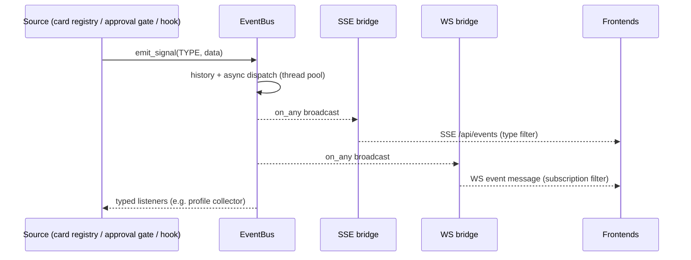

# Cross-Cutting Concerns

Topics that span layers: governance, events, system-prompt injection,
session contract, port abstractions, and collaboration discipline.

## Governance (will cannot violate the constitution)

```
User will ──> L3A (central) ──card──> GateChain G1–G5 ──> tools
                  │                         ▲
                  └── constitution rules ───┘  (highest authority)
```

- **Constitution** (L1): rule engine over `.praxis-rules.md`; injected
  into every agent loop as a summary (gated `prompt.inject.constitution`).
- **GateChain** (L1): per-tool authorization — whitelist, identity
  (process table), territory/risk, escalation, composite judgment.
- **Approval flow** (L3): ApprovalGate + PendingQueue with event push
  (CARD_PENDING / APPROVAL_REQUIRED / APPROVAL_RESPONDED) — the same
  events drive the user profile decision-style collector.

## Event flow (one bus, many listeners)

```
emit_signal / emit_event → EventBus (async thread pool)
   ├─ history (bounded deque)
   ├─ typed listeners (on / on_event)
   ├─ wildcard listeners (on_any) → SSE bridge → /api/events
   └─ wildcard → WS bridge → subscribed clients (event-type filter)
```



Cards: `EVENT_TASK_ASSIGN` / `TASK_DONE`; approval: `APPROVAL_*`;
monitor/stats events on the time bus (`stats.*`); hook events
(`agent.turn_complete` / `loop_error` / `session_end`) from
`EventEmitHook`.

## System-prompt injection (user-configurable)

Each injectable block is gated by `prompt.inject.<domain>` (SettingsCenter
key, runtime toggle via `/api/v2/settings`, defaults true). On any settings
failure `l1.kernel.settings.inject_enabled()` falls back to enabled —
safety context is never silently stripped.

| Domain | Block | Gated in |
|--------|-------|----------|
| `profile` | `[User Profile Reference]` + card `_profile_summary` | `l3a/helpers.py` |
| `constitution` | constitution summary | `agent/agent_loop.py` |
| `skills` | evolved skills + lean failure cases | `agent/agent_loop.py` |
| `verification` | verification culture | `agent/agent_loop.py` |
| `memory` | task-aware memory context | `agent/_term_handlers.py` |

## Session contract (anti-blowup design)

- **Cursor paging**: `messages(cursor, limit)` — UI renders a window, pages
  backward; `API_PAGE_MAX_LIMIT` caps page size.
- **Kernel-side caps**: `SESSION_HISTORY_MAX_TOKENS=32000` compression,
  `MANAGED_OUTPUT_MAX_BYTES=50000` output spill, per-user profile caps.
- **Frontend-side** (future TUI): bounded event queue + frame throttling,
  display windowing — never unbounded accumulation.

## Port abstractions (language-agnostic kernel)

```python
register_port(name, adapter) / get_port(name)   # duck-typed
```

Adapters: `auth` (AuthService), `fs` (FsAdapter), `profile`
(UserProfileService), `rpc` (RpcServer); LLM/i18n/worker/channel/event-bus/
card-registry/monitor-bus/transport. The kernel never imports upper layers —
swapping the Python kernel for another language only changes adapters.

## Testing & QA

- **3383 tests** under `tests/` organized by layer (`tests/l1/` … `tests/l5/`,
  `tests/infra/`, `tests/integration/`).
- **Singleton hygiene**: `tests/conftest.py` `_RESETS` resets ~33 known
  singletons before every test (autouse) — new services register their
  reset there; xdist workers get isolated skill dirs.
- **Runner batches**: `tests/runner.py` — Batch 1 (fast core), Batch 2
  (slow: r4_agent, archive, convention).
- **xdist discipline**: CI (Linux, fork) runs `-n 4`; local Windows pins
  `-n 0` (spawn re-imports the whole src per worker — a net slowdown).
- **Hard gates**: `test_layer_imports.py` (layer boundary allowlist),
  `test_params_compliance.py` (no hardcoded truncation/hash/constants),
  `test_hardcoded_fixes_regression.py`.
- **CI**: GitHub Actions (dual-remote mirror), matrix 3.11/3.12, concurrency
  cancel-in-progress; GitCode AtomGit Action pending platform rollout.
- **Flaky knowns**: Windows file-lock races in file_editor/resource_buffer
  tests — re-run the single file before blaming a change.

## Skills lifecycle (agent growth)

```
builtin (config/skills, read-only) ── SkillManager (L1)
evolved (skills/evolved)       ←── R4Agent.evolve_skill (LLM SkillArchitect)
lean    (skills/lean)          ←── failure traces (dedup by exact name/key)
usage: bump_usage (atomic) / bind_skills per Cell / prompt.inject.skills
archive: pre-evolution + pruned versions → R4 (fonds="skills")
```

- Round-trip integrity: `SKILL.md` YAML frontmatter (name/description/
  tags/allowed_tools/variables) must round-trip on reload.
- Write gate: external callers (L2 shell `/skills`, L4 API) must pass an
  explicit identity; identity-less writes only with `internal=True`.
- Per-Cell injection: `Cell.bind_skills` whitelists; unbound cells fall
  back to the global pool.

## Collaboration discipline (agents)

- **7 work domains** (K/M/S/T/C/B/A), one branch per agent
  (`feature/<agent>-<area>`), merge order K → M/T/S → C/B → A.
- **One worktree per agent — FORBIDDEN to share a tree**:
  `bash scripts/check-worktree.sh` before any switch (rejects dirty trees
  exit 1, duplicate checkouts exit 2); `.githooks/post-checkout` warns on
  dirty carries. Two incidents on record (network-refactor drift,
  2026-08-05 shared-tree drift).
- **Per-agent gates**: layer-import + params-compliance + domain tests +
  full baseline + ruff green before push.
- **Dual remotes**: every push to main goes to GitCode (canonical) AND
  GitHub (CI carrier).
