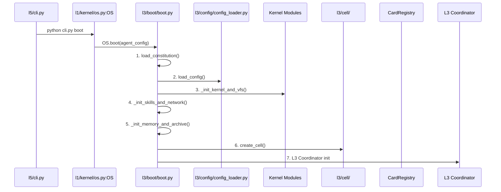

# Boot Sequence

> **Source:** `src/l3/boot/boot.py` (650 lines)  
> **Entry:** `boot(agent_config, interactive) -> dict`

## Phases



## Default Boot Steps

Registered in `_register_default_boot_steps()` (line 252):

| # | Step | Depends On | Description |
|---|------|-----------|-------------|
| 1 | `load_constitution` | — | Load `.praxis-rules.md` into territory + rule engine |
| 2 | `load_config` | 1 | Load `praxis.yaml` → apply to system settings |
| 3 | `load_tools` | 2 | Load tool specifications from `tools.yaml` |
| 4 | `init_services` | 3 | Initialize all L3 services (memory, central security, etc.) |
| 5 | `create_cell` | 4 | Create Cell with agents from `agent_config` |

## Additional Boot Actions

- **Bootstrap wizard** — first-boot YAML config via `bootstrap.run_bootstrap()`
- **State restore** — `l1.kernel.persist.restore()` from previous session
- **Auto-save** — background thread if `PERSIST_AUTO` is set
- **Memory init** — `memory_init.init_from_memories()` loads agent config from prior snapshot
- **Kernel OS wiring** — connects shutdown/terminal/cell reset callbacks
- **Boot snapshot** — saves boot result to memories on success
- **Shutdown handler** — `atexit` + `SIGTERM` handler via `memory_init.register_shutdown_handler()`

## Extensibility

```python
from l3.boot.boot import register_boot_step
register_boot_step("my_step", my_fn, depends_on=["init_services"])
```

Steps are topologically sorted by dependency.
