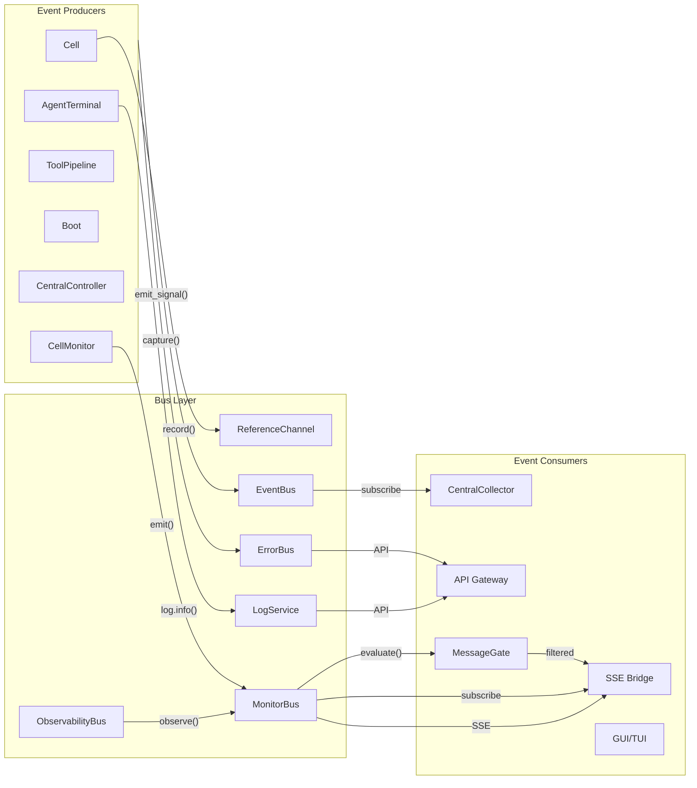

# Central Control Systems & Buses

> **Sources:** `l3/cell/peers/l3.py`, `l3/scheduler/scheduler*.py`, `l3/bus/observability_bus.py`, `l3/memory/r4_agent.py`, `l3/cell/components/cell_monitor.py`,  
> `l3/bus/l3b.py`, `l3/services/central_security.py`, `l3/memory/central_memory.py`, `l3/services/central_plugin.py`, `l3/cell/peers/central_collector.py`,  
> `l1/kernel/event.py`, `l3/bus/monitor_bus.py`, `l3/error_bus/`, `l3/bus/message_gate.py`, `l3/bus/log.py`,  
> `l4/sse_bridge.py`, `l3/bus/reference_channel.py`, `l3/bus/observability_bus.py`

## Overview

```mermaid
flowchart TB
    subgraph Buses["Message Buses / Event Channels"]
        EB["EventBus\nl1/kernel/event.py\nKernel pub/sub\nSignalType events"]
        MB["MonitorBus\nl3/bus/monitor_bus.py\nUnified event bus\nJSONL persist + SSE"]
        ERR["ErrorBus\nl3/error_bus/\nError logging\nDedup + API + SSE"]
        LOG["LogService\nl3/bus/log.py\nLog rotation\nQuery + Export"]
        SSE["SSE Bridge\nl4/sse_bridge.py\nServer-Sent Events\nStreaming"]
        RC["ReferenceChannel\nl3/bus/reference_channel.py\nAsync event recorder\nJSONL buffered"]
        OB["ObservabilityBus\nl3/bus/observability_bus.py\nAlert / Health / Metric"]
        MG["MessageGate\nl3/bus/message_gate.py\nPolicy engine\nDependency-aware filter"]
    end

    subgraph Centers["10 Central Control Systems"]
        CC["CentralController\nl3/cell/peers/l3.py\nIntent lifecycle"]
        CS["CentralScheduler\nl3/scheduler/scheduler*.py\n5D scheduling"]
        OBS["ObservabilityBus\nl3/bus/observability_bus.py\nAlert/Health/Metric"]
        R4["R4Agent\nl3/memory/r4_agent.py\nArchive + Skills"]
        CM["CellMonitor\nl3/cell/components/cell_monitor.py\nHealth events"]
        LB["L3B\nl3/bus/l3b.py\nCross-cell routing"]
        CSEC["CentralSecurity\nl3/services/central_security.py\n6-gate unified check"]
        CMEM["CentralMemory\nl3/memory/central_memory.py\nR1-R4 coordinator"]
        CPLUG["CentralPlugin\nl3/services/central_plugin.py\nPlugin lifecycle"]
        CCOL["CentralCollector\nl3/cell/peers/central_collector.py\nToken aggregation"]
    end

    Buses -->|"feed into"| Centers
    Centers -->|"emit to"| Buses
```



## Message Buses

### EventBus (`l1/kernel/event.py`)

Lowest-level kernel event bus — pub/sub with typed signals:

```python
from l1.kernel import emit_signal, get_event_bus, Signal, SignalType

# Emit a signal
emit_signal(EVENT_TASK_ASSIGN, sender="shell", target="l3",
            data={"card_id": "card-123"})

# Subscribe
bus = get_event_bus()
bus.subscribe(lambda s: print(s.type, s.data))
```

| Feature | Detail |
|---------|--------|
| Signal types | `TASK_ASSIGN`, `TASK_CANCEL`, `REVIEW_REQUESTED`, `CROSS_REVIEW`, ... |
| History | `EVENT_MAX_HISTORY=200` entries |
| Query | `EVENT_QUERY_LIMIT=20` |
| Constants | `EVENT_TASK_ASSIGN`, `EVENT_REVIEW_REQUESTED`, `EVENT_TOKEN_USAGE`, `EVENT_CROSS_REVIEW`, `EVENT_AGENT_BOOT`, `EVENT_ARCHIVE_ALERT` |

### MonitorBus (`l3/bus/monitor_bus.py`)

Unified monitoring event bus with JSONL persistence and streaming:

```python
from l3.bus.monitor_bus import get_bus, MonitorEvent

bus = get_bus()
bus.emit(MonitorEvent(
    type="token.cell.usage",
    source="cell_token_merger",
    severity="info",
    cell_id="cell-1",
    data={"token_total": 50000}
))
```

| Feature | Detail |
|---------|--------|
| Event types | `kernel.*`, `network.*`, `service.*`, `task.*` |
| Persistence | JSONL file (`PRAXIS_MONITOR_BUS_LOG`) |
| SSE | `subscribe_sse()` / `unsubscribe_sse()` |
| Query | `query(level, source, since, limit)` |
| Ring buffer | deque maxlen=2000 (default) |

### ErrorBus (`l3/error_bus/`)

Three-tier error logging bus merging ~190 exception capture points:

```python
from l3.error_bus import capture, error_boundary

# One-liner in except blocks
try:
    ...
except Exception as e:
    capture("memory compact failed", exc=e, component="services")

# Context manager
with error_boundary("loading config", component="boot"):
    load_config()
```

| Layer | Component | Description |
|-------|-----------|-------------|
| 1 | `ErrorLogEntry` | Structured error record with SHA-256 fingerprint dedup |
| 2 | `ErrorBus` | Merging engine: dedup + LogService + EventBus + SSE |
| 3 | API handlers | `handle_log_errors*` → REST endpoints via ApiGateway |

| Feature | Detail |
|---------|--------|
| Buffer | `ERROR_BUS_BUFFER=5000` entries |
| Dedup | `ERROR_BUS_DEDUP_WINDOW=300s` |
| Export | `ERROR_BUS_EXPORT_LIMIT=10000` |
| API | 6 routes (`/api/logs/errors/*`) |

### LogService (`l3/bus/log.py`)

OS-level logging service with rotation and bridging:

```python
from l3.bus.log import get_service
log = get_service()
log.info("Cell booted", service="cell", agent_id="agent-1")
log.install_handler()  # captures all logging.getLogger() calls
```

| Feature | Detail |
|---------|--------|
| Levels | `debug`, `info`, `warn`, `error` |
| Persistence | Rotating JSON files (`LOG_MAX_FILES=5`, `LOG_MAX_FILE_SIZE=1MB`) |
| Memory | `LOG_MAX_MEMORY_ENTRIES=5000` |
| API | `POST /api/logs/query`, `GET /api/logs/recent`, `GET /api/logs/stats`, `POST /api/logs/export` |

### SSE Bridge (`l4/sse_bridge.py`)

Server-Sent Events streaming bridge for real-time UI updates:

```python
# Client connects to GET /api/events
# Server pushes JSON events as SSE data frames
data: {"type": "cell.step", "payload": {...}, "timestamp": ...}
```

### Reference Channel (`l3/bus/reference_channel.py`)

Non-blocking async event recorder for audit trail:

```python
from l3.bus.reference_channel import get_channel
ch = get_channel()
ch.record("tool_call", {"tool": "read_file", "path": "/etc/config"})
```

| Feature | Detail |
|---------|--------|
| Storage | JSONL file (`.praxis_reference_channel.jsonl`) |
| Flush | `RC_FLUSH_INTERVAL=5.0s` or `RC_MAX_EVENTS=100` |
| Export | `RC_EXPORT_LIMIT=999999` |

### ObservabilityBus (`l3/bus/observability_bus.py`)

Unified alert/health/metric bus:

```python
from l3.bus.observability_bus import get_obs_bus
bus = get_obs_bus()
bus.observe("health", "cell", {"status": "healthy"})
```

### MessageGate (`l3/bus/message_gate.py`)

Dependency-aware message policy engine for MonitorBus events:

```python
from l3.bus.message_gate import get_gate, MessageGateRule
gate = get_gate()
gate.add(MessageGateRule(
    pattern="token.*",
    action="block",
    priority=10
))
```

| Action | Effect |
|--------|--------|
| `allow` | Let through |
| `block` | Discard |
| `mute` | Store but exclude from queries |
| `hold` | Queue pending dependency resolution |
| `redirect` | Forward to webhook/SSE |

## Central Control Systems

### 1. CentralController (`l3/cell/peers/l3.py`)

Intent lifecycle controller — translates user intent to cards:

```python
from l3.cell.peers.l3 import get_coordinator
coord = get_coordinator()
result = coord.process_intent("fix the login bug")
# → creates Card, submits to CardRegistry
```

### 2. CentralScheduler (`l3/scheduler/scheduler*.py`)

Five-dimensional scheduling across 5 files:

| File | Function |
|------|----------|
| `scheduler/scheduler.py` | Unified scheduler (L3Router + RequestPool + TimeScheduler) |
| `scheduler/scheduler_rate.py` | Rate-limit scheduler (per ring: 60/20/5 calls/min) |
| `scheduler/scheduler_scope.py` | Scope-based scheduling (global/cell/agent) |
| `scheduler/scheduler_time.py` | Time-slice scheduler (preemptive: `DEFAULT_QUANTUM=15s`) |
| `scheduler/scheduler_router.py` | L3Router: intent → best agent routing |

```python
from l3.scheduler.scheduler import get_scheduler
sched = get_scheduler()
sched.stats()
# → {"rate": {...}, "time": {...}, "scope": {...}, "queue": {...}}
```

### 3. R4Agent (`l3/memory/r4_agent.py`)

Archive agent — manages Ring 4 cold storage + skill evolution:

| Method | Description |
|--------|-------------|
| `archive_ring3(importance_threshold=0.7)` | Archive Ring 3 entries to Ring 4 |
| `restore(limit=100)` | Restore archived entries back to Ring 3 |
| `get_lean_cases(agent_id, limit=20)` | Retrieve lean case examples |
| `evolve_skill(intent)` | Evolve a new skill from archived patterns |
| `stats()` | Archive statistics |

### 4. CellMonitor (`l3/cell/components/cell_monitor.py`)

Cell health monitoring and event logging:

```python
from l3.cell.components.cell_monitor import get_cell_monitor
cm = get_cell_monitor()
cm.record("cell-1", "agent_crashed", agent_id="agent-writer")
cm.get_events(cell_id="cell-1", limit=20)
cm.stats()
```

### 5. L3B (`l3/bus/l3b.py`)

Cross-cell routing — coordinates multiple Cells:

```python
from l3.bus.l3b import get_l3b
l3b = get_l3b()
l3b.route(card_id="card-123", target_cell="cell-2")
```

### 6. CentralSecurity (`l3/services/central_security.py`)

Six-gate unified security check:

```python
from l3.services.central_security import get_center
sec = get_center()
sec.check_all(action="write_file", agent_id="agent-writer",
              target="src/main.py", tool_name="edit")
# → {"allowed": bool, "gates": {...}}
```

6 gates: Tool whitelist → Identity → Territory + Risk → Rate Limit → Allocator → Resource

### 7. CentralMemory (`l3/memory/central_memory.py`)

R1-R4 memory lifecycle coordinator (see [memory.md](deep-dive/memory.md)).

### 8. CentralPlugin (`l3/services/central_plugin.py`)

Plugin lifecycle manager:

```python
from l3.services.central_plugin import get_center
plug = get_center()
plug.install_tool_plugin(name="docker", tools=[...])
plug.list_plugins()
plug.remove_tool_plugin("docker")
```

### 9. CentralCollector (`l3/cell/peers/central_collector.py`)

Token aggregation and quota enforcement:

```python
from l3.cell.peers.central_collector import get_center
col = get_center()
col.stats()
# → {"tokens": {...}, "cells": {...}, "quotas": {...}}
```

| Quota | Limit |
|-------|-------|
| `TOKEN_CELL_QUOTA` | 5,000,000 per Cell |
| `TOKEN_GLOBAL_QUOTA` | 50,000,000 total |

## Bus Interconnections



## Key Constants

| Constant | Value | System |
|----------|-------|--------|
| `ERROR_BUS_BUFFER` | 5000 | ErrorBus |
| `ERROR_BUS_DEDUP_WINDOW` | 300s | ErrorBus |
| `ERROR_BUS_EXPORT_LIMIT` | 10000 | ErrorBus |
| `LOG_MAX_MEMORY_ENTRIES` | 5000 | LogService |
| `LOG_MAX_FILE_SIZE` | 1MB | LogService |
| `LOG_MAX_FILES` | 5 | LogService |
| `LOG_EXPORT_LIMIT` | 10000 | LogService |
| `RC_FLUSH_INTERVAL` | 5s | ReferenceChannel |
| `RC_MAX_EVENTS` | 100 | ReferenceChannel |
| `RC_EXPORT_LIMIT` | 999999 | ReferenceChannel |
| `TOKEN_CELL_QUOTA` | 5,000,000 | CentralCollector |
| `TOKEN_GLOBAL_QUOTA` | 50,000,000 | CentralCollector |
| `ARCHIVE_IMPORTANCE_THRESHOLD` | 0.7 | R4Agent |
| `ARCHIVE_RESTORE_LIMIT` | 100 | R4Agent |
| `CRON_CHECK_INTERVAL` | 60s | Scheduler |
| `DEFAULT_QUANTUM` | 15.0s | TimeScheduler |
| `MAX_PREEMPT` | 60.0s | TimeScheduler |
| `COMM_HISTORY_MAX` | 500 | Communication monitor |
| `EVENT_MAX_HISTORY` | 200 | EventBus |
