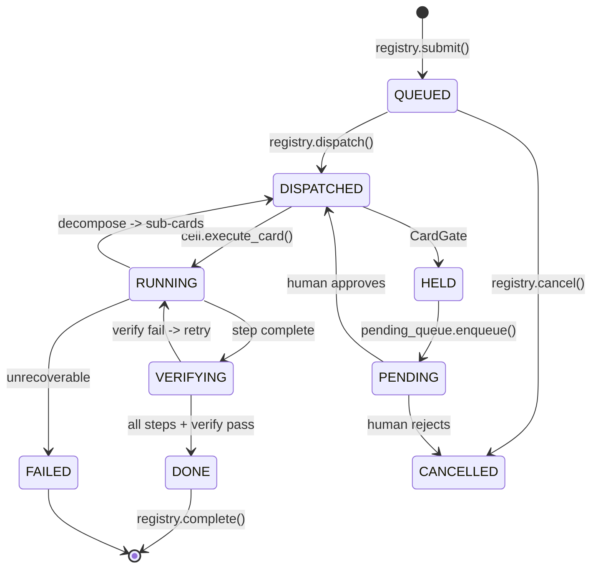
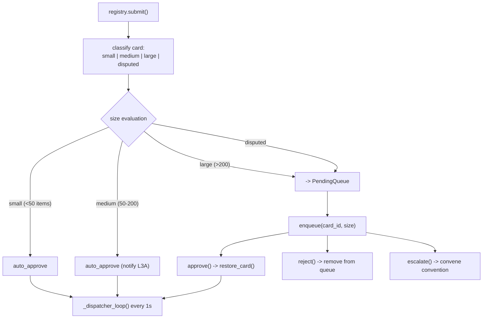

# Card Lifecycle

> **Sources:** `l3/card_registry.py`, `l3/card_gate.py`, `l3/card_unified.py`, `l3/pending_queue.py`

## State Machine



## Dual-Layer Card Queue

### 1. Dispatch Queue (`CardRegistry._queue`)

Priority-sorted list of card IDs waiting for Cell dispatch.

### 2. CardGate + PendingQueue

Human/convention approval queue for cards requiring review.



## Card Record

```python
class CardRecord:
    card_id: str
    intent: str
    domain: str
    status: CardState     # QUEUED | DISPATCHED | RUNNING | ...
    priority: int         # 1-10
    approval_status: str  # pending | auto_approved | human_approved | rejected | escalated
    approval_size: str    # small | medium | large | disputed
    phases: list[Phase]
```

## PendingQueue

Persistent queue for cards awaiting human decisions.

| Method | Description |
|--------|-------------|
| `enqueue(card_id, intent, domain, size, priority)` | Add to pending |
| `approve(msg_id, response)` | Approve, restore in CardRegistry |
| `reject(msg_id, response)` | Reject, mark REJECTED |
| `escalate(msg_id)` | Escalate to convention |
| `list(status, limit)` | Query by status |
| `set_priority(msg_id, priority)` | Adjust priority |

## Approval Trail

Each card records its approval history:

```
approval_status: pending | auto_approved | human_approved | rejected | escalated
approval_size:   small | medium | large | disputed
approval_at:     ISO timestamp
approval_by:     agent_id or "auto"
```

## Card Types

Registered via `card_unified.py`. Each card type defines phases, steps, and verification chain.

```python
card = CardUnified(nature="execution", priority=5)
card.add_phase(name="investigate", mode="parallel", agents=["reader", "scout"])
card.add_task(phase_name="investigate", action="read_file", target="src/main.py")
```
