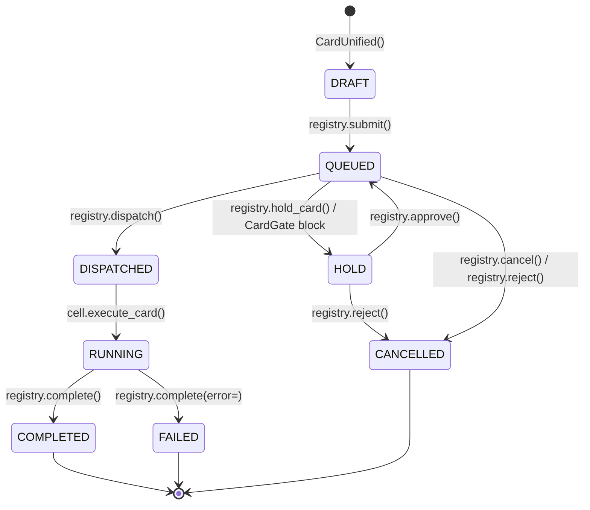

# Card Lifecycle

> **Sources:** `l3/card/card_registry.py`, `l3/card/card_gate.py`, `l3/card/card_unified.py`

## State Machine

`CardUnified.state` (CardLifecycle enum):



## CardRegistry — central card queue

Single registry (`.praxis/card_registry.json`, auto-saved). Background dispatcher
thread polls `_queue` every `CARD_DISPATCH_INTERVAL` and routes to Cells.

### Core operations

| Method | Transition | Notes |
|--------|-----------|-------|
| `submit(intent, domain, priority)` | → QUEUED | Priority-sorted queue, emits `EVENT_TASK_ASSIGN` |
| `dispatch(card_id)` | QUEUED → DISPATCHED | Territory match via `_match_cell` |
| `complete(card_id, result)` | → COMPLETED/FAILED | Fires subscribers, task_bus webhook, reference_channel |
| `cancel(card_id)` | → CANCELLED | |
| `hold_card(card_id)` | QUEUED → HOLD | Queue entry replaced by `__HOLD__:<id>` placeholder |
| `restore_card(card_id)` | HOLD → QUEUED | Placeholder → real id, re-sorted |
| `approve(card_id)` | HOLD → QUEUED | Explicit approval (L2 `/card approve`) |
| `reject(card_id, reason)` | HOLD → CANCELLED | Cascades to dependent cards, notifies subscribers |

### Completion subscription (external closed loop)

```python
registry.subscribe(card_id, callback)      # callback(card_id, state, result)
registry.unsubscribe(card_id, callback)    # or all callbacks if omitted
```

Fired on COMPLETED / FAILED / CANCELLED. Used by L3A sessions to receive card
execution results asynchronously.

### Dispatcher guardrail

- `_recheck_held()` — every 10 ticks, re-evaluates held cards via CardGate (auto-release)
- `_escalate_stale()` — QUEUED > 1h → CANCELLED + signal
- `_find_dependents()` — dependency cascade on hold/reject
- `generate_plan()` — LLM plan generation before HOLD (approval preview)

## Approval flow

```
submit → dispatcher tick → CardGate.evaluate()
  ├── auto_approve=True  → dispatch → Cell execute
  └── auto_approve=False → generate_plan() → hold_card() → HOLD
                              │
                              ├── /card approve <id> → QUEUED → dispatch
                              ├── /card reject <id>  → CANCELLED (+ dependents)
                              └── _recheck_held()     → gate re-eval (auto-release)
```

## Card model — CardUnified

```python
card = CardUnified(nature="execution", priority=5)
card.summary = CardSummary(title=..., description=..., columns={"domain": ...})
card.add_phase(name="investigate", mode="parallel", agents=["reader", "scout"])
card.add_task(phase_name="investigate", action="read_file", target="src/main.py")
card.submit()
```

Hidden system fields: `timestamps`, `modifications`, `_gate_scope`, `_changes`.

## Events emitted

| Event | On |
|-------|-----|
| `EVENT_TASK_ASSIGN` submitted | `submit()` |
| `EVENT_TASK_ASSIGN` dispatched | `dispatch()` |
| `EVENT_TASK_ASSIGN` completed | `complete()` |
| `EVENT_TASK_ASSIGN` stale_escalated | `_escalate_stale()` |
| `EVENT_TASK_ASSIGN` approved / rejected | `approve()` / `reject()` |
| task_bus webhook | `complete()` (external dispatch) |
| reference_channel.card_lifecycle | submit / complete |

## L3A session closed loop

```
L3A Session → cardwrite tool
  ├── CardUnified created → registry.submit() → QUEUED
  ├── SessionTaskTable.track(card_id)          ← task monitor buffer
  ├── registry.subscribe(card_id, callback)    ← completion subscription
  └── prompt returns immediately (async)

  (background) dispatcher → Cell executes
    └── registry.complete() → _notify_subscribers()
          ├── SessionTaskTable.update(status, result)
          └── Session.history.append("Card <id> → completed: <summary>")
```

Watcher: `L3ADaemon.tick()` calls `SessionTaskTable.sync_from_registry()` every
60s to reconcile any state changes missed by callbacks.
