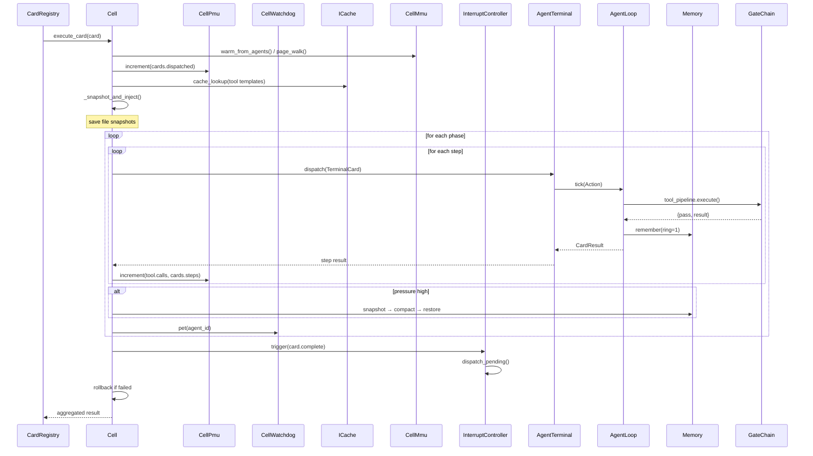

# Cell & Agent Architecture

> **Sources:** `src/l3/cell/__init__.py`, `src/l3/agent_terminal/__init__.py`

## Overview

The Cell is the **CPU core** of Praxis. It holds N AgentTerminals (execution units), a shared ScoutPool, an inter-agent mailbox, a PMU (performance counters), a Watchdog (per-agent liveness), an I-Cache (instruction cache), an MMU+TLB (territory→agent translation), an InterruptController (priority event routing), and snapshot/rollback capability.

| CPU Core Concept | Cell Equivalent |
|-----------------|----------------|
| Instruction pipeline | Card phases/steps |
| Register file | `agent_map` (agent_id → AgentInfo) |
| Cache L1/L2/L3 | Memory rings R1/R2/R3 |
| PMU (performance counters) | `CellPmu` — 28 counters, 11 groups |
| Watchdog timer | `CellWatchdog` — per-agent liveness, auto-reboot |
| I-Cache (instruction cache) | `ICache` — LFU eviction, 1h TTL |
| MMU + TLB | `CellMmu` + `CellTlb` — 3-level territory→agent cascade |
| Interrupt controller | `InterruptController` — 16 IRQs, 4 priority levels, NMI |
| Branch predictor | HTN Planner intent decomposition |
| Hyper-threading | Multi-agent parallel phase execution |
| Memory controller | CentralMemory (R1-R4 coordinator) |

## Cell Internal Architecture

```mermaid
flowchart TB
    subgraph Input["Card Input (from CardRegistry)"]
        CARD_IN["execute_card(intent, domain)"]
    end

    subgraph Cell["Cell = CPU Core (l3/cell/)\ncard queue + agent map + mailbox"]
        direction TB
        AQ["Agent Queue:\n_terminal_id → AgentTerminal\n(agent_map from Card)"]
        MB["Mailbox:\nCellMessage[]\nagent-to-agent messaging"]
        SP["ScoutPool\n(shared investigation pool)"]
        SUB["SubAgentFramework:\nsubagent_dispatch()\nsubagent_orchestrate()"]
        SNAP["Snapshot/Rollback\n(pre-exec file snapshots)"]
        RB["_rollback_ring\nCircularBuffer(20)\nrollback context"]
        CH["_card_history\nCircularBuffer(100)\ncard event log"]
        PMU["PMU: CellPmu\n28 counters, 11 groups\nauto-snapshots → MonitorBus"]
        WD["Watchdog: CellWatchdog\nper-agent liveness\nHEALTHY→UNRESPONSIVE→CRASHED"]
        IC["I-Cache: ICache\ninstructions/tools/templates\nLFU eviction, 1h TTL"]
        MMU["MMU + TLB:\nCellMmu + CellTlb\n3-level cascade:\nTLB → I-Cache → agents"]
        INT["InterruptController:\n16 IRQs, 4 priority\nNMI bypass\n_wire_interrupts()"]
    end

    subgraph AgentTerminal["AgentTerminal = Execution Unit\n(l3/agent_terminal/)"]
        direction TB
        STDIN["stdin: deque[TerminalCard]\nmax=200"]
        STDOUT["stdout: deque[CardResult]\nmax=500"]
        STDERR["stderr: deque[str]\nmax=200"]
        WORKER["Worker Thread Pool\n_max_workers=4"]
        FC["file_cache: IsolatedCache\n(per-cell_id)"]
        CR["context: ContextRegister\n(per-cell_id)"]
    end

    subgraph AgentLoop["AgentLoop = Microcode Sequencer\n(l3/agent_loop.py)"]
        direction TB
        MAIN["run() → engine.tool_use()\nLLM multi-turn"]
        DETECT["ToolLoopDetector\nCoarseRepeatDetector"]
        TODO["TodoTracker\npersistent state machine"]
        CADENCE["VerifyCadence\nsubprocess checks"]
        FINISH["_finish()\ncentralized terminal funnel"]
    end

    subgraph Support["Support Agents"]
        SCT["Scout\nRing 1, read-only\nPool-managed"]
        SUB2["SubAgent\nRing 1, sync\nStateless"]
    end

    CARD_IN --> Cell
    Cell -->|"dispatch TerminalCard"| STDIN
    WORKER -->|"_process_card"| MAIN
    MAIN --> DETECT
    MAIN --> TODO
    MAIN --> CADENCE
    MAIN --> FINISH
    Cell --> SP
    Cell --> SUB
    Cell --> SNAP
    Cell --> RB
    Cell --> CH
    Cell --> PMU
    Cell --> WD
    Cell --> IC
    Cell --> MMU
    Cell --> INT
    SP --> SCT
    SUB --> SUB2
```



### ASCII Architecture

```
+---------------------------------------------------------------+
|  Card Input (from CardRegistry)                               |
|  execute_card(intent, domain)                                  |
+---------------------------------------------------------------+
                               |
                               v
+---------------------------------------------------------------+
|  Cell = CPU Core (l3/cell/)                                   |
|                                                                |
|  +------------------+  +------------------+  +--------------+  |
|  | Agent Queue      |  | Mailbox          |  | ScoutPool    |  |
|  | agent_map → term |  | CellMessage[]    |  | (read-only)  |  |
|  +------------------+  +------------------+  +--------------+  |
|  +------------------+  +------------------+  +--------------+  |
|  | _rollback_ring   |  | _card_history    |  | _card_       |  |
|  | CircularBuffer(20)|  | CircularBuffer(100)| | snapshots   |  |
|  +------------------+  +------------------+  +--------------+  |
|  +------------------+  +------------------+  +--------------+  |
|  | PMU: CellPmu     |  | Watchdog:        |  | I-Cache:     |  |
|  | 28 counters      |  | CellWatchdog     |  | ICache       |  |
|  | 11 groups        |  | HEALTHY→         |  | LFU eviction |  |
|  | auto-snapshots   |  | UNRESPONSIVE→    |  | 1h TTL       |  |
|  |                  |  | CRASHED+NMI+     |  |              |  |
|  |                  |  | auto-reboot      |  |              |  |
|  +------------------+  +------------------+  +--------------+  |
|  +------------------+  +------------------+                   |
|  | MMU + TLB:       |  | InterruptCtrl:   |                   |
|  | CellMmu+CellTlb  |  | 16 IRQs, 4 pri   |                   |
|  | 3-level cascade  |  | NMI bypass       |                   |
|  +------------------+  +------------------+                   |
|  +------------------+                                         |
|  | SubAgentFramework|                                         |
|  | subagent_dispatch|                                         |
|  | subagent_orchest. |                                         |
|  +------------------+                                         |
+---------------------------------------------------------------+
      |        |                        |              |
      v        v                        v              v
+------------+ +------------+ +---------------+ +----------+
| stdin      | | stdout     | | Worker Pool   | | File     |
| TerminalCard| | CardResult | | max_workers=4 | | Cache    |
| deque(200) | | deque(500) | | threads       | | per-cell |
+------------+ +------------+ +---------------+ +----------+
      |                                              |
      v                                              v
+----------------------------------+     +-------------------+
| AgentLoop = Microcode Sequencer  |     | Memory (3-ring)   |
| run() → LLM tool_use()           |     | ContextRegister   |
| ToolLoopDetector + TodoTracker   |     +-------------------+
| VerifyCadence + _finish()        |
+----------------------------------+
```

## Card Execution Flow (Inside Cell)



## Cell (`l3/cell/__init__.py`)

### Internal State

| Field | Type | Purpose |
|-------|------|---------|
| `cell_id` | `str` | Unique Cell identifier |
| `territory` | `list[str]` | Covered file system paths |
| `_agents` | `dict[str, AgentInfo]` | Registered agents with roles/rings |
| `_mailbox` | `dict[str, list[CellMessage]]` | Per-agent message queues |
| `_rollback_ring` | `CircularBuffer(20)` | Rollback context history |
| `_card_history` | `CircularBuffer(100)` | Card execution history |
| `_card_snapshots` | `dict[str, dict]` | Pre-execution file snapshots |
| `_scout_cache` | `dict` | Cached scout results |
| `_spawn_hooks` | `list[Callable]` | Veto-capable spawn hooks |
| `_kill_hooks` | `list[Callable]` | Veto-capable kill hooks |
| `_boot_hooks` | `list[Callable]` | Observation-only boot hooks |
| `_shutdown_hooks` | `list[Callable]` | Observation-only shutdown hooks |
| `_pmu` | `CellPmu` | Per-Cell performance counters (28 counters, 11 groups) |
| `_watchdog` | `CellWatchdog` | Per-agent liveness monitor (HEALTHY→UNRESPONSIVE→CRASHED) |
| `_icache` | `ICache` | Instruction cache — tools, templates, territory maps (LFU, 1h TTL) |
| `_tlb` | `CellTlb` | Translation lookaside buffer — 1st level of MMU cascade |
| `_mmu` | `CellMmu` | Memory management unit — territory→agent translation |
| `_interrupt` | `InterruptController` | Priority interrupt routing — 16 IRQs, 4 levels, NMI |
| `_subagent_dispatcher` | `SubAgentDispatcher` | Dispatches SubAgent specs with Cell-wired result delivery |
| `_cache` | `CellCache` | Cell L2 shared cache for cross-agent hot data |

### 30+ Public Methods

| Method | Purpose |
|--------|---------|
| `add_agent(agent_id, role, ...)` | Register a new agent, spawn hooks may veto |
| `remove_agent(agent_id)` | Remove agent, clean memory + context + mailbox + watchdog + MMU TLB |
| `save_state(path)` | Persist Cell state (agents, conventions, snapshots) to JSON |
| `restore_state(path)` | Restore Cell state from JSON |
| `send_message(sender, target, ...)` | Agent-to-agent mailbox message |
| `read_messages(agent_id, clear)` | Read pending mailbox messages |
| `agent_reachable(agent_id)` | Ping agent terminal |
| `send_direct_message(agent_id, text)` | Queue stdin message |
| `liveness()` | Aggregate health (healthy/degraded/unreachable) |
| `agent_status(agent_id)` | Single agent status |
| `on_boot/on_shutdown/on_spawn/on_kill(hook)` | Lifecycle hooks |
| `boot_agent/boot_all(agent_id)` | Start agents, register with watchdog, wire pet callback |
| `shutdown_all()` | Stop watchdog, stop all agents, reset terminals |
| `emergency_stop()` | Halt all operations (emergency flag) |
| `resume()` | Clear emergency flag, resume agents |
| `reset_agent_context(agent_id)` | Pause → compact → clear Ring 1 → restore Ring 2 |
| `dispatch_card(target, action, ...)` | Dispatch TerminalCard, auto cross-review for writes |
| `convene(issue_card)` | Multi-agent convention protocol |
| `close_convention(card_id)` | End convention |
| `handle_convention_message(...)` | Route convention message |
| `execute_card(card, domain, ...)` | Execute a Card (structured or raw), auto-decompose |
| `rollback_card(card_id)` | Restore checkpoints + file snapshots, discard sandbox |
| `decompose_card(card, domain)` | Decompose by territory |
| `agent_tools/cell_tools()` | List available tools |
| `wait_for_card(card_id, timeout)` | Block for result |
| `reuse_scout_result(template, scope, ttl)` | Cached scout result |
| `set_think_quota(distribution, **config)` | Update think quota |
| `stats()` | Full Cell snapshot (includes pmu, watchdog, icache, mmu, interrupt subsections) |
| `pmu_snapshot()` | Take immediate PMU counter snapshot |
| `subagent_dispatch(spec, prompt, ...)` | Dispatch SubAgent with Cell-wired result delivery |
| `subagent_orchestrate(sub_tasks, ...)` | Full fork-join-verify-gap SubAgent cycle |
| `subagent_dispatch_from_text(text, ...)` | Parse @mention from text and dispatch SubAgent |
| `dispatch_pending_interrupts(max_per)` | Dispatch pending queued interrupts periodically |

### Factory Functions

```python
get_cell(cell_id, territory)       # Singleton factory
get_cells()                         # All registered Cells
reset_cells()                       # Clear registry
```

### Agent Equality

All three Peer Agents (`reader`, `writer`, `reviewer`) are **equal** — ring 3, full tools, same capability. `CENTRAL_DEFAULT_ROLES = ["reader", "writer", "reviewer"]` is a **naming convention** only, not a capability difference. The HTN planner `_infer_agent()` uses `AGENT_ROLE_MAP` which is **config-driven** (via `praxis.yaml agent_role_map:`) and not hardcoded.

| Aspect | Detail |
|--------|--------|
| Ring level | All Peer Agents run at ring 3 (full tool access) |
| Tools | Same tool registry, filtered only by ring + mute |
| Role labels | `reader` / `writer` / `reviewer` are conventional names, not capability tiers |
| HTN inference | `AGENT_ROLE_MAP` maps ring level → role string (config-driven, overridable at runtime) |
| Cross-review | Any Peer Agent may review any other; no role-based restriction |

## PMU — Performance Monitoring Unit

`self._pmu: CellPmu` — per-Cell hardware-style performance counters. Created in `__init__()` after the Watchdog. Provides observability across all Cell operations.

- **28 counters** across **11 groups** (agent, bus, cards, cache, constitution, deploy, memory, pipeline, scout, token, tool)
- Each group exposes counters via `pmu.increment(group.counter)` and `pmu.read(group.counter)`
- **Auto-snapshots** to `MonitorBus` on configurable interval — enables external observability without polling
- Counter groups are frozen at class level; unknown counters log a warning and are discarded
- Properties: `pmu` property on Cell for external access
- Wired into tool pipeline (`get_pipeline().set_pmu()`) so every tool execution increments pipeline counters
- `pmu_snapshot()` returns a timestamped dict of all counters

```python
pmu = cell.pmu
pmu.increment("cards.dispatched")
snap = pmu.snapshot()  # {timestamp, counters: {"agent.boots": 3, ...}}
```

## Watchdog — Per-Agent Liveness Monitor

`self._watchdog: CellWatchdog` — background thread that polls agent terminals for liveness. Each agent must call `pet(agent_id)` within the deadline or the watchdog escalates.

### State Machine

```
HEALTHY ──→ UNRESPONSIVE ──→ CRASHED
   ↑                                │
   └────────── pet() ───────────────┘
```

| State | Trigger | Action |
|-------|---------|--------|
| `HEALTHY` | Agent `pet()` within deadline | Normal operation |
| `UNRESPONSIVE` | Missed deadline → `on_timeout` callback | Agent terminal paused; warning logged |
| `CRASHED` | Consecutive misses → `on_crash` callback | **NMI interrupt** via `_interrupt.trigger("watchdog.crash")`, **TLB flush** via `_mmu.flush_agent()`, **auto-reboot** (shutdown + boot agent terminal), PMU counter `agent.crashes` incremented |
| Recovery | Agent `pet()` after UNRESPONSIVE → `on_recovery` callback | Agent terminal resumed |

### Wiring

- `boot_agent(agent_id)` calls `_watchdog.register(agent_id)`
- Agent terminal gets `set_watchdog_pet(lambda aid: self._watchdog.pet(aid))`
- `remove_agent(agent_id)` calls `_watchdog.unregister(agent_id)`
- `boot_all()` calls `_watchdog.start()`; `shutdown_all()` calls `_watchdog.stop()`

```python
cell.boot_agent("agent-1")  # registers with watchdog, wires pet callback
cell._watchdog.pet("agent-1")  # agent calls this in its processing loop
```

## I-Cache — Instruction Cache

`self._icache: ICache` — read-mostly cache for instructional content: tool definitions, prompt templates, territory maps, and any other data that backs the MMU page walk.

- **Eviction policy:** LFU (Least Frequently Used) — frequency counters per entry
- **Default TTL:** 1 hour (configurable)
- **Lookup fallback:** Misses delegate to the underlying store (agents dict) via the MMU cascade
- **Warmed** on `add_agent()` via `_mmu.warm_from_agents()`
- **Stats** available via `_icache.stats()` — hit rate, entry count, memory usage

```python
# The MMU cascade uses the I-Cache as its 2nd level:
# TLB → I-Cache → agents dict
cell.icache  # ICache instance
```

## MMU + TLB — Memory Management Unit

`self._mmu: CellMmu` + `self._tlb: CellTlb` — territory→agent translation subsystem. Maps file paths (territory) to the agent that should handle them.

### Three-Level Cascade

```
Agent Lookup Request (territory → agent_id)
         │
         v
    ┌─────────┐  hit ──→ return agent_id
    │  TLB    │
    │(CellTlb)│
    └────┬────┘
         │ miss
         v
    ┌─────────┐  hit ──→ return agent_id
    │ I-Cache│
    │(ICache)│
    └────┬────┘
         │ miss
         v
    ┌─────────┐
    │ agents  │  scan → warm TLB + I-Cache → return agent_id
    │  dict   │
    └─────────┘
```

| Event | MMU Action |
|-------|-----------|
| `add_agent()` | `_mmu.warm_from_agents(self._agents)` — preload TLB and I-Cache |
| `remove_agent()` | `_mmu.flush_agent(agent_id)` — evict from TLB and I-Cache |
| Watchdog crash | `_mmu.flush_agent(agent_id)` — same as remove_agent |
| Constitution violation | `_mmu.flush_all()` — evict all mappings |

```python
cell.mmu   # CellMmu instance
cell.tlb   # CellTlb instance (also accessible as cell.mmu.tlb)
```

## InterruptController — Priority Interrupt Routing

`self._interrupt: InterruptController` — priority-based event routing with 16 built-in IRQs across 4 priority levels. Interrupts can be synchronous (immediate handler) or queued (dispatched in priority order by `dispatch_pending()`).

### IRQ Table

| IRQ | Priority | Handler (wired in `_wire_interrupts()`) |
|-----|----------|----------------------------------------|
| `task.assign` | Normal | `pmu.increment("bus.signals_emitted")` |
| `token.usage` | Normal | `pmu.increment("token.consumed")` |
| `cache.flush` | High | `_cache.flush()` |
| `constitution.violation` | Critical | `_mmu.flush_all()` |
| `watchdog.crash` | NMI | Bypasses queue, fires immediately |

- **16 IRQ slots** total, configurable
- **4 priority levels:** Low, Normal, High, Critical + **NMI** (Non-Maskable Interrupt)
- NMI bypasses the dispatch queue entirely — fires the handler synchronously
- `dispatch_pending_interrupts(max_per=5)` processes queued interrupts in priority order, called periodically from the Cell event loop
- IRQ handlers and wiring live in `_wire_interrupts()`

```python
cell.interrupt  # InterruptController instance
cell.interrupt.trigger("cache.flush", data={"reason": "eviction"})
cell.dispatch_pending_interrupts()  # process queued IRQs
```

## SubAgent Framework

The Cell exposes two SubAgent entry points for Peer Agents to delegate work:

### `cell.subagent_dispatch(spec, prompt, parent, post_actions, cell=self)`

Dispatches a single SubAgent task. The SubAgent runs in its own daemon thread; results are delivered to the parent Peer Agent via the `CellMessage` mailbox (`SUBAGENT_RESULT` type). If the Peer Agent is busy, the message queues with a 1h TTL.

- `post_actions` — optional list of actions (e.g. `{"type": "scout", "prompt": "Verify {result}"}`) executed after the SubAgent completes but before delivery
- Delegates to `SubAgentDispatcher` with the Cell reference for result delivery wiring
- `subagent_dispatch_from_text()` parses `@mention` syntax from free text

### `cell.subagent_orchestrate(sub_tasks, parent_agent_id, verify_prompt, ...)`

Full fork-join-verify-gap cycle:

1. **Fork** — dispatch `sub_tasks` in parallel to SubAgents
2. **Join** — collect all SubAgent results (buffer_1)
3. **Verify** — dispatch Scout investigation using `verify_prompt` template (buffer_2)
4. **Gap analysis** — compare SubAgent results vs Scout verification; identify gaps
5. **Return** — structured result with `phases[]`, `gap_analysis`, `todo_items`

```python
result = cell.subagent_orchestrate(
    sub_tasks=[
        {"spec": "architect", "prompt": "review src/"},
        {"spec": "security-auditor", "prompt": "check auth.py"},
    ],
    parent_agent_id="agent-1",
    verify_prompt="Verify that {spec} result {answer} covers {result}",
)
# result.phases[].buffer_1 — SubAgent work
# result.phases[].buffer_2 — Scout verification
# result.phases[].gap_analysis — gaps
# result.todo_items — TodoTracker-compatible corrections
```

## AgentTerminal (`l3/agent_terminal/__init__.py`)

### Architecture

```
AgentTerminal = Execution Unit
├── stdin: deque[TerminalCard]          # max=200
├── stdout: deque[CardResult]           # max=500  
├── stderr: deque[str]                   # max=200
├── workers: list[thread] (max=4)
├── file_cache: IsolatedCache (per-cell)
├── context: ContextRegister (per-cell)
├── scout_pool: shared pool
├── todo_table: TodoTable
├── output_guard: guard_output()
├── _pending: dict[str, threading.Event]  # card_id → event
├── _results: OrderedDict[str, CardResult]
├── _watchdog_pet: Callable               # wired from Cell
└── _lock: threading.RLock
```

### 20+ Public Methods

| Method | Purpose |
|--------|---------|
| `boot()` | Constitution check → warm memory → register context pool → load skills → start workers → emit boot signal |
| `set_tool_registry(registry)` | Set tool spec registry (from Cell) |
| `set_watchdog_pet(callback)` | Wire watchdog pet callback from Cell |
| `list_tools()` | Tools visible to this agent (filtered by ring + mute) |
| `dispatch(card)` | Append TerminalCard to stdin |
| `wait_for_result(card_id, timeout)` | Blocking wait for result |
| `read_stdout/read_stderr(clear)` | Read output queues |
| `add_todo/list_todos/cancel_todo/todo_stats()` | Task management |
| `spawn_scout_async(template, scope)` | Async scout investigation |
| `collect_scout/scouts(scout_id, timeout)` | Collect async scout results |
| `set_mode(mode)` | Switch assembly/direct (validated) |
| `pause/resume()` | Suspend/resume processing (status → BLOCKED) |
| `shutdown()` | Stop workers, clear state, status → STOPPED |
| `session_reachable()` | Check if accepting messages |
| `send_direct_message(text, sender)` | Queue direct message as TerminalCard |
| `status_report()` | Full state snapshot |

### Lifecycle States

```
BOOTING ──→ IDLE ──→ PROCESSING ──→ CRASHED
              │           │
              ├──→ BLOCKED│  
              │           └──→ STOPPED
              └──────────────→ STOPPED
```

### Factory Functions

```python
get_terminal(agent_id, role, territory, cell_id)  # Singleton factory
get_terminals()                                      # All terminals
reset_terminals()                                    # Shutdown + clear
```

## AgentLoop (`l3/agent_loop.py`)

Wraps `LLMEngine.tool_use()` with four self-correction mechanisms:

- **ToolLoopDetector** — SHA256(tool+args+result) identical ×3 → WARN, ×4 → STOP
- **CoarseRepeatDetector** — Same tool name ×3 → NUDGE, ×6 → STOP
- **TodoTracker** — Persistent in-context state machine; injects continuation nudge on open items
- **VerifyCadence** — write_file/edit_file → nudge build/check (at most once per edit)

```python
# Every think action injects OS-managed context
memory = get_memory()
ring_context = memory.build_context(agent_id, max_tokens=1024)
system_prompt = f"You are {agent_id} in NOMOS Praxis.\n--- Memory ---\n{ring_context}"
loop = AgentLoop(task, agent_id, system=system_prompt)
result = loop.run(max_steps=10)
memory.remember(agent_id, "thought", output, ring=1)
```

## Convention Protocol

`Cell.convene()` initiates a multi-agent meeting for card resolution:

1. L3A submits IssueCard with proposals and challenges
2. Cell dispatches to involved agents via `handle_convention_message()`
3. Agents discuss via mailbox messages (proposals, challenges, responses)
4. `convergence.py` reads the CacheDocument discussion → generates convergence summary
5. `Convergence.to_execution_card()` → creates ExecutionCard with phases
6. Card is submitted to CardRegistry for standard execution

## Key Constants

| Constant | Value | Use |
|----------|-------|-----|
| `CELL_ROLLBACK_RING_SIZE` | 20 | Rollback context entries |
| `CELL_HISTORY_RING_SIZE` | 100 | Card history entries |
| `CELL_SNAPSHOT_MAX` | 50 | Pre-execution file snapshots (capped) |
| `CELL_MAILBOX_MAX_PER_AGENT` | 100 | Max queued messages per agent |
| `CELL_MAILBOX_TTL` | 3600s | Message TTL before auto-discard |
| `TERMINAL_MAX_WORKERS` | 4 | Worker thread pool size |
| `AGENT_LOOP_DEFAULT_STEPS` | 10 | Max LLM turns per loop |
| `AGENT_LOOP_DEFAULT_TIMEOUT` | 120s | Per-loop timeout |
| `TERMINAL_SCOUT_FINDINGS_LIMIT` | 5 | Max scout findings per card |
| `TERMINAL_MODE_VALID` | `("assembly", "direct")` | Valid terminal modes |
| `SUBAGENT_LOOP_STEPS` | 5 | Max turns per SubAgent loop |
| `SUBAGENT_LOOP_TIMEOUT` | 30s | Per-SubAgent loop timeout |
| `SUBAGENT_MAX_TOKENS` | 4096 | Max SubAgent response tokens |
| `CENTRAL_DEFAULT_ROLES` | `["reader", "writer", "reviewer"]` | Conventional naming, not capability tiers |
| `AGENT_ROLE_MAP` | `{1: "reader", 2: "writer", 3: "reviewer"}` | Config-driven ring→role mapping for HTN |
