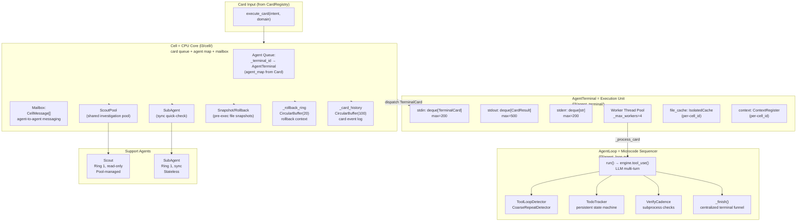
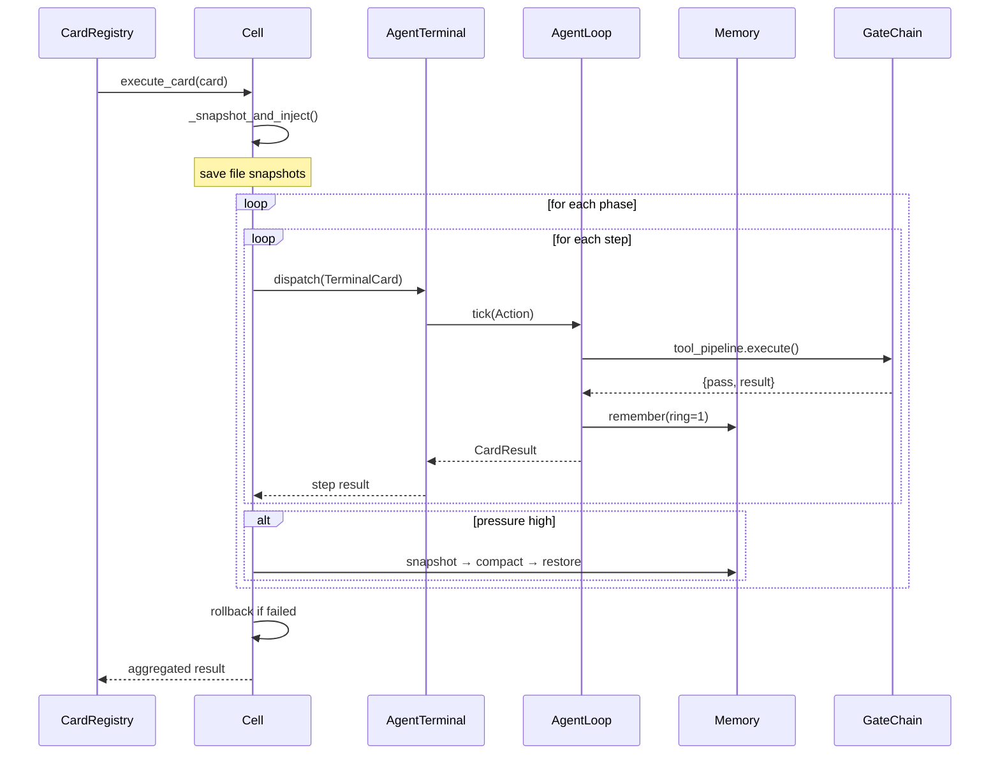

# Cell & Agent Architecture

> **Sources:** `src/l3/cell/__init__.py`, `src/l3/agent_terminal/__init__.py`

## Overview

The Cell is the **CPU core** of Praxis. It holds N AgentTerminals (execution units), a shared ScoutPool, an inter-agent mailbox, and snapshot/rollback capability.

| CPU Core Concept | Cell Equivalent |
|-----------------|----------------|
| Instruction pipeline | Card phases/steps |
| Register file | `agent_map` (role → agent_id) |
| Cache L1/L2/L3 | Memory rings R1/R2/R3 |
| Branch predictor | HTN Planner intent decomposition |
| Hyper-threading | Multi-agent parallel phase execution |
| Interrupt controller | EventBus SignalType subscription |
| Memory controller | CentralMemory (R1-R4 coordinator) |

## Cell Internal Architecture



### ASCII Architecture

```
+---------------------------------------------------------------+
|  Card Input (from CardRegistry)                               |
|  execute_card(intent, domain)                                  |
+---------------------------------------------------------------+
                               |
                               v
+---------------------------------------------------------------+
|  Cell = CPU Core (l3/cell/)                                   |
|                                                                |
|  +------------------+  +------------------+  +--------------+  |
|  | Agent Queue      |  | Mailbox          |  | ScoutPool    |  |
|  | agent_map → term |  | CellMessage[]    |  | (read-only)  |  |
|  +------------------+  +------------------+  +--------------+  |
|  +------------------+  +------------------+  +--------------+  |
|  | _rollback_ring   |  | _card_history    |  | _card_       |  |
|  | CircularBuffer(20)|  | CircularBuffer(100)| | snapshots   |  |
|  +------------------+  +------------------+  +--------------+  |
|  +------------------+                                         |
|  | SubAgent         |                                         |
|  | (sync quick-check)|                                         |
|  +------------------+                                         |
+---------------------------------------------------------------+
      |        |                        |              |
      v        v                        v              v
+------------+ +------------+ +---------------+ +----------+
| stdin      | | stdout     | | Worker Pool   | | File     |
| TerminalCard| | CardResult | | max_workers=4 | | Cache    |
| deque(200) | | deque(500) | | threads       | | per-cell |
+------------+ +------------+ +---------------+ +----------+
      |                                              |
      v                                              v
+----------------------------------+     +-------------------+
| AgentLoop = Microcode Sequencer  |     | Memory (3-ring)   |
| run() → LLM tool_use()           |     | ContextRegister   |
| ToolLoopDetector + TodoTracker   |     +-------------------+
| VerifyCadence + _finish()        |
+----------------------------------+
```

## Card Execution Flow (Inside Cell)



## Cell (`l3/cell/__init__.py`)

### Internal State

| Field | Type | Purpose |
|-------|------|---------|
| `cell_id` | `str` | Unique Cell identifier |
| `territory` | `list[str]` | Covered file system paths |
| `_agents` | `dict[str, AgentInfo]` | Registered agents with roles/rings |
| `_mailbox` | `dict[str, list[CellMessage]]` | Per-agent message queues |
| `_rollback_ring` | `CircularBuffer(20)` | Rollback context history |
| `_card_history` | `CircularBuffer(100)` | Card execution history |
| `_card_snapshots` | `dict[str, dict]` | Pre-execution file snapshots |
| `_scout_cache` | `dict` | Cached scout results |
| `_spawn_hooks` | `list[Callable]` | Veto-capable spawn hooks |
| `_kill_hooks` | `list[Callable]` | Veto-capable kill hooks |
| `_boot_hooks` | `list[Callable]` | Observation-only boot hooks |
| `_shutdown_hooks` | `list[Callable]` | Observation-only shutdown hooks |

### 28 Public Methods

| Method | Purpose |
|--------|---------|
| `add_agent(agent_id, role, ...)` | Register a new agent, spawn hooks may veto |
| `remove_agent(agent_id)` | Remove agent, clean memory + context + mailbox |
| `save_state(path)` | Persist Cell state (agents, conventions, snapshots) to JSON |
| `restore_state(path)` | Restore Cell state from JSON |
| `send_message(sender, target, ...)` | Agent-to-agent mailbox message |
| `read_messages(agent_id, clear)` | Read pending mailbox messages |
| `agent_reachable(agent_id)` | Ping agent terminal |
| `send_direct_message(agent_id, text)` | Queue stdin message |
| `liveness()` | Aggregate health (healthy/degraded/unreachable) |
| `agent_status(agent_id)` | Single agent status |
| `on_boot/on_shutdown/on_spawn/on_kill(hook)` | Lifecycle hooks |
| `boot_agent/boot_all(agent_id)` | Start agents |
| `shutdown_all()` | Stop all agents, reset terminals |
| `emergency_stop()` | Halt all operations (emergency flag) |
| `resume()` | Clear emergency flag, resume agents |
| `reset_agent_context(agent_id)` | Pause → compact → clear Ring 1 → restore Ring 2 |
| `dispatch_card(target, action, ...)` | Dispatch TerminalCard, auto cross-review for writes |
| `convene(issue_card)` | Multi-agent convention protocol |
| `close_convention(card_id)` | End convention |
| `handle_convention_message(...)` | Route convention message |
| `execute_card(card, domain, ...)` | Execute a Card (structured or raw), auto-decompose |
| `rollback_card(card_id)` | Restore checkpoints + file snapshots, discard sandbox |
| `decompose_card(card, domain)` | Decompose by territory |
| `agent_tools/cell_tools()` | List available tools |
| `wait_for_card(card_id, timeout)` | Block for result |
| `reuse_scout_result(template, scope, ttl)` | Cached scout result |
| `set_think_quota(distribution, **config)` | Update think quota |
| `stats()` | Full Cell snapshot |

### Factory Functions

```python
get_cell(cell_id, territory)       # Singleton factory
get_cells()                         # All registered Cells
reset_cells()                       # Clear registry
```

## AgentTerminal (`l3/agent_terminal/__init__.py`)

### Architecture

```
AgentTerminal = Execution Unit
├── stdin: deque[TerminalCard]          # max=200
├── stdout: deque[CardResult]           # max=500  
├── stderr: deque[str]                   # max=200
├── workers: list[thread] (max=4)
├── file_cache: IsolatedCache (per-cell)
├── context: ContextRegister (per-cell)
├── scout_pool: shared pool
├── todo_table: TodoTable
├── output_guard: guard_output()
├── _pending: dict[str, threading.Event]  # card_id → event
├── _results: OrderedDict[str, CardResult]
└── _lock: threading.RLock
```

### 20+ Public Methods

| Method | Purpose |
|--------|---------|
| `boot()` | Constitution check → warm memory → register context pool → load skills → start workers → emit boot signal |
| `set_tool_registry(registry)` | Set tool spec registry (from Cell) |
| `list_tools()` | Tools visible to this agent (filtered by ring + mute) |
| `dispatch(card)` | Append TerminalCard to stdin |
| `wait_for_result(card_id, timeout)` | Blocking wait for result |
| `read_stdout/read_stderr(clear)` | Read output queues |
| `add_todo/list_todos/cancel_todo/todo_stats()` | Task management |
| `spawn_scout_async(template, scope)` | Async scout investigation |
| `collect_scout/scouts(scout_id, timeout)` | Collect async scout results |
| `set_mode(mode)` | Switch assembly/direct (validated) |
| `pause/resume()` | Suspend/resume processing (status → BLOCKED) |
| `shutdown()` | Stop workers, clear state, status → STOPPED |
| `session_reachable()` | Check if accepting messages |
| `send_direct_message(text, sender)` | Queue direct message as TerminalCard |
| `status_report()` | Full state snapshot |

### Lifecycle States

```
BOOTING ──→ IDLE ──→ PROCESSING ──→ CRASHED
              │           │
              ├──→ BLOCKED│  
              │           └──→ STOPPED
              └──────────────→ STOPPED
```

### Factory Functions

```python
get_terminal(agent_id, role, territory, cell_id)  # Singleton factory
get_terminals()                                      # All terminals
reset_terminals()                                    # Shutdown + clear
```

## AgentLoop (`l3/agent_loop.py`)

Wraps `LLMEngine.tool_use()` with four self-correction mechanisms:

- **ToolLoopDetector** — SHA256(tool+args+result) identical ×3 → WARN, ×4 → STOP
- **CoarseRepeatDetector** — Same tool name ×3 → NUDGE, ×6 → STOP
- **TodoTracker** — Persistent in-context state machine; injects continuation nudge on open items
- **VerifyCadence** — write_file/edit_file → nudge build/check (at most once per edit)

```python
# Every think action injects OS-managed context
memory = get_memory()
ring_context = memory.build_context(agent_id, max_tokens=1024)
system_prompt = f"You are {agent_id} in NOMOS Praxis.\n--- Memory ---\n{ring_context}"
loop = AgentLoop(task, agent_id, system=system_prompt)
result = loop.run(max_steps=10)
memory.remember(agent_id, "thought", output, ring=1)
```

## Convention Protocol

`Cell.convene()` initiates a multi-agent meeting for card resolution:

1. L3A submits IssueCard with proposals and challenges
2. Cell dispatches to involved agents via `handle_convention_message()`
3. Agents discuss via mailbox messages (proposals, challenges, responses)
4. `convergence.py` reads the CacheDocument discussion → generates convergence summary
5. `Convergence.to_execution_card()` → creates ExecutionCard with phases
6. Card is submitted to CardRegistry for standard execution

## Key Constants

| Constant | Value | Use |
|----------|-------|-----|
| `CELL_ROLLBACK_RING_SIZE` | 20 | Rollback context entries |
| `CELL_HISTORY_RING_SIZE` | 100 | Card history entries |
| `CELL_SNAPSHOT_MAX` | 50 | Pre-execution file snapshots (capped) |
| `CELL_MAILBOX_MAX_PER_AGENT` | 100 | Max queued messages per agent |
| `CELL_MAILBOX_TTL` | 3600s | Message TTL before auto-discard |
| `TERMINAL_MAX_WORKERS` | 4 | Worker thread pool size |
| `AGENT_LOOP_DEFAULT_STEPS` | 10 | Max LLM turns per loop |
| `AGENT_LOOP_DEFAULT_TIMEOUT` | 120s | Per-loop timeout |
| `TERMINAL_SCOUT_FINDINGS_LIMIT` | 5 | Max scout findings per card |
| `TERMINAL_MODE_VALID` | `("assembly", "direct")` | Valid terminal modes |
