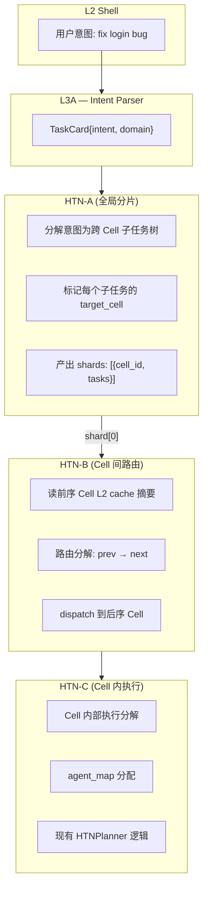
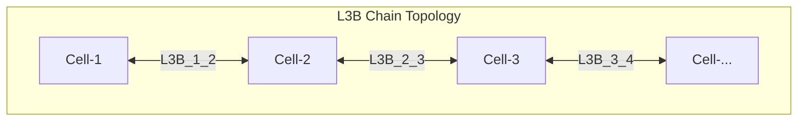

# Cross-Cell Architecture & L3 Decomposition

> **Sources:** `l3/l3.py`, `l3/l3a.py`, `l3/l3b.py`, `l3/l3b_bus.py`, `l3/l3b_message_pool.py`,  
> `l3/htn_a.py`, `l3/htn_b.py`, `l3/htn_planner.py`, `l3/cell_cache.py`,  
> `l3/cell_types.py`, `l1/kernel/params/system.py`

## L3 Architecture Overview

```
L2 Shell (用户输入)
  │
  ├── /command ─────────────────────────────→ 直接执行
  │
  └── 自然语言 ──→ L3A (意图 → Card)
       │               ↑
       │               │ 纠正回路
       │               │
       │          L3C (行为采集) ──→ CellCache / Memory
       │               │
       │               ├── 采集用户纠正模式
       │               ├── 采集意图→工具映射偏好
       │               └── 采集会话习惯
       │
       └──→ HTN-A (全局意图分片)
              │
              ├── L3B[1↔2] ──→ Cell-1
              ├── L3B[2↔3] ──→ Cell-2
              └── L3B[3↔4] ──→ Cell-3
```

## Triple HTN Decomposition



| Layer | Name | Scope | Function |
|-------|------|-------|----------|
| HTN-A | Global Sharder | 全部 Cell | 将用户意图分解为跨 Cell 子任务树，标记每个子任务的目标 Cell |
| HTN-B | Cell Router | 相邻 2 Cell | 读前序 Cell L2 cache，路由分解，dispatch 到后序 Cell |
| HTN-C | Cell Executor | 单个 Cell | Cell 内部执行分解，agent_map 分配，现有 planner 逻辑 |

## L3B Composite Chain

每个 L3B 复合体 = HTN-B + 路由能力，插在两个相邻 Cell 之间：



### L3BComposite 约束

| 规则 | 说明 |
|------|------|
| 只能读前序 Cell 的 L2 cache | `read_prev_cache()`, 不能读后序 |
| 只能 dispatch 到后序 Cell | `dispatch_to_next()`, 不能跨跳 |
| 数量 = max(0, Cell_count - 1) | 随 Cell 注册自动创建/销毁 |
| 通信走 L3B 总线 | 链式拓扑，不能跨级 |

### L3B Bus

```python
# l3b_bus.py — 5 种消息类型
class L3BMessageType(Enum):
    CARD_FORWARD = auto()   # 向前传递卡分片
    RESULT_BACK = auto()    # 向后回传执行结果
    STATUS_CHECK = auto()   # 状态查询
    BACKPRESSURE = auto()   # 反压信号（下游繁忙→上游降速）
    HEARTBEAT = auto()      # 心跳
```

### L3B Message Pool (双层缓冲)

消息通道复用了记忆系统的环形缓冲+持久化设计：

```python
# l3b_message_pool.py
_HOT_RING_SIZE = 200                # 热区环形缓冲
_PERSIST_HIGH_WATERMARK = 0.8       # Hot Ring 使用率≥80% → 启用 persist
_BACKPRESSURE_THRESHOLD = 1000      # 持久化积压≥1000 → 发反压
_BACKPRESSURE_COOLDOWN = 30.0       # 反压后 30s 内不再重复
```

```
消息写入 → Hot Ring (deque, 200条)
            │ 满 80%
            v
         Persist Queue (SQLite)
            │ 积压 1000 条
            v
         BACKPRESSURE 信号 → 上游降速
```

## L3A + L3C (意图解析 + 行为采集)

### L3A (当前—175行)

```python
class L3A:
    def process_intent(self, text: str) -> Card:
        # LLM 解析意图 → 生成 TaskCard
        # 当前无用户画像、无行为学习
```

### L3C (设计方向)

L3C 与 L3A 同级，从通信侧采集用户行为来纠正 L3A 的意图解析：

| 采集类型 | 来源 | 用途 |
|---------|------|------|
| 意图纠正 | 用户修改 L3A 产出的 Card | 优化 intent→Card 映射 |
| 工具选择偏好 | 用户手动 `/spawn` 而非自然语言 | 学习用户工作流 |
| 命令 vs NLP 切换 | 用户何时用 `/command` 而非自然语言 | 自适应交互模式 |
| 重复会话模式 | 用户每日/每周的固定任务 | 自动预加载、快捷命令建议 |

```
L3A parse "修复 bug" → Card(xx)
  └── 用户改成手动操作
        └── L3C 记录纠正
              └── 下次 L3A + L3C 联合产出更精确的 Card
```

数据存储：→ CellCache (热) → MemoryManager R2/R3 (持久)

## Composite Four-Level Memory

### Per-Cell L2 Cache (CellCache)

```
                          MemoryManager (L3 global, R1/R2/R3)
                               ↑ flush / promote
                          ┌────┴────┐
                          │ CellCache (L2, per-Cell) │
                          ├─ Hot Ring:  deque[IndexEntry] (50条, 5min TTL)
                          ├─ Index Chain: dict[key→IndexEntry] (200条, 15min TTL)
                          └─ KV Cache:   dict[key→CellCacheEntry] (100值, 30min TTL)
                          └─────────┬─────────┘
                                    ↑ inject / lookup / search
                               Cell → Agents (共享热数据)
```

### 完整四级层次

| 层级 | 名称 | 作用域 | 容量 | TTL | 后端 |
|------|------|--------|------|-----|------|
| L1 | ContextRegister | per-Agent | 可变 | 会话级 | 内存 |
| L2 | CellCache | per-Cell | 50/200/100 条 | 5min/15min/30min | 内存 |
| L3 | MemoryManager | 全局 | 32/200/1000 条 | 30min/24h/∞ | deque/JSONL/SQLite |
| L4 | R4Agent | 全局 | ∞ | ∞ | 磁盘 |

### 数据流

```
Agent 产生数据 → CellCache.inject()
  → Hot Ring (即刻可见于同 Cell 所有 agent)
  → Index Chain (淘汰后仍存活)
  → KV Cache (完整值)
  → 淘汰时 flush → MemoryManager.remember(ring=2/3)
  → 归档 → R4Agent
```

### 跨 Cell L2 Cache 读取

```python
# l3b.py — L3BComposite.read_prev_cache()
# 只读前序 Cell 的 L2 cache，不查全局 L3
cell = get_cell(self.prev_cell)
hits = cell.cache.search(query, limit=limit)
```

## Key Constants

| Constant | Value | Component |
|----------|-------|-----------|
| `CELL_CACHE_HOT_SIZE` | 50 | CellCache Hot Ring |
| `CELL_CACHE_INDEX_SIZE` | 200 | CellCache Index Chain |
| `CELL_CACHE_KV_SIZE` | 100 | CellCache KV Cache |
| `CELL_CACHE_HOT_TTL` | 300.0 | 5 min |
| `CELL_CACHE_INDEX_TTL` | 900.0 | 15 min |
| `CELL_CACHE_KV_TTL` | 1800.0 | 30 min |
| `_HOT_RING_SIZE` | 200 | L3B Message Pool |
| `_BACKPRESSURE_THRESHOLD` | 1000 | L3B Message Pool |
