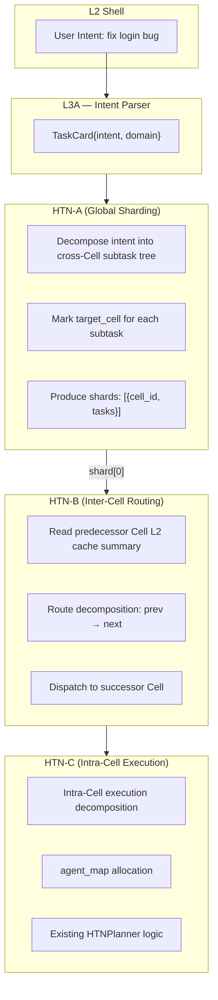
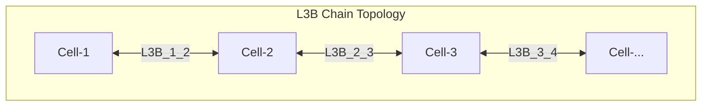

# Cross-Cell Architecture & L3 Decomposition

> **Sources:** `l3/cell/peers/l3.py`, `l3/cell/peers/l3a.py`, `l3/bus/l3b.py`, `l3/bus/l3b_bus.py`, `l3/bus/l3b_message_pool.py`,  
> `l3/bus/htn_a.py`, `l3/bus/htn_b.py`, `l3/bus/htn_planner.py`, `l3/cell/components/cell_cache.py`,  
> `l3/cell/components/cell_types.py`, `l1/kernel/params/system.py`

## L3 Architecture Overview

```
L2 Shell (User Input)
  │
  ├── /command ─────────────────────────────→ Direct Execution
  │
  └── Natural Language ──→ L3A (Intent → Card)
       │               ↑
       │               │ Correction Loop
       │               │
       │          L3C (Behavior Collection) ──→ CellCache / Memory
       │               │
       │               ├── Collect user correction patterns
       │               ├── Collect intent→tool mapping preferences
       │               └── Collect session habits
       │
       └──→ HTN-A (Global Intent Sharding)
              │
              ├── L3B[1↔2] ──→ Cell-1
              ├── L3B[2↔3] ──→ Cell-2
              └── L3B[3↔4] ──→ Cell-3
```

## Triple HTN Decomposition



| Layer | Name | Scope | Function |
|-------|------|-------|----------|
| HTN-A | Global Sharder | All Cells | Decompose user intent into cross-Cell subtask tree, mark the target Cell for each subtask |
| HTN-B | Cell Router | Adjacent 2 Cells | Read predecessor Cell L2 cache, route decomposition, dispatch to successor Cell |
| HTN-C | Cell Executor | Single Cell | Intra-Cell execution decomposition, agent_map allocation, existing planner logic |

## L3B Composite Chain

Each L3B Composite = HTN-B + routing capability, inserted between two adjacent Cells:



### L3BComposite Constraints

| Rule | Description |
|------|------|
| Can only read predecessor Cell L2 cache | `read_prev_cache()`, cannot read successor |
| Can only dispatch to successor Cell | `dispatch_to_next()`, cannot skip |
| Count = max(0, Cell_count - 1) | Auto-created/destroyed with Cell registration |
| Communication via L3B Bus | Chain topology, cannot cross levels |

### L3B Bus

```python
# l3/bus/l3b_bus.py — 5 message types
class L3BMessageType(Enum):
    CARD_FORWARD = auto()   # Forward card shard
    RESULT_BACK = auto()    # Return execution result backward
    STATUS_CHECK = auto()   # Status query
    BACKPRESSURE = auto()   # Backpressure signal (downstream busy → upstream slow down)
    HEARTBEAT = auto()      # Heartbeat
```

### L3B Message Pool (Dual-Layer Buffer)

The message channel reuses the memory system's ring buffer + persistence design:

```python
# l3/bus/l3b_message_pool.py
_HOT_RING_SIZE = 200                # Hot ring buffer
_PERSIST_HIGH_WATERMARK = 0.8       # Hot Ring usage ≥80% → enable persist
_BACKPRESSURE_THRESHOLD = 1000      # Persist backlog ≥1000 → send backpressure
_BACKPRESSURE_COOLDOWN = 30.0       # No repeat within 30s after backpressure
```

```
Message write → Hot Ring (deque, 200 entries)
            │ 80% full
            v
         Persist Queue (SQLite)
            │ 1000 backlogged
            v
         BACKPRESSURE signal → upstream slow down
```

## L3A + L3C (Intent Parsing + Behavior Collection)

### L3A (Current — 175 lines)

```python
class L3A:
    def process_intent(self, text: str) -> Card:
        # LLM parses intent → generate TaskCard
        # Currently no user profiling, no behavior learning
```

### L3C (Design Direction)

L3C is peer to L3A, collecting user behavior from the communication side to correct L3A's intent parsing:

| Collection Type | Source | Purpose |
|---------|------|------|
| Intent correction | User modifies Card produced by L3A | Optimize intent→Card mapping |
| Tool selection preference | User manually `/spawn` instead of natural language | Learn user workflow |
| Command vs NLP switching | When user uses `/command` instead of natural language | Adaptive interaction mode |
| Repeated session patterns | User's daily/weekly regular tasks | Auto preload, shortcut command suggestions |

```
L3A parse "fix bug" → Card(xx)
  └── User changes to manual operation
        └── L3C records correction
              └── Next time, L3A + L3C jointly produce a more accurate Card
```

Data storage: → CellCache (hot) → MemoryManager R2/R3 (persistent)

## Composite Four-Level Memory

### Per-Cell L2 Cache (CellCache)

```
                          MemoryManager (L3 global, R1/R2/R3)
                               ↑ flush / promote
                          ┌────┴────┐
                          │ CellCache (L2, per-Cell) │
                          ├─ Hot Ring:  deque[IndexEntry] (50 entries, 5min TTL)
                          ├─ Index Chain: dict[key→IndexEntry] (200 entries, 15min TTL)
                          └─ KV Cache:   dict[key→CellCacheEntry] (100 values, 30min TTL)
                          └─────────┬─────────┘
                                    ↑ inject / lookup / search
                               Cell → Agents (shared hot data)
```

### Complete Four-Level Hierarchy

| Level | Name | Scope | Capacity | TTL | Backend |
|------|------|--------|------|-----|------|
| L1 | ContextRegister | per-Agent | Variable | Session | Memory |
| L2 | CellCache | per-Cell | 50/200/100 entries | 5min/15min/30min | Memory |
| L3 | MemoryManager | Global | 32/200/1000 entries | 30min/24h/∞ | deque/JSONL/SQLite |
| L4 | R4Agent | Global | ∞ | ∞ | Disk |

### Data Flow

```
Agent produces data → CellCache.inject()
  → Hot Ring (immediately visible to all agents in same Cell)
  → Index Chain (survives after eviction)
  → KV Cache (full value)
  → Flush on eviction → MemoryManager.remember(ring=2/3)
  → Archive → R4Agent
```

### Cross-Cell L2 Cache Read

```python
# l3/bus/l3b.py — L3BComposite.read_prev_cache()
# Only read predecessor Cell's L2 cache, don't query global L3
cell = get_cell(self.prev_cell)
hits = cell.cache.search(query, limit=limit)
```

## Key Constants

| Constant | Value | Component |
|----------|-------|-----------|
| `CELL_CACHE_HOT_SIZE` | 50 | CellCache Hot Ring |
| `CELL_CACHE_INDEX_SIZE` | 200 | CellCache Index Chain |
| `CELL_CACHE_KV_SIZE` | 100 | CellCache KV Cache |
| `CELL_CACHE_HOT_TTL` | 300.0 | 5 min |
| `CELL_CACHE_INDEX_TTL` | 900.0 | 15 min |
| `CELL_CACHE_KV_TTL` | 1800.0 | 30 min |
| `_HOT_RING_SIZE` | 200 | L3B Message Pool |
| `_BACKPRESSURE_THRESHOLD` | 1000 | L3B Message Pool |
