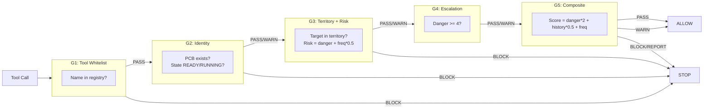

# GateChain G1-G5

> **Source:** `src/l1/kernel/gatechain.py` (278 lines)  
> **Constants:** `params/kernel.py` — `GateStatus` (PASS/WARN/BLOCK/REPORT)

## Architecture

GateChain is a non-bypassable tool authorization pipeline with **5 gates**. Every tool call passes through all gates before execution. Results are recorded in a `ToolHistoryLedger` for risk analysis.



## Five Gates

| Gate | Function | What it checks | Decision |
|------|----------|---------------|----------|
| **G1** | `_gate_g1` | Tool name is in `_known_tools` whitelist | PASS / BLOCK |
| **G2** | `_gate_g2` | Agent exists in ProcessTable, state is READY/RUNNING, has Ed25519 keypair | PASS / WARN / BLOCK |
| **G3** | `_gate_g3` | Target within agent's territory + risk score (danger × frequency mod) | PASS / WARN / BLOCK |
| **G4** | `_gate_g4` | Danger level >= 4 triggers L3 notification | PASS / WARN |
| **G5** | `_gate_g5` | Composite: reputation × danger × history × frequency + stagnation | PASS / WARN / BLOCK / REPORT |

## GateStatus

| Status | Meaning |
|--------|---------|
| `PASS` | Gate check passed |
| `WARN` | Allowed but flagged (e.g., risk high, no keypair) |
| `BLOCK` | Rejected (fail-closed) |
| `REPORT` | Reported to L3 for review |

## G5 Composite Scoring

```
score = danger_level * GATECHAIN_DANGER_WEIGHT(2)
      + history_count * GATECHAIN_HISTORY_WEIGHT(0.5)
      + frequency * GATECHAIN_FREQ_WEIGHT(1.0)
```

| Condition | Result |
|-----------|--------|
| Reputation >= 0.9 + G3 WARN | PASS (high tolerance) |
| Reputation < 0.7 + G3 WARN | BLOCK |
| Repeated + high frequency same tool | REPORT |
| Repetition count >= 5 + continuous | WARN / REPORT |

## Danger Levels

| Level | Label | Example Gates |
|-------|-------|--------------|
| 0 | read_only | G1, G2 |
| 1 | safe_write | G1, G2, G3, G4 |
| 2 | dangerous | G1, G2, G3, G4 |
| 3 | destructive | G1, G2, G3, G4, G5 |

## ToolPolicy Integration

ToolPolicy (`l3/tool_policy.py`) adds a higher-level visibility layer before GateChain:

| Layer | Priority | Scope |
|-------|----------|-------|
| SESSION | 5 | Per-session override |
| AGENT | 4 | Per-agent policy |
| ROLE | 3 | Per-role policy |
| CELL | 2 | Per-Cell policy |
| GLOBAL | 1 | Global default |

Actions: `disable`, `enable`, `require_approval`. Integrates with `ApprovalGate` for wait/approve/reject.

## Key Constants

| Constant | Value | Use |
|----------|-------|-----|
| `GATECHAIN_RISK_WARN_THRESHOLD` | 6.0 | G3 risk threshold |
| `GATECHAIN_REPEAT_THRESHOLD` | 5 | G5 repeat detection |
| `GATECHAIN_HIGH_FREQ_THRESHOLD` | 3 | G5 frequency |
| `GATECHAIN_DANGER_WEIGHT` | 2 | G5 scoring |
| `GATECHAIN_LEDGER_LIMIT` | 100 | History ledger size |
