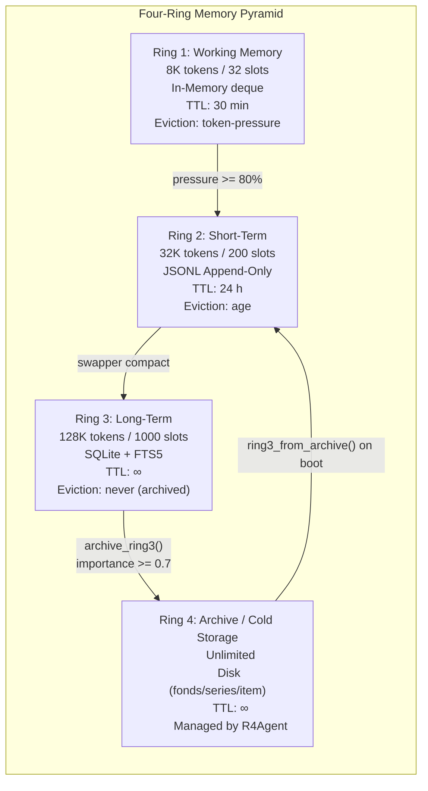
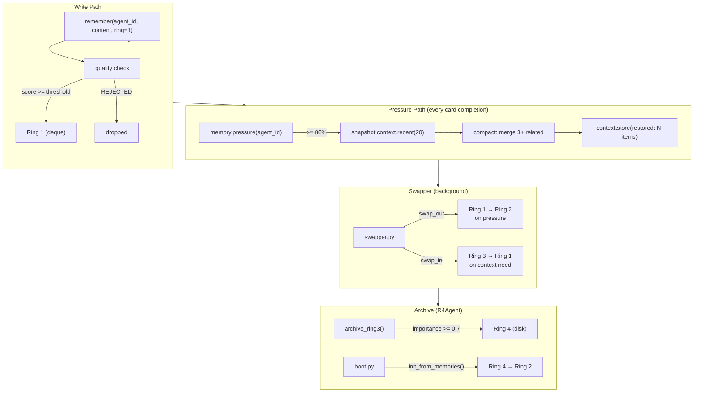

# Memory System

> **Source:** `src/l3/memory.py` (562 lines), `memory_ring.py` (153 lines), `memory_quality.py` (92 lines),  
> `central_memory.py` (169 lines), `archive_orchestrator.py` (104 lines), `r4_agent.py` (443 lines)

## Four-Ring Architecture



| Ring | Name | Budget | Slots | TTL | Backend | Eviction |
|------|------|--------|-------|-----|---------|----------|
| 1 | Working | 8K tokens | 32 | 30 min | deque in-memory | token pressure |
| 2 | Short-Term | 32K tokens | 200 | 24 h | JSONL file | age / FIFO |
| 3 | Long-Term | 128K tokens | 1000 | ∞ | SQLite + FTS5 | never → archive |
| 4 | Archive | ∞ | ∞ | ∞ | disk directories | R4Agent lifecycle |

## MemEntry

```python
@dataclass
class MemEntry:
    id: str
    agent_id: str          # Primary partition key
    cell_id: str = ""      # Cell partition (per-Cell isolation)
    entry_type: str        # boot, thought, observation, card_result, ...
    content: str
    tokens: int = 0
    tags: list[str]
    source: str = ""
    fingerprint: str = ""
    importance: float = 0.5
    timestamp: float
    ttl: float = 0.0
```

## MemoryManager (singleton)

All memory operations go through `get_memory()` in `l3/memory.py`.

### Key Methods

| Method | Description |
|--------|-------------|
| `remember(agent_id, entry_type, content, cell_id=..., ring=1)` | Store with quality validation, returns entry ID |
| `recall(agent_id, entry_type, tag, rings, limit, cell_id=...)` | Multi-ring filtered query |
| `build_context(agent_id, max_tokens=4096)` | Build LLM context string with watermark |
| `compact(agent_id, ring=0)` | Merge 3+ related entries → summary in Ring 2 |
| `stub_compact(agent_id, keep_recent_turns, min_collapse_size)` | Stub old tool results to save tokens |
| `quality_report(agent_id)` | Memory quality distribution report |
| `forget_agent(agent_id)` | Clear all entries for an agent across all rings |
| `forget_cell(cell_id)` | Clear all entries for a Cell |
| `pressure(agent_id) -> dict` | Memory pressure check: returns `{level, working_pct, short_pct, long_pct}` |
| `stats()` | Entry counts per ring |
| `search_long_term(query, agent_id, limit)` | FTS5 full-text search on Ring 3 |

### Memory Quality

Auto-scores each entry 0.0-1.0 on write, rejects low quality:

| Criterion | Bonus/Penalty | Example |
|-----------|--------------|---------|
| Type: decision/pattern | +0.3 | "use Poetry not pip" |
| Contains file path | +0.1 | "~/code/api uses Go 1.22" |
| Contains IP/version | +0.1 | "staging at 10.0.1.50" |
| Contains port | +0.05 | "SSH port 2222 not 22" |
| Contains env var | +0.05 | "DATABASE_URL=..." |
| Too short (<30 chars) | REJECTED | "read file" |
| Too long (>2000 chars) | REJECTED | raw log dump |
| Vague pattern | REJECTED | "user has a project" |

### Ring 3: FTS5 Full-Text Search

Ring 3 is backed by SQLite with FTS5 virtual table:

```python
# CREATE VIRTUAL TABLE knowledge_fts USING fts5(...)
entries = memory.search_long_term(query="port configuration",
                                   agent_id="agent-1", limit=10)
```

### Ring 4: Archive (R4Agent)

The R4 agent (`l3/r4_agent.py`) manages cold storage with `archive_orchestrator.py`:

| Function | Description |
|----------|-------------|
| `archive_ring3(mem)` | Archive Ring 3 entries with importance >= 0.7 to Ring 4 |
| `restore_ring3(limit)` | Restore archived entries back to Ring 3 on boot |
| `get_lean_cases()` | Retrieve lean case examples from archive |
| `evolve_skill(intent)` | Evolve a new skill from archived patterns |

Standalone function in `archive_orchestrator.py`:

| Function | Description |
|----------|-------------|
| `ring3_from_archive(mem)` | Restore recent Archive entries into Ring 3 knowledge (called by boot) |

## CentralMemory (coordinator)

`l3/central_memory.py` wraps `MemoryManager` with quality gate and archive orchestration:

| Method | Description |
|--------|-------------|
| `remember(agent_id, content, *, cell_id=..., ring=1)` | Quality gate (Rings 1-3) + store; Ring 4 → direct archive |
| `recall(agent_id, query, tags, rings)` | Search + sort by timestamp |
| `compact(agent_id, ring=0)` | Trigger compaction |
| `archive_ring3(mem)` | Incremental Ring 3 → Ring 4 archive via R4Agent |
| `stats()` | Aggregated memory + R4 stats |

## Memory Rings Data Flow



## Cell-Level Memory Management

Each memory entry carries a `cell_id` for Cell-scoped queries:

- `MemoryManager.recall(cell_id="cell-1")` — query all agents in a Cell
- `MemoryManager.forget_cell(cell_id)` — destroy all Cell memory
- `Cell.remove_agent()` calls `memory.forget_agent()` + `context_pool.unregister()`

### ContextPool

`l3/context_pool.py` provides per-agent `ContextManager` instances with Cell mapping:

| Function | Description |
|----------|-------------|
| `register(agent_id, cell_id)` | Create per-agent context, register cell mapping |
| `unregister(agent_id)` | Remove agent from pool |
| `get(agent_id)` | Retrieve agent's context manager |
| `token_usage(agent_id)` | Token count per agent |
| `cell_total(cell_id)` | Sum tokens for all agents in a Cell |
| `all_cell_totals()` | Aggregate across all Cells |

### CellTokenMerger

`l3/cell_token_merger.py` runs a background thread per Cell that polls `cell_total()` every 60s and emits token usage signals:

- → **CentralCollector** via EventBus (`EVENT_TOKEN_USAGE`)
- → **MonitorBus** as `MonitorEvent(type="token.cell.usage")`

## Memory → AgentLoop Bridge

```python
# In _term_handlers.py — every think action auto-injects context:
memory = get_memory()
ring_context = memory.build_context(agent_id, max_tokens=1024)
system_prompt = f"You are {agent_id} in NOMOS Praxis.\n"
if ring_context:
    system_prompt += f"\n--- Memory Context ---\n{ring_context}\n---"
loop = AgentLoop(task=task, agent_id=agent_id, system=system_prompt)
result = loop.run(max_steps=10)
memory.remember(agent_id, "thought", output, ring=1)
```

## Memory Budgets

| Constant | Value | Ring |
|----------|-------|------|
| `MEMORY_RING_WORKING_BUDGET` | 8192 | R1 |
| `MEMORY_RING_SHORT_BUDGET` | 32768 | R2 |
| `MEMORY_RING_LONG_BUDGET` | 131072 | R3 |
| `MEMORY_RING_WORKING_TTL` | 1800.0 (30 min) | R1 |
| `MEMORY_RING_SHORT_TTL` | 86400.0 (24h) | R2 |
| `MEMORY_RING_LONG_TTL` | 0.0 (∞) | R3 |
| `ARCHIVE_IMPORTANCE_THRESHOLD` | 0.7 | R3 → R4 gate |
| `ARCHIVE_RESTORE_LIMIT` | 100 | R4 → R2 on boot |
| `MEMORY_BUILD_CONTEXT_LIMIT` | 10 | Max entries per context build |
