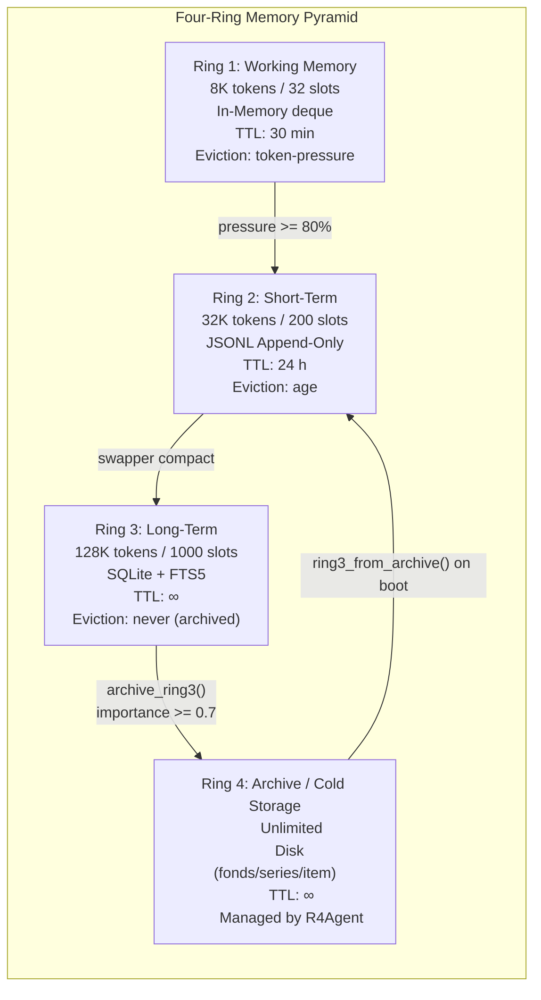
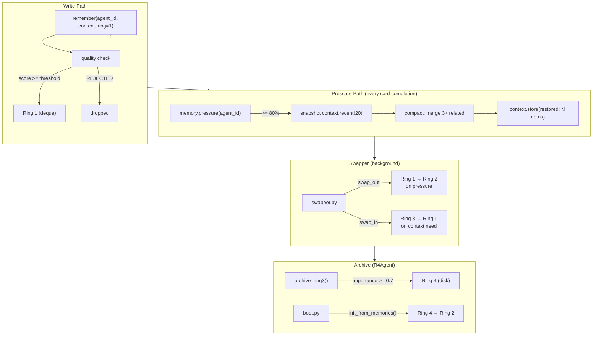
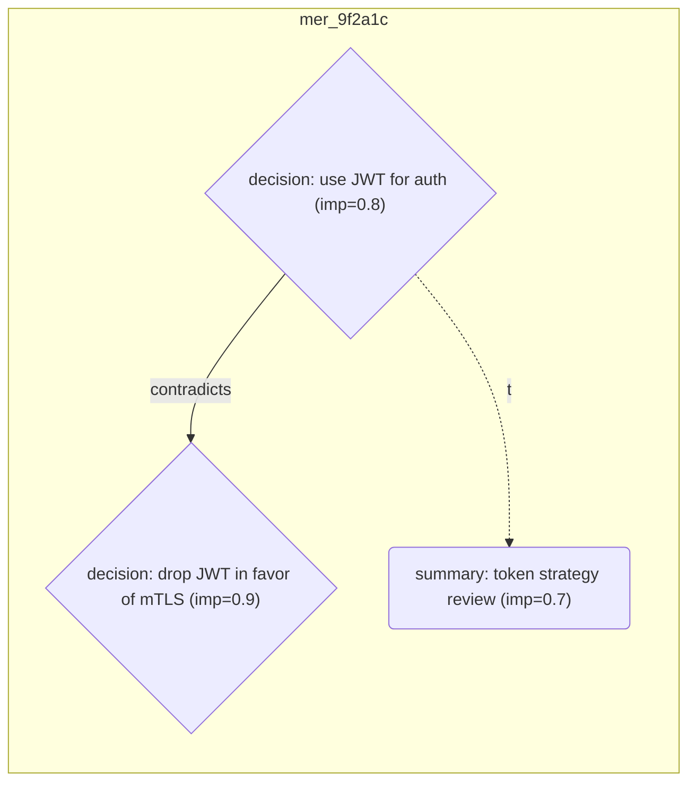

# Memory System

> **Source:** `src/l3/memory/memory.py` (480 lines), `memory/memory_ring.py` (153 lines), `memory/memory_quality.py` (92 lines),  
> `memory/central_memory.py` (169 lines), `memory/archive_orchestrator.py` (104 lines), `memory/r4_agent.py` (443 lines)

## Four-Ring Architecture



| Ring | Name | Budget | Slots | TTL | Backend | Eviction |
|------|------|--------|-------|-----|---------|----------|
| 1 | Working | 8K tokens | 32 | 30 min | deque in-memory | token pressure |
| 2 | Short-Term | 32K tokens | 200 | 24 h | JSONL file | age / FIFO |
| 3 | Long-Term | 128K tokens | 1000 | ∞ | SQLite + FTS5 | never → archive |
| 4 | Archive | ∞ | ∞ | ∞ | disk directories | R4Agent lifecycle |

## MemEntry

```python
@dataclass
class MemEntry:
    id: str
    agent_id: str          # Primary partition key
    cell_id: str = ""      # Cell partition (per-Cell isolation)
    entry_type: str        # boot, thought, observation, card_result, ...
    content: str
    tokens: int = 0
    tags: list[str]
    source: str = ""
    fingerprint: str = ""
    importance: float = 0.5
    timestamp: float
    ttl: float = 0.0
```

## MemoryManager (singleton)

All memory operations go through `get_memory()` in `l3/memory/memory.py`.

### Key Methods

| Method | Description |
|--------|-------------|
| `remember(agent_id, entry_type, content, cell_id=..., ring=1)` | Store with quality validation, returns entry ID |
| `recall(agent_id, entry_type, tag, rings, limit, cell_id=...)` | Multi-ring filtered query |
| `build_context(agent_id, max_tokens=4096)` | Build LLM context string with watermark |
| `compact(agent_id, ring=0)` | Merge 3+ related entries → summary in Ring 2 |
| `stub_compact(agent_id, keep_recent_turns, min_collapse_size)` | Stub old tool results to save tokens |
| `quality_report(agent_id)` | Memory quality distribution report |
| `forget_agent(agent_id)` | Clear all entries for an agent across all rings |
| `forget_cell(cell_id)` | Clear all entries for a Cell |
| `pressure(agent_id) -> dict` | Memory pressure check: returns `{level, working_pct, short_pct, long_pct}` |
| `stats()` | Entry counts per ring |
| `search_long_term(query, agent_id, limit)` | FTS5 full-text search on Ring 3 |

### Memory Quality

Auto-scores each entry 0.0-1.0 on write, rejects low quality:

| Criterion | Bonus/Penalty | Example |
|-----------|--------------|---------|
| Type: decision/pattern | +0.3 | "use Poetry not pip" |
| Contains file path | +0.1 | "~/code/api uses Go 1.22" |
| Contains IP/version | +0.1 | "staging at 10.0.1.50" |
| Contains port | +0.05 | "SSH port 2222 not 22" |
| Contains env var | +0.05 | "DATABASE_URL=..." |
| Too short (<30 chars) | REJECTED | "read file" |
| Too long (>2000 chars) | REJECTED | raw log dump |
| Vague pattern | REJECTED | "user has a project" |

### Ring 3: FTS5 Full-Text Search

Ring 3 is backed by SQLite with FTS5 virtual table:

```python
# CREATE VIRTUAL TABLE knowledge_fts USING fts5(...)
entries = memory.search_long_term(query="port configuration",
                                   agent_id="agent-1", limit=10)
```

### Ring 4: Archive (R4Agent)

The R4 agent (`l3/memory/r4_agent.py`) manages cold storage with `memory/archive_orchestrator.py`:

| Function | Description |
|----------|-------------|
| `archive_ring3(mem)` | Archive Ring 3 entries with importance >= 0.7 to Ring 4 |
| `restore_ring3(limit)` | Restore archived entries back to Ring 3 on boot |
| `get_lean_cases()` | Retrieve lean case examples from archive |
| `evolve_skill(intent)` | Evolve a new skill from archived patterns |

Standalone function in `memory/archive_orchestrator.py`:

| Function | Description |
|----------|-------------|
| `ring3_from_archive(mem)` | Restore recent Archive entries into Ring 3 knowledge (called by boot) |

## CentralMemory (coordinator)

`l3/memory/central_memory.py` wraps `MemoryManager` with quality gate and archive orchestration:

| Method | Description |
|--------|-------------|
| `remember(agent_id, content, *, cell_id=..., ring=1)` | Quality gate (Rings 1-3) + store; Ring 4 → direct archive |
| `recall(agent_id, query, tags, rings)` | Search + sort by timestamp |
| `compact(agent_id, ring=0)` | Trigger compaction |
| `archive_ring3(mem)` | Incremental Ring 3 → Ring 4 archive via R4Agent |
| `stats()` | Aggregated memory + R4 stats |

## Memory Rings Data Flow



## Cell-Level Memory Management

Each memory entry carries a `cell_id` for Cell-scoped queries:

- `MemoryManager.recall(cell_id="cell-1")` — query all agents in a Cell
- `MemoryManager.forget_cell(cell_id)` — destroy all Cell memory
- `Cell.remove_agent()` calls `memory.forget_agent()` + `context_pool.unregister()`

### ContextPool

`l3/memory/context_pool.py` provides per-agent `ContextManager` instances with Cell mapping:

| Function | Description |
|----------|-------------|
| `register(agent_id, cell_id)` | Create per-agent context, register cell mapping |
| `unregister(agent_id)` | Remove agent from pool |
| `get(agent_id)` | Retrieve agent's context manager |
| `token_usage(agent_id)` | Token count per agent |
| `cell_total(cell_id)` | Sum tokens for all agents in a Cell |
| `all_cell_totals()` | Aggregate across all Cells |

### CellTokenMerger

`l3/cell/components/cell_token_merger.py` runs a background thread per Cell that polls `cell_total()` every 60s and emits token usage signals:

- → **CentralCollector** via EventBus (`EVENT_TOKEN_USAGE`)
- → **MonitorBus** as `MonitorEvent(type="token.cell.usage")`

## Memory → AgentLoop Bridge

```python
# In l3/agent/_term_handlers.py — every think action auto-injects context:
memory = get_memory()
ring_context = memory.build_context(agent_id, max_tokens=1024)
system_prompt = f"You are {agent_id} in NOMOS Praxis.\n"
if ring_context:
    system_prompt += f"\n--- Memory Context ---\n{ring_context}\n---"
loop = AgentLoop(task=task, agent_id=agent_id, system=system_prompt)
result = loop.run(max_steps=10)
memory.remember(agent_id, "thought", output, ring=1)
```

## Memory Budgets

| Constant | Value | Ring |
|----------|-------|------|
| `MEMORY_RING_WORKING_BUDGET` | 8192 | R1 |
| `MEMORY_RING_SHORT_BUDGET` | 32768 | R2 |
| `MEMORY_RING_LONG_BUDGET` | 131072 | R3 |
| `MEMORY_RING_WORKING_TTL` | 1800.0 (30 min) | R1 |
| `MEMORY_RING_SHORT_TTL` | 86400.0 (24h) | R2 |
| `MEMORY_RING_LONG_TTL` | 0.0 (∞) | R3 |
| `ARCHIVE_IMPORTANCE_THRESHOLD` | 0.7 | R3 → R4 gate |
| `ARCHIVE_RESTORE_LIMIT` | 100 | R4 → R2 on boot |
| `MEMORY_BUILD_CONTEXT_LIMIT` | 10 | Max entries per context build |


## R5: MemoryGraph (群域图 — semantic topology layer)

`l3/memory/memory_graph.py` adds a semantic-topology index **above** the four rings:
R4 archives hold the lossless ground truth; R5 organizes those entries into a
graph (nodes = entries, edges = relations). The graph is a *derived* layer:
it can be rebuilt from R4, so pruning/recovery never endanger the archive.

### Layer positioning

```
R1-R3  operational memory (agent runtime access)
R4     lossless archive (snapshot, rollback baseline, audit source)
R5     graph index (topology — navigation, compression, diffusion recall)
```

### Edge types

| Relation | Source | Weight | Meaning |
|----------|--------|--------|---------|
| `sequential` | rule (auto) | 1.0 | same-agent write chain |
| `type_chain` | rule (auto) | 1.2 | same agent + same entry_type (strongest rule edge) |
| `cell_chain` | rule (auto) | 0.8 | same cell, different agent |
| `contradicts` | semantic (explicit/LLM) | 1.5 | B overturns/conflicts with A |
| `depends_on` | semantic (explicit/LLM) | 1.5 | B builds on/requires A |
| `refines` | semantic (explicit/LLM) | 1.5 | B refines A |

Every edge records `created_by` + `created_at` (attribution/governance).

### Semantic-extraction state machine

```
off → rules → hybrid ⇄ paused
  off    : no semantic extraction (default)
  rules  : rule edges only (zero LLM cost)
  hybrid : LLM extracts contradicts/depends_on/refines (compress time)
  paused : auto-degraded on LLM engine failure (recoverable)

Transitions are validated (no arbitrary jumps); each transition emits
`stats.memory.graph.edge_mode` on the time bus. Extraction is bounded:
max 5 pairs/run, 10s timeout, 256 output tokens.
```

### Switch & config

```yaml
# config/praxis.yaml
memory:
  graph:
    enabled: false          # master switch (default off = zero impact)
# runtime: SettingsCenter memory.graph.enabled / memory.graph.edge_mode
# (persisted to .praxis_settings.json)
```

### Consumption points

- `MemoryManager.recall(graph_diffusion=True)` — expand linear hits along edges
- `Session.compress()` — auto-runs graph reduction after folding (enabled only)
- `Session.resume_from_archive()` — diffuses from recent memory seeds and
  injects related context (system message, metadata `graph_recall`)
- `MemoryGraph.compact(min_degree, dry_run)` — prune leaves, keep hubs
  (small-graph guard: refuses pruning below 4 edges)
- `MemoryGraph.semantic_edges()` / `add_semantic_edge()` — semantic knowledge

### API endpoints

| Method | Path | Description |
|--------|------|-------------|
| GET  | `/api/memory/graph` | switch state + stats + compact report |
| PUT  | `/api/memory/graph` | toggle enabled (persisted) |
| POST | `/api/memory/graph/compact` | graph reduction (dry_run default) |
| POST | `/api/memory/graph/edge` | add semantic edge |
| GET  | `/api/memory/graph/semantic` | list semantic edges |

`/stats graph` (L2 shell) shows the same surface. Time-bus events:
`stats.memory.graph.switch` / `.edge_mode` / `.compact` / `.semantic`.

## Mer: Symbolic Memory Bypass (swarm-domain visualization)

`l3/memory/memory_mer.py` — a **bypass** memory transformation: it does not
touch the R1-R4 flow, but periodically aggregates high-value entries across
scopes (Cells + L3A) and renders a **Mermaid flowchart** — a "visualized
condensed version" of the swarm's memory. The diagram is archived to R4
(`agent-l3a / memory_mer_snapshot`) as an audit baseline; because the
original entries stay in R1-R4, the Mer graph can be discarded at any time
without loss.

### Data flow

```
L3A daemon tick ──► MerTransformer.transform_and_archive()
                        │
                        ├─ collect_entries(scope_ids)   ← CentralMemory: R1-R3,
                        │     high-value only (importance ≥ MER_MIN_IMPORTANCE),
                        │     across Cells + L3A scopes, per-scope bounded
                        ├─ collect_edges(node_ids)       ← R5 MemoryGraph edges
                        │     (only when memory.graph.enabled; [] otherwise)
                        ├─ to_mermaid(entries, edges)    ← symbolization
                        └─ archive_to_r4(mermaid, meta)  ← R4 agent-l3a/
                              memory_mer_snapshot (rollback baseline, audit)
```

### Mermaid symbolization (node shapes & edges)

Node **shape** encodes entry type; **label** carries type, content preview
(40 chars) and importance:

| Entry type | Shape | Mermaid |
|------------|-------|---------|
| `decision` | diamond | `e0{"decision: ... (imp=0.8)"}` |
| `summary` / `card` | rounded | `e1("summary: ... (imp=0.7)")` |
| `user` / `assistant` / `tool_call` | rectangle | `e2["assistant: ... (imp=0.5)"]` |

Edges come from two independent sources:

| Edge | Rendering | Source |
|------|-----------|--------|
| Semantic relations | solid `-->|relation|` | R5 graph (`contradicts`, `depends_on`, `refines`, ...) — only when graph enabled |
| Chronological chains | dashed `-.->|t|` | within-scope entries ordered by `timestamp` — always rendered, so temporal order is visible even without R5 |

Example output (two scopes, one semantic edge, temporal chains):



### Guarantees

- **Bypass semantics**: Mer never mutates the main memory path; on any error
  it degrades to a no-op (entries intact, R4 baseline unaffected).
- **Lossless originals**: only a *rendered* condensation is archived — the
  source entries remain in their rings, so the diagram is disposable.
- **Bounded work**: per-scope entry caps (`MER_ENTRIES_PER_SCOPE`), max scope
  count (`MER_MAX_SCOPES`), edge list truncated; driven by the L3A daemon tick.

### Switch & config

```yaml
# config/praxis.yaml
memory:
  mer:
    enabled: false          # default off = zero impact
```

Runtime: SettingsCenter `memory.mer.enabled`; API: `/api/memory/mer/status`,
`/api/memory/mer/set`, `/api/memory/mer/transform`. Monitor-bus event:
`stats.memory.mer.transform` (entries/edges/archive_ref).

## User Profile: the user-model side-channel

`l3/services/user_profile.py` — a **bypass** side-channel that grows a
typed, per-user model of preferences and decision patterns, feeding L3A
intent parsing and central (L3A) decisions. Same philosophy as Mer: it
never mutates the main memory/card flow; on error it degrades to a no-op.

### Data flow

```
User interaction (cards, approvals, sessions, API ingest)
    │  collectors (event bus: APPROVAL_RESPONDED → decision_style,
    │               CARD_PENDING → domain_focus) + explicit ingest
    ▼
ProfileStore (per-user typed entries, confidence, TTL, decay loop)
    │  refiner (rule-based frequency synthesis → trait entries;
    │           LLM slot reserved, always degrades)
    ├─ R4 archive (fonds=user_profile, series=user_id) — portable
    ├─ export/import (JSON, source rewritten to "import")
    └─ port "profile" (any service may query)
    ▼
Consumers: L3A system prompt ([User Profile Reference]) + card columns
           (_profile_summary) — both gated by prompt.inject.profile
```

### Entry kinds (extensible registry)

| Kind | Meaning | Typical source |
|------|---------|----------------|
| `preference` | established style (concise, language, tools) | session/API |
| `domain_focus` | frequent working domains | CARD_PENDING |
| `decision_style` | approve/reject tendency | APPROVAL_RESPONDED |
| `rejection` | explicitly declined things | ingest |
| `habit` | recurring patterns | ingest |
| `correction` | what the user fixed | ingest |
| `trait` | refined synthesis (LLM/rule) | refiner |
| `custom` | extension point | ingest |

### Lifecycle

- **Cap**: `PROFILE_MAX_ENTRIES_PER_USER` (500), oldest evicted.
- **TTL/decay**: entries carry `expires_at` (default 90d); a decay loop
  purges expired entries and weakens stale confidence each
  `PROFILE_DECAY_INTERVAL`.
- **Refinement**: `refine()` needs ≥ `PROFILE_REFINE_MIN_ENTRIES` raw
  entries, folds the top `PROFILE_REFINE_MAX_RAW`, emits a `trait` entry.
- **Portability**: export/import round-trip; archived per user to R4.

### Switch & config

```yaml
# config/praxis.yaml
user_profile:
  enabled: false          # default off = zero impact

prompt:
  inject:
    profile: true         # gate the L3A system-prompt injection
```

Runtime: SettingsCenter `user_profile.enabled`; API `/api/v2/profile*`
(list/get/ingest/refine/export/import/clear); port `"profile"`.
Monitor-bus events: `stats.user_profile.updated` / `.switch` / `.refined`
/ `.decay`.
