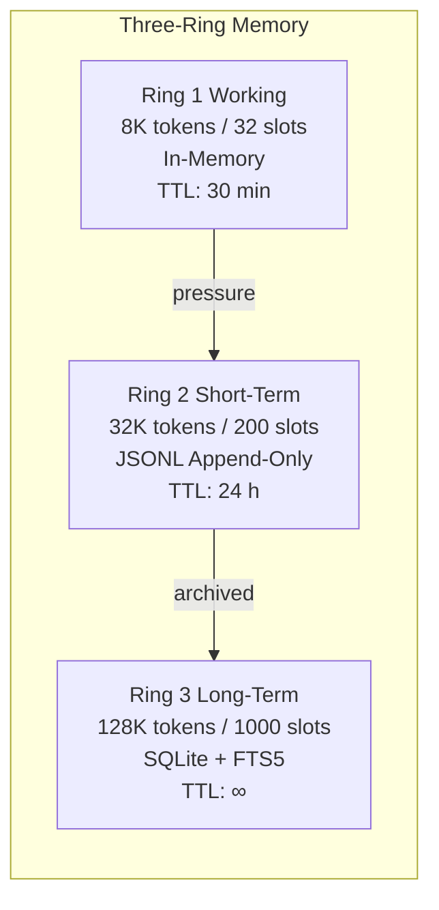

# Memory System

> **Source:** `src/l3/memory.py` (469 lines), `memory_ring.py` (125 lines), `memory_quality.py` (75 lines), `memory_init.py` (265 lines), `central_memory.py` (139 lines)

## Three-Ring Architecture



## MemEntry

```python
@dataclass
class MemEntry:
    id: str
    agent_id: str
    cell_id: str = ""      # Added for per-Cell isolation
    entry_type: str         # boot, thought, observation, card_result, ...
    content: str
    tokens: int = 0
    tags: list[str] = field(default_factory=list)
    source: str = ""
    fingerprint: str = ""
    importance: float = 0.5
    timestamp: float = field(default_factory=time.time)
    ttl: float = 0.0
```

## MemoryManager (singleton)

All memory operations go through `get_memory()` in `l3/memory.py`.

### Key Methods

| Method | Description |
|--------|-------------|
| `remember(agent_id, entry_type, content, cell_id=..., ring=1)` | Store with quality validation |
| `recall(agent_id, entry_type, tag, rings, limit, cell_id=...)` | Multi-ring query |
| `build_context(agent_id, max_tokens=4096)` | Build LLM context string |
| `compact(agent_id, ring=0)` | Merge related entries |
| `forget_agent(agent_id)` | Clear all entries for an agent |
| `forget_cell(cell_id)` | Clear all entries for a Cell |
| `pressure()` | Memory pressure check (0.0-1.0) |
| `stats()` | Entry counts per ring |

### Memory Quality

Auto-scores each entry 0.0-1.0 on write, rejects low quality:

| Criterion | Bonus | Example |
|-----------|-------|---------|
| Type: decision/pattern | +0.3 | "use Poetry not pip" |
| Contains file path | +0.1 | "~/code/api uses Go" |
| Contains IP/version | +0.1 | "staging at 10.0.1.50" |
| Too short (<30 chars) | REJECTED | "read file" |
| Too long (>2000 chars) | REJECTED | raw log dump |
| Vague pattern | REJECTED | "user has a project" |

### CentralMemory (coordinator)

`l3/central_memory.py` wraps `MemoryManager` with a simpler API:

| Method | Description |
|--------|-------------|
| `remember(agent_id, content, *, cell_id=..., ring=1)` | Quality gate + store |
| `recall(agent_id, query, tags, rings)` | Search + sort by timestamp |
| `compact(agent_id, ring=0)` | Trigger compaction |
| `archive_ring3()` | Incremental Ring 3 → Ring 4 archive |

## Cell-Level Memory Management

Each memory entry optionally carries a `cell_id` for Cell-scoped queries:

- `MemoryManager.recall(cell_id="cell-1")` — query all agents in a Cell
- `MemoryManager.forget_cell(cell_id)` — destroy Cell memory
- `Cell.remove_agent()` now calls `memory.forget_agent()` and `context_pool.unregister()`

### ContextPool

`l3/context_pool.py` provides per-agent `ContextManager` instances with Cell mapping:

| Function | Description |
|----------|-------------|
| `register(agent_id, cell_id)` | Create per-agent context |
| `unregister(agent_id)` | Remove agent from pool |
| `cell_total(cell_id)` | Sum tokens for all agents in Cell |
| `all_cell_totals()` | Aggregate across all Cells |

## Memory → AgentLoop Bridge

```python
# In _term_handlers.py — every think action:
memory = get_memory()
ring_context = memory.build_context(agent_id, max_tokens=1024)
system_prompt = f"...\n--- Memory Context ---\n{ring_context}\n---"
```

## Memory Budgets

| Budget Constant | Value |
|----------------|-------|
| `MEMORY_RING_WORKING_BUDGET` | 8192 |
| `MEMORY_RING_SHORT_BUDGET` | 32768 |
| `MEMORY_RING_LONG_BUDGET` | 131072 |
| `MEMORY_RING_WORKING_TTL` | 1800.0 (30 min) |
| `MEMORY_RING_SHORT_TTL` | 86400.0 (24h) |
| `MEMORY_RING_LONG_TTL` | 0.0 (∞) |
