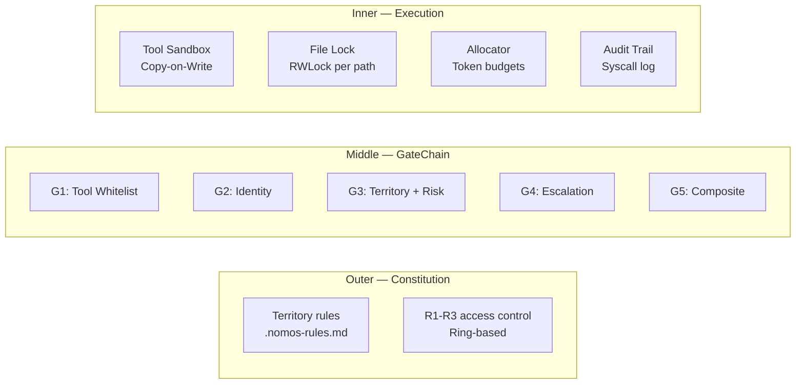

# Security Architecture

> **Sources:** `l1/kernel/constitution.py`, `l1/kernel/gatechain.py`, `l3/tool_system/tool_pipeline.py`, `l3/tool_system/tool_spec.py`, `l3/card/approval_gate.py`, `l3/services/content_trust.py`, `l4/sandbox/`, `tests/test_layer_imports.py`

## Three-Layer Security



## 1. Constitution (`l1/kernel/constitution.py`)

The **highest authority** in Agent OS. Parses `.nomos-rules.md` and enforces 14+ built-in rules.

### 14 Built-in Rule Descriptors

| Section | Severity | Description |
|---------|----------|-------------|
| §2.3 | MUST | Agent must not write outside its territory |
| §3.1 | MUST | Agent must not read outside territory without L3 |
| §3.3 | MUST | All tool calls must pass GateChain G1-G5 |
| §3.4 | MUST | Cross-unit calls require G5 |
| §4.5 | MUST | All modifications go through sandbox |
| §4.6 | MUST | Modifications reviewable by L3 |
| §4.7 | MUST | No agent modifies constitution |
| §5.1 | MUST | All tool calls logged with audit |
| §5.2 | SHOULD | Decisions recorded in Ring 2 |
| §6.1 | MUST | Cross-territory changes need peer review |
| §6.2 | MUST | L3 is final arbiter |
| §7.1 | MUST | Scouts read-only, depth=1 |
| §7.2 | SHOULD | Scout findings logged before disposal |
| §8.1 | MUST | Context from Ring memory, not raw output |
| §8.2 | SHOULD | Important decisions to Ring 3 |

### Key API

```python
constitution = get_constitution()
constitution.is_allowed(action, agent_id, target)  # → {"allowed": bool, "blocks": [...]}
constitution.check(action, agent_id, target)        # → list[CheckReport]
constitution.load(path)                              # → dict
```

## 2. GateChain G1-G5

See [gatechain.md](gatechain.md) for full details.

## 3. Sandbox (`l4/sandbox/`)

Copy-on-write process isolation for tool execution:

| Profile | Constant | Gating |
|---------|----------|--------|
| DANGER_0 | `SANDBOX_PROFILE_READ_ONLY` | read-only tools |
| DANGER_1 | `SANDBOX_PROFILE_SAFE_WRITE` | safe write tools |
| DANGER_2 | `SANDBOX_PROFILE_NETWORK` | network tools |
| DANGER_3 | `SANDBOX_PROFILE_FULL` | full execution |
| DANGER_4 | `SANDBOX_PROFILE_HOST` | host access |

### ResourceBuffer Integration

```
Sandbox (temp dir) → ResourceBuffer (ring buffer) → Real File System
   crash = lost        crash = recoverable             final target
```

## 4. Content Trust (`l3/services/content_trust.py`)

Provenance system for all memory entries and messages:

```python
trust = get_trust()
prov = trust.tag(source_type="agent", source_id=agent_id, method="tool")
# → provenance with signer_id, timestamp, trust_score
trust.can_store(prov)  # threshold check
trust.can_recall(prov)  # threshold check
```

**Trust scoring:** `score = base * 0.6 + decay * 0.3 + reputation_bonus + signature_bonus`, clamped to [0, 1].

## 5. Layer Import Constraints (`tests/test_layer_imports.py`)

```python
LAYER_ORDER = {"l1": 0, "l2": 1, "l3": 2, "l4": 3, "l5": 4}
```

| Rule | Enforced |
|------|----------|
| L1 → L2+ | ❌ Blocked |
| L2 → L3+ | ❌ Blocked (except 3 allowlisted) |
| L3 → L4 | ❌ Blocked (except 16 allowlisted) |
| L4 → L5 | ❌ Blocked |
| L5 → any | ✅ Allowed |

49 pre-existing cross-layer imports are allowlisted (adapter patterns + LLM calls).

## 6. Error Codes

20 standardized error codes in `l1/kernel/errors.py`:

```python
error("E_CONSTITUTION_BLOCKED", "Blocked by constitution", cause=exc)
error("E_GATECHAIN_BLOCKED", "Blocked by gate chain")
error("E_HUMAN_REJECTED", "Rejected by human approval")
```

All errors produce: `{"success": false, "error": str, "error_code": str}`

## 7. ErrorBus (`l3/error_bus/`)

~190 exception capture points unified into a single bus:

```python
try:
    ...
except Exception as e:
    capture("memory compact failed", exc=e, component="services")
```

Or with context manager:

```python
with error_boundary("loading config", component="boot"):
    load_config()
```

## Key Security Constants

| Constant | Value | Use |
|----------|-------|-----|
| `HEARTBEAT_TIMEOUT` | 15s | Agent unresponsive threshold |
| `CRASH_TIMEOUT` | 30s | Crash detection |
| `SANDBOX_EXEC_TIMEOUT` | 300s | Max sandbox execution |
| `APPROVAL_GATE_WAIT_TIMEOUT` | 300s | Human approval timeout |
| `ERROR_BUS_DEDUP_WINDOW` | 300s | Dedup identical errors |
