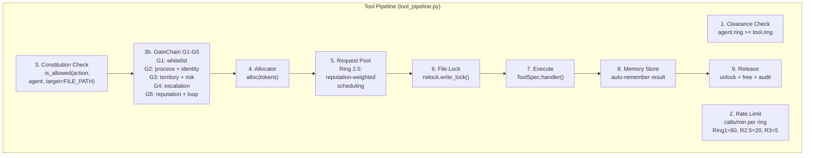

# Tool Pipeline

> **Source:** `src/l3/tool_pipeline.py` (251 lines), `src/l3/tool_spec.py` (449 lines)  
> **Constants:** `params/tool.py`

## 9-Step Execution Pipeline

Every tool call passes through 9 sequential steps before execution:



## Tool Rings

| Ring | Label | Rate Limit | Typical Tools |
|------|-------|------------|---------------|
| 1 | Private | 60/min | read_file, grep, search |
| 2.5 | RequestPool | 20/min | write_file, edit, create |
| 3 | Witness | 5/min | destroy, deploy, execute |

## ToolSpec Registry

Tools are registered in a global `TOOL_REGISTRY: dict[str, ToolSpec]` in `l3/tool_spec.py`.

### ToolSpec

```python
@dataclass
class ToolSpec:
    name: str
    description: str
    category: str
    ring: str          # "RING_1" | "RING_2_5" | "RING_3"
    danger: int        # 0-3
    handler: Callable
    parameters: list[ParamSpec]
    parallel_safe: bool
    sandbox_profile: str | None  # "DANGER_0".."DANGER_4"
```

### Registration

```python
@tool(name="read_file", description="Read a file", category="files",
      ring=RING_1, danger=0,
      params=[ParamSpec("path", "string", required=True)])
def _cmd_read_file(args: dict, agent_id: str) -> dict:
    ...
```

### Mute System

Four independent mute levels:

| Level | Function | Effect |
|-------|----------|--------|
| Tool | `mute_tool("run_in_terminal")` | Disable one tool |
| Category | `mute_category("network")` | Disable all tools in category |
| Plugin | `mute_plugin("docker")` | Disable all tools from a plugin |
| Ring | `mute_ring("ring_3")` | Disable all tools at ring level |

## Key Constants

| Constant | Value |
|----------|-------|
| `TOOL_RATE_RING_1` | 60/min |
| `TOOL_RATE_RING_2_5` | 20/min |
| `TOOL_RATE_RING_3` | 5/min |
| `TOOL_EXEC_TOKEN_BUDGET` | 100 |
| `TOOL_BUILD_TIMEOUT` | 300s |
| `TOOL_HANDLER_TIMEOUT` | 60s |
