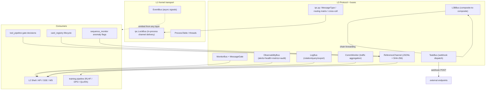

# L3 — Bus (message bus + observability + causal recording)

How the cell layer moves messages, records decisions, and emits telemetry.
One transport (kernel IPC), one protocol layer (20+ message types), and a
family of purpose-built buses for monitoring, webhooks, and — above all —
the causal reference channel that turns every agent decision into
training-grade data.

## Layered view



## ReferenceChannel — the causal recorder (`reference_channel.py`)

Pure observability, zero effect on execution: async writes, no
backpressure, no blocking. Every event is a self-contained JSON line with a
SHA-256 content hash — provenance-complete, suitable for downstream
training pipelines. The design references the NOMOS Reference Channel.

| Property | Value |
|----------|-------|
| Buffer | fixed-size ring (bounds memory; full buffer flushes immediately, never drops) |
| Flush | background daemon thread every `flush_interval`; failure re-queues events |
| Integrity | `sha256` per record (truncated to `RC_SHA256_TRUNC`) |
| API | `get_rc().event(type, data)` — O(1) append from any component |

### Event types

| Type | Source | Payload highlights |
|------|--------|--------------------|
| `tool_call` | tool_pipeline | allowed, gate, reason, **predicted_success**, deviation, card_scope |
| `card_lifecycle` | card_registry | intent, state, nature/size, error, **predicted_state**, deviation |
| `gatechain` | gatechain | per-gate decision steps |
| `human_correction` | L2 Shell / API | field, old/new preview, reason (CORRECT signals) |
| `convention` | convention | outcome, participant count, summary |
| `anomaly` | sequence_monitor | detection payload |

### The causal triple

The training-value core is the `{predicted, actual, deviation}` triple:

```
predicted_success=true  + allowed=false → false_positive_expectation
predicted_success=false + allowed=true  → false_negative_expectation
predicted_state=completed + state=failed → completion_mismatch
```

Aggregated across many calls these become negative-training-signal
datasets — the governance layer records *why* the model was wrong, which
is precisely the "儿童机器" (child machine) causal data that later
weight-level training consumes. The harness `governed/semi/minimal` modes
never skip this recording: it is part of the safety bottom line.

Export: `export(limit, offset, event_type)` (pure query), `count(type)`,
`stats()` (buffered / flusher alive).

## RecordCenter — unified record center (`record_center.py`)

`RecordCenter` aggregates error/log/reference stores behind one facade and
delegates to ErrorBus (fingerprint-deduped errors), LogService (ring + disk)
and ReferenceChannel (audit JSONL). `query()` / `stats()` / `export()` unify
the three sources with `_source` tags on every entry.

**Error → MonitorBus:** `ErrorBus._ingest` mirrors every captured error to
the MonitorBus (`type="error.bus"`, severity debug/info→info, warn→warn,
error/critical→crit, payload carries fingerprint), in addition to its
LogService push and `error_log` EventBus emit — so errors join the same
observability stream as messages and logs.

**Plug-in sources (`register_source`, Phase E):** boot wiring can register
extra domains so `query()`/`stats()`/`export()` cover them without touching
the three built-ins. The security domain is registered with
`query_fn=security_notifications`, `stats_fn=notifications count`,
`export_fn=security_notifications` — security-mode warnings/changes are a
first-class RC source.

**Event → StatsCenter ingestion (14-gap closure):** high-value lifecycle
events that previously stopped at the EventBus now land in the StatsCenter
time series under domain namespaces:

| Domain | Metrics | Emitter |
|--------|---------|---------|
| security | `security.mode.change/warning`, `security.bypass.confirmed/denied`, `security.posture.full_power` (gauge), `security.warrant.issued/denied`, `security.team.activated`, `security.gate.injection.blocked/allowed`, `security.gate.use_skill.blocked`, `security.gate.skill_use.blocked`, `security.gate.g4.full_power` | `security_mode.py`, `helpers.py`, `agent_loop.py`, `_skills.py`, `cell/__init__.py`, L1 sink (constitution/gatechain) |
| memory | `stats.memory.graph.switch/edge_mode/compact/semantic`, `stats.memory.mer.switch/transform/archived` | `memory_graph.py`, `memory_mer.py` `_emit_event` |
| discussion | `discussion.completed` | `issue_orchestrator.py` |
| agent lifecycle | `agent.turn_complete`, `agent.loop_error`, `agent.session_end` | `hook.py` `EventEmitHook` |

**L1 metric sink:** the kernel layers (constitution §9.2, gatechain G4)
never import L3 — boot injects a `set_metric_sink()` callback (same pattern
as the posture provider) that forwards `security.*` counters to StatsCenter.
L1 calls are best-effort and never break the protected path.

## IPC protocol layer (`ipc.py`)

Transport lives in L1 (`kernel/ipc.LockBus`); `l3/bus/ipc.py` is the
protocol: `MessageType` + routing matrix + cross-cell routing (Agent OS
spec §2). 20+ message types across 7 categories:

| Direction | Message types |
|-----------|---------------|
| L3 → Agent | `task.assign`, `task.cancel`, `review.result` |
| Agent → L3 | `task.accept`, `task.done`, `task.error`, `dispute.raise`, `issue.proposal`, `scout.request` |
| Agent ↔ Agent | `review.request`, `review.response`, `territory.query`, `agent.message`, `agent.broadcast` |
| Scout → Agent | `scout.report`, `scout.progress` |
| System | `heartbeat`, `constitution.update`, `cell.join`, `cell.leave`, `cell.restart`, `scout.timeout` |
| Direct | `direct.session_start`, `direct.session_end`, `direct.message` |

Communication is constrained by an allow/deny matrix — the protocol layer
is where agent-to-agent trust is expressed.

**Default observer:** `IpcBus._on_start` registers a subscriber for every
`MessageType` that mirrors routed messages to the MonitorBus
(`type="ipc.message"`), so IPC traffic joins the unified observability
stream even when no business subscriber is attached.

## Purpose-built buses

| Bus | Module | Role |
|-----|--------|------|
| MonitorBus | `monitor_bus.py` | unified typed event stream (`kernel.*` / `network.*` / `service.*` / `task.*`), JSONL persistence, ring rehydrated on startup, streaming; internal `subscribe()`/`unsubscribe()` (non-SSE) path for components; every emitted event is ingested into StatsCenter as a `monitor.event.<type>` counter |
| MessageGate | `message_gate.py` | dependency-aware policy engine over MonitorBus: `allow` / `block` / `mute` / `hold` / `redirect`, with dependency chains + hold timeout |
| ObservabilityBus | `observability_bus.py` | single `observe()` facade wrapping ops_console (alerts) + health + counter (metrics) + audit (syscall log) |
| LogBus | `log.py` | OS-level logging: levels, size-based rotation, time-range query, JSON export, service tagging; integrates with the kernel event bus; each entry is mirrored to MonitorBus (`type="log.entry"`, severity mapped debug/info→info, warn→warn, error/critical→crit) |
| TaskBus | `task_bus.py` | webhook dispatch on card completion: subscriber filters, exponential backoff (3 attempts: 1s → 4s → 10s), non-blocking, `webhooks:` config |
| CommMonitor | `comm_monitor.py` | traffic aggregation across IPC/cell-mailbox/event history: message counts, latency samples, trace IDs, heartbeats, health probes; each `record_message` is mirrored to MonitorBus (`type="comm.message"`) |
| L3BBus | `l3b_bus.py` + `l3b_message_pool.py` | composite-to-composite chain + hop-by-hop forwarding (`CARD_FORWARD` / `RESULT_BACK` / `STATUS_CHECK` / `BACKPRESSURE`), one mailbox per composite; successful sends are mirrored to MonitorBus (`type="l3b.message"` via `_mirror_send`) |

## Relation

- `l1-kernel.md` §EventBus: transport primitives; L3 buses ride on the
  same kernel event bus for cross-service log collection and signals.
- `l3-routing.md` §Message gate/pool: L3B composites and message pooling
  are covered there for routing; this document covers the buses
  themselves.
- `l3-tools.md` §pipeline: every gate decision lands in the Reference
  Channel; the harness-mode bottom line guarantees recording in all modes.
- `cross-cutting.md` §events: SSE `/api/events` + WS stream the kernel
  event bus outward to frontends.
