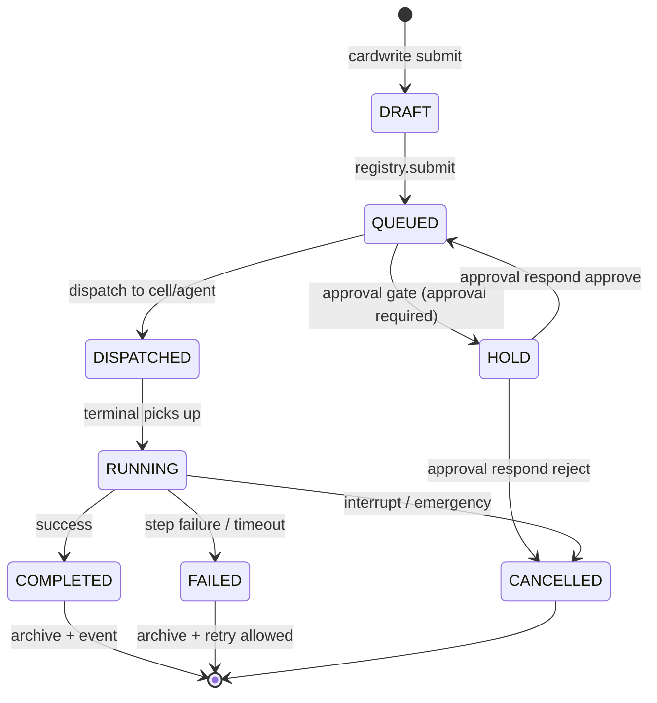

# L3 — Card Lifecycle (produce → execute → archive)

The card is the unit of will: everything in L3 orbits it. This document
follows one card end-to-end. 225 files / 50,272 lines across L3.

```
PRODUCE ──> EXECUTE ──> APPROVE ──> COMPLETE ──> ARCHIVE
  │            │            │           │            │
  L3A          Execution    GateChain    EventBus     R4 archive
  cardwrite    plan/run     G4/G5        TASK_DONE    (fonds/series)
  (intent)     agents       approval     subscribers  + restore
```

## 1. Produce — will becomes a card

- **Source of will**: user intent via L2 shell / L3A session / API
  (`POST /api/v2/l3a/sessions/{id}/send` → `Session.prompt` → `cardwrite`).
- **Card model**: `CardUnified` (nature/priority/state/summary/phases/
  tasks) — the single card type; legacy `Card` bridged by normalizers.
- **Card types**: registry (`card_unified.py`, EXECUTION/ISSUE/DIRECTIVE/…),
  `list_card_types()` feeds the L3A prompt.
- **User profile reference**: with `user_id` on the session, cardwrite
  attaches `_profile_summary` (preferences/traits) to `columns` — intent
  parsing has context (gated by `prompt.inject.profile`).
- **Registry**: `card_registry.py` — submit (queue, cap
  `CARD_QUEUE_PENDING_MAX`), list (limit=0 = unlimited), persistence.

## 2. Execute — plan, agents, verification



- **ExecutionPlan** (`execution_plan.py` / `execution_run.py`): phases
  (sequential/parallel), per-step checkpoints (fault_tolerance service),
  step budget (ScopeScheduler). Parallel mode runs each step once.
- **Terminals**: `agent_terminal` — AgentLoop per agent; dispatch returns
  card_id (str), `wait_for_result` blocks for the outcome.
- **Tools**: `tool_pipeline.py` 9-step pipeline — constitution gate →
  GateChain G1–G5 → sandbox → rate limit → execution → record.
- **Agents**: `agent/` (24 files) — AgentLoop, Scout pool, SubAgent gate/
  pool, term handlers; `cell/` (22 files) — Cell, PMU, watchdog, MMU,
  interrupt, decomposition.
- **Verification**: `execution_verify` — scout verification + diff verify
  on file mutations.

## 3. Approve — governance gates

- **ApprovalGate** (`approval_gate.py`): `request()` (emits
  `APPROVAL_REQUIRED`), `respond()` (emits `APPROVAL_RESPONDED` — feeds the
  user profile decision_style collector).
- **PendingQueue** (`pending_queue.py`): `enqueue()` emits `CARD_PENDING`.
- **GateChain G4/G5** escalation for ring 2.5/3 tools.
- Frontends receive these as events (SSE/WS) — no polling.

## 4. Complete — events and subscribers

- Registry emits `EVENT_TASK_ASSIGN` / `TASK_DONE` signals; session
  subscribes (`Session._subscribed_cards` → `_on_card_completed`).
- Session task table (`task_table.py`) tracks per-card progress; TODOs via
  `todos()`.
- History message chain: user intent → card result fold into session
  history (value-weighted compression at `SESSION_HISTORY_MAX_TOKENS`).

## 5. Archive — R4

- `tools/_archive.py`: fonds/series/ref-code store; session close archives
  history; Mer snapshots and profile entries archive as side-channels.
- `Session.resume_from_archive` restores a closed session (context epochs,
  todos, graph diffusion).

## Supporting subsystems (inside L3)

| Subsystem | Files | Role in the lifecycle |
|-----------|-------|-----------------------|
| `bus/` | 15 | monitor bus, L3B routing, message gate/pool, HTN planner (intent decomposition), observability |
| `services/` | 34 | stats center, model service (strategy packs), fault tolerance, assembly, hook chain, user profile, fs adapter |
| `scheduler/` | 11 | 5D scheduler + ACB (step budgets, rate, scope) |
| `resource_buffer/` | 4 | ring buffer for agent I/O |
| `discussion/` | 7 | multi-agent assembly + convergence (issue → answer aggregation → report) |
| `error_bus/` | 2 | error capture with dedup + export |
| `config/` | 8 | three-layer config (params ← discovery ← praxis.yaml) |

## Card API surface (L4-facing)

`/api/v2/card*` (list/get/submit/plan/rollback/approval-trail),
`/api/v2/card-gate/*`, `/api/v2/approvals*`, `/api/v2/pending*`,
`/api/v2/card-unified/*` — all versioned under `/api/v2/`.
