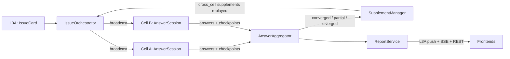

# L3 — Convention (cross-cell deliberation)

Multi-agent deliberation: when an issue is bigger than one cell, the
convention system convenes cells, cross-examines answers, aggregates,
detects divergence, and reports. 7 files in `src/l3/discussion/`.

## Flow

## Modules

| Module | Role |
|--------|------|
| `issue_orchestrator.py` | top-level lifecycle: receives L3A IssueCard → broadcasts to all cells → manages per-cell AnswerSessions → triggers aggregation → replays supplement issues |
| `answer_session.py` | in-cell 3-agent ordered protocol: 5 phases (answer → cross_examine → supplement → converge → report), checkpointed per phase (crash recovery) |
| `cell_answer_repo.py` | per-cell answer persistence (Archive SQLite + Ring3 FTS5), checkpoints so watchdog restarts can resume |
| `answer_aggregator.py` | cross-cell merge: fingerprint dedup, coverage check, divergence detection, supplement extraction → AggregatedReport (converged/partial/diverged) |
| `supplement_manager.py` | supplement classification (cross_cell / within_cell / human_only); cross_cell replayed into IssueTable |
| `report_service.py` | structured report (consensus + divergence + supplements) → L3A, SSE broadcast, REST query |

## API surface

`/api/v2/discussion*` — sessions, session status, answers, report,
supplement, push-to-l3a.

## Relation

- `l3a-central.md`: L3A issues the card and receives the report — the
  central office commissions the convention and takes its findings.
- `l3-card-lifecycle.md`: issue-type cards route through the orchestrator
  instead of direct dispatch.
