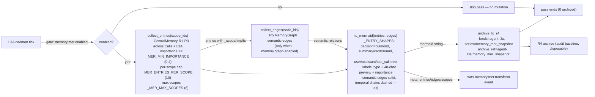
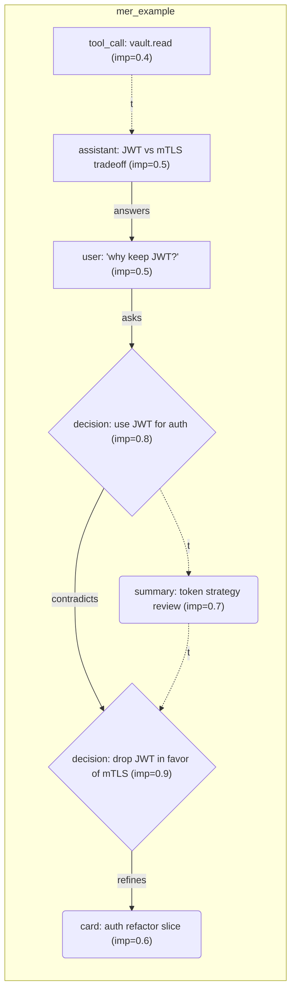

# L3 — Memory System (4 rings + side-channels)

How agents remember: operational rings, lossless archive, and the bypass
side-channels (Mer / R5 / User Profile). 24 files / 5,956 lines.

## Four-ring architecture

```
R1 working   — current task context (agent-local, hot)
R2 short     — session-scale memory (auto-persist, JSONL)
R3 long      — FTS5 searchable knowledge (SQLite)
R4 archive   — lossless, append-only (fonds/series/ref-code), restore baseline
```

| Concern | Module |
|---------|--------|
| Manager + rings | `memory.py`, `memory_ring.py`, `pager_swapper.py` |
| Multi-scope center | `central_memory.py` (register scopes: cells + L3A) |
| Persistence | `persist.py`-style mixins; crash-safety: dirty sets cleared only after write success |
| FTS5 / recall | `context_search.py`, `quality.py` (importance filtering) |
| R4 agent | `r4_agent.py` (archive, skill evolution, lean cases) |
| Task-aware injection | `memory_inject.py` (execute→summary / decide→Mer / resume→layered) |
| Init from memories | `memory_init.py` (boot restores agent topology) |

## Side-channels (bypass, all default off)

Independent transformations that never mutate the main flow; on error they
degrade to no-ops (originals intact):

| Channel | Module | What it does | Switch |
|---------|--------|--------------|--------|
| **Mer symbolization** | `memory_mer.py` | Aggregates high-value R1–R3 across scopes → **Mermaid flowchart** (node shapes = entry type: decision=diamond, summary/card=round; labels carry importance; R5 semantic edges solid; within-scope temporal chains dashed `-.->|t|`) → R4 (`agent-l3a/memory_mer_snapshot`) | `memory.mer.enabled` |
| **R5 graph** | `memory_graph.py` | SQLite `memory_edges`; rule + semantic (LLM) edges; diffusion recall; compact/reduce | `memory.graph.enabled` |
| **User profile** | `l3/services/user_profile.py` | Typed per-user model (preference/domain_focus/decision_style/rejection/habit/correction/trait/custom); collectors (APPROVAL_RESPONDED → decision_style, CARD_PENDING → domain_focus) + ingest API; rule refiner; TTL/decay; R4 per user; portable export/import; consumed by L3A (see `l3a-central.md`) | `user_profile.enabled` |

Side-channel lifecycle events are ingested into StatsCenter for
observability: Mer emits `stats.memory.mer.switch/transform/archived`, R5
graph emits `stats.memory.graph.switch/edge_mode/compact/semantic` — both
`_emit_event()` hooks publish to MonitorBus AND StatsCenter (best-effort,
never break the bypass pipeline).

### Mer data flow (bypass pipeline)



Guarantees: bypass semantics (never mutates the main flow), lossless
originals (only a rendered condensation is archived), bounded work
(per-scope caps, max scopes, edge truncation).

### Mer symbolization example

All node shapes and edge styles in one view — diamond (decision), round
(summary/card), rect (user/assistant/tool_call); solid arrows are R5
semantic edges, dashed `-.->|t|` arrows are within-scope chronology:



## System-prompt injection (memory-related)

`prompt.inject.memory` (default true) gates task-aware memory context in
agent prompts; `prompt.inject.skills` gates evolved skills + lean failure
cases. See `cross-cutting.md` for the full injection table.

## Contract surface

- `/api/v2/memory*` (store/recall/stats), `/api/v2/memory/graph*` (R5),
  `/api/memory/mer/*` (Mer), `/api/v2/profile*` (user profile)
- Ports: none dedicated (memory accessed in-process); profile exposes
  port `"profile"` for cross-service queries
