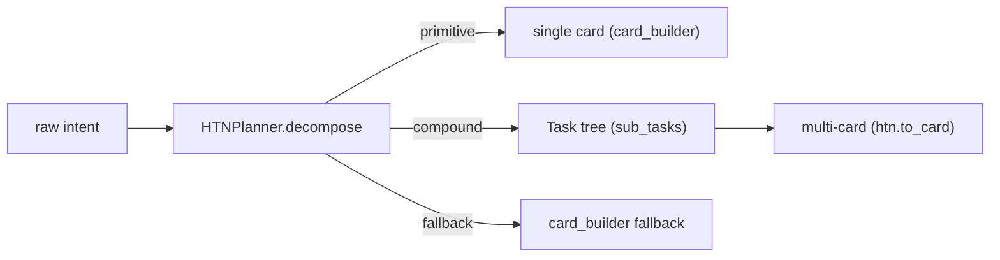

# L3 — Routing (HTN intent decomposition + L3B cross-cell)

How intents become routed work: HTN decomposes the will into a task
hierarchy; the scheduler router picks the best agent; L3B moves work
across cells when a task overflows one cell.

## HTN — intent decomposition (`bus/htn_planner.py`)

- `Task` / `TaskStatus` / `DecompositionMethod` model the hierarchy.
- Compound tasks decompose into ordered subtasks → routed to agents/cells
  by territory; primitive tasks become cards directly.
- Used by `cell_execute._raw_to_card` (raw intent → structured card) and
  the scheduler router's intent classification.

## L3B — cross-cell routing (`bus/l3b.py`)

| Component | Role |
|-----------|------|
| `L3BComposite` | a live cell-to-cell link: `read_prev_cache` (context carry-over), `dispatch_to_next` (card handoff), `route_subtask` (split a subtask chain across cells) |
| `L3B` | composite registry + tier classification; boot/shutdown of links |

Workflows that span cells (issue cards, cross-domain refactors) flow
through composites: each cell summarizes its result into the next cell's
cache, so context carries without a global bus.

## Message gate / pool (`bus/`)

| Module | Role |
|--------|------|
| `message_gate.py` | authorization gate for bus messages |
| `message_pool.py` | pooled delivery (bounded, with HMAC signing when secret set) |
| `task_bus.py` | webhook/task delivery with retry |
| `task_bus_cron.py` | cron dispatch → card submission |
| `observability_bus.py` / `monitor_bus.py` | metrics + monitor event stream |

## Relation

- `l3-card-lifecycle.md` §1: HTN feeds card production; decomposed slices
  route through the scheduler.
- `l3-scheduler.md` §route: L3Router picks the best agent per intent;
  L3B handles the *inter-cell* hop after that.
- `l3-convention.md`: cross-cell deliberation uses L3B composites to
  coordinate cell answers.
