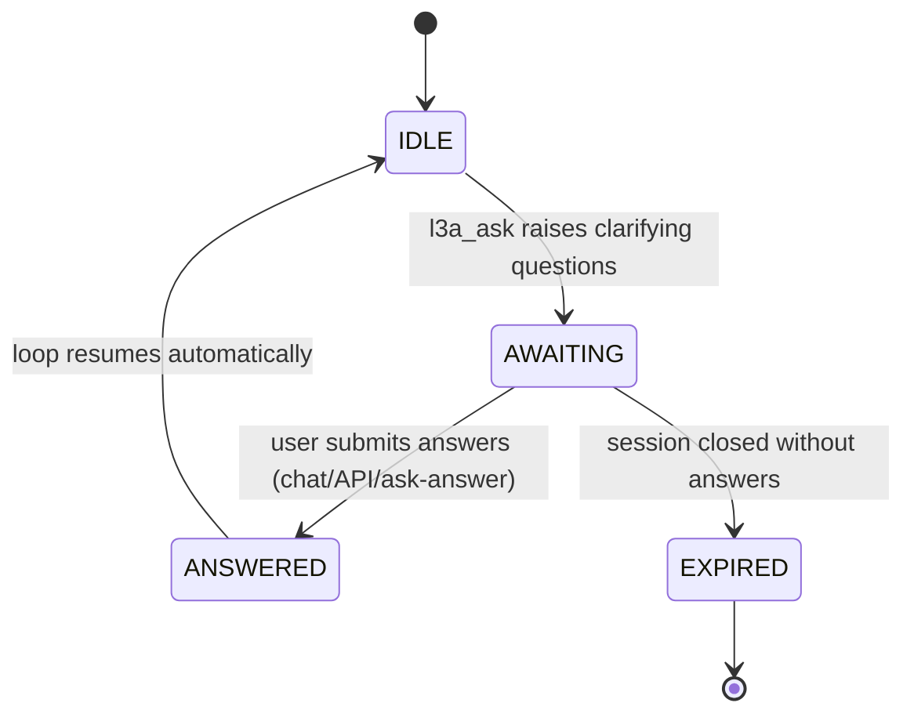
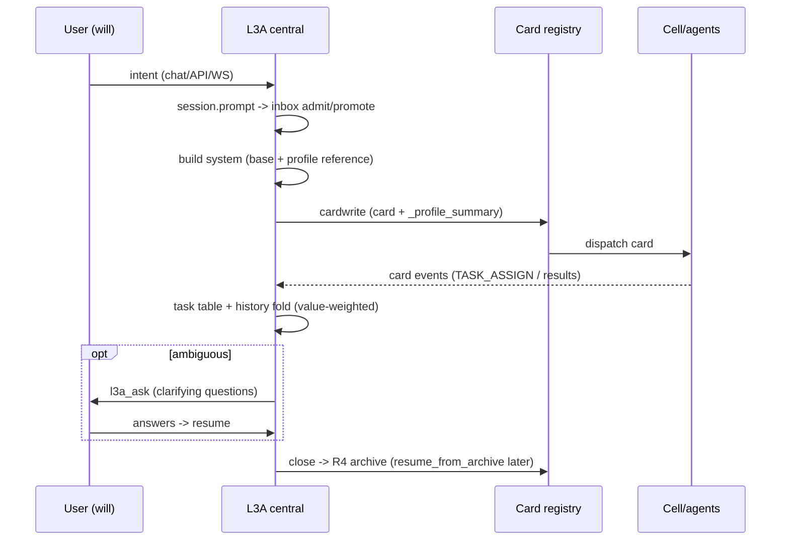

# L3A — The Central Decision Layer

L3A is not another agent loop — it is the **central office** between the
will (user) and the departments (cells/agents). 15 files / 4,015 lines in
`src/l3/cell/peers/l3a/`.

```
User (will) ──intent──> L3A central ──card──> Cell/agents (execution)
                          │  ▲
                          │  └─ results, asks, events
                          └─── archive → R4 / profile → Mer/R5
```

## State metaphor (why it is a layer, not a loop)

| L3A module | Office analogue | Behavior |
|------------|-----------------|----------|
| `session.py` | case files | Session/SessionHistory/SessionManager; cursor-paged `messages(cursor, limit)`; value-weighted compression; `resume_from_archive` |
| `ask.py` | secretary querying the will | l3a_ask clarification state machine (awaiting → answers → resume) |
| `helpers.py` cardwrite | policy issuance | intent → structured card; attaches user profile `_profile_summary` |
| `helpers.py` convergence | cabinet consultation | multi-agent result convergence |
| `subagent.py` | staff pool | L3ASubAgentPool: spawn/collect/peek |
| `task_table.py` | docket | per-session card task monitor |
| `inbox.py` | intake registry | durable prompt admission/promotion |
| `context.py` | policy epoch | ContextEpoch / ContextRegistry |
| `archive.py` | national archive | R4 store/restore glue |
| `pipeline.py` | document control | ManagedToolOutput (oversized result spill) |
| `model.py` | budget rules | L3AModelConfig inheritance chain |

## Session contract (language-agnostic)

Exposed over `/api/v2/l3a/*` so any frontend (TUI/desktop/TS) drives the
central layer purely over HTTP:

| Endpoint | Purpose |
|----------|---------|
| `POST /api/v2/l3a/sessions` | create session |
| `GET  /api/v2/l3a/sessions` | list active sessions |
| `GET  /api/v2/l3a/sessions/{id}` | detail (info + todos) |
| `GET  /api/v2/l3a/sessions/{id}/messages?cursor=` | **cursor-paged history** (anti-blowup) |
| `POST /api/v2/l3a/sessions/{id}/send` | send intent / continue |
| `POST /api/v2/l3a/sessions/{id}/close` | close + R4 archive |
| `POST /api/v2/l3a/sessions/{id}/compress` | manual history compression |
| `POST /api/v2/l3a/ask/status` / `ask/answer` | clarification flow |

## Ask flow (secretary requests the will's decision)



`ask_status()` / `submit_answers()` / `resume_after_ask()` expose the
state machine; `POST /api/v2/l3a/ask/status|answer` expose it over HTTP.

## Session lifecycle (one will-decision cycle)



## System prompt (what the central layer knows)

`build_l3a_prompt(user_id)` assembles: role + card types + cardwrite steps
+ ask guidance + **`[User Profile Reference]`** (preferences/traits — gated
by `prompt.inject.profile`, injected only when the session carries a
`user_id`). `l3a.parse_system` template is a fallback (AgentLoop uses the
injected `system` argument first).

## Profile consumption

- **Prompt injection**: session base system carries the user model.
- **Card columns**: session cardwrite forwards `user_id` → `_profile_summary`.
- **Collectors**: approval decisions and pending cards feed the profile
  (decision_style / domain_focus) — the central layer's knowledge of the
  will grows with every decision.

## Ticks & lifecycle

- L3A daemon tick drives Mer symbolization (when enabled) and session
  upkeep; conftest resets via `reset_daemon()`.
