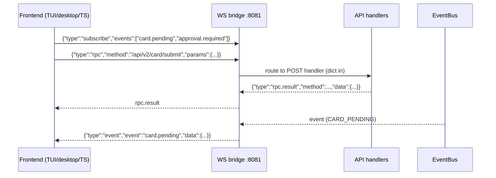
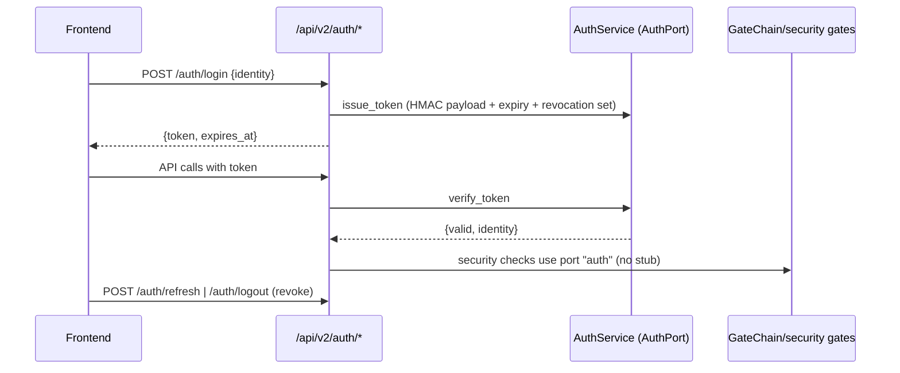

# L4 — Bridge Layer

The boundary: HTTP API (274 routes), LLM engine, realtime channels,
sandbox, auth, filesystem, RPC. 69 files / 13,989 lines; 17 handler
modules.

## Responsibility boundary

- Exposes the kernel/cell world over **versioned HTTP contracts**
  (`/api/v2/*`), SSE/WebSocket event streams, and RPC.
- Implements port adapters (Auth/WS/RPC/FS) and LLM providers.
- No business logic beyond translation/aggregation.

## Subsystems

| Subsystem | Files | Role |
|-----------|-------|------|
| `api/` | gateway (route index + signature cache), routes (274), middleware, endpoints manifest (validate) | HTTP surface |
| `api_handlers/` | 17 modules | dict-in/dict-out handlers per domain |
| `llm/` | engine + providers (OpenAI/Anthropic/DeepSeek/Ollama/mock), `http_pool` keep-alive | model calls, effort-tier normalization, capability probes |
| `sse/` | `sse_bridge.py` | one-way event stream (`/api/events`, event-type filter) |
| `ws/` | `ws_bridge.py` (websockets.sync, `API_WS_PORT=8081`) | bidirectional: subscribe/unsubscribe/rpc messages |
| `rpc/` | protocol + transport + `server.py` (`RPC_SERVER_PORT=42110`) | distributed method invocation |
| `sandbox/` | COW isolation + exec sandbox (per-thread event loop) | safe tool execution |
| `vault/` | `credential_vault.py` + `auth.py` (AuthPort adapter: HMAC token lifecycle) | secrets + identity |
| `lsp/` `search/` `mcp_bridge.py` `cron_scheduler.py` `supervisor.py` `notify.py` `user_session.py` | editor/lexical/plugin-adjacent services | auxiliary bridges |

## Realtime channels (frontend contract)

```
SSE  /api/events               one-way push (EventBus on_any)
WS   ws://host:8081            subscribe/unsubscribe/rpc (bidirectional)
     {"type":"rpc","method":"/api/v2/card/submit","params":{...}}
     → {"type":"rpc.result","method":...,"data":{...}}
```

WS `rpc` routes full API paths to POST handlers (module-path refs only);
SSE stays the notification bus. Both deliver card/approval events without
polling (CARD_PENDING / APPROVAL_REQUIRED / APPROVAL_RESPONDED).



## Auth flow (login state)



## Auth contract

- `POST /api/v2/auth/login|logout|refresh` — HMAC-signed token lifecycle
  (`AuthService` implements `AuthPort`, self-registers on port `"auth"`).
- `central_security` verifies `user_token` via the port (no hardcoded stub).

## FS contract

- `GET /api/v2/fs/tree|read`, `POST /api/v2/fs/watch|unwatch` — via
  `FilesystemPort` adapter (`l3/services/fs_adapter.py`, mtime-poll watch).

## Gateway fast paths

- O(1) exact-match route index (lazy rebuild), cached
  `inspect.signature(handler)` per handler, persistent LLM connections
  (`http_pool`), per-thread sandbox event loops.

## Contract discipline

- Manifest `validate()` (api_endpoints) enforces kebab-case paths, `{param}`
  names mirroring handler kwargs, no trailing-slash params — run
  `python -m l4.api.api_endpoints` before pushing API changes.
- Version bumps are atomic (pyproject + AGENTS.md + docs).

## CI review API (card-triggered automation)

The CI review module (`ci.py` + `ci_review.py`) exposes a control plane for
the card-triggered pipeline (`l3-card-lifecycle.md` §4a):

| Method | Path | Purpose |
|--------|------|---------|
| `GET` | `/api/v2/ci/reviews` | query CI review reports |
| `GET` | `/api/v2/ci/reviews/{card_id}` | single card CI review report |
| `POST` | `/api/v2/ci/reviews/{card_id}/rerun` | re-run CI review for a card |
| `GET` | `/api/v2/ci/config` | switch state + permissions |
| `PUT` | `/api/v2/ci/config` | toggle runtime switch (control-plane gated) |

Writability is governed by `config/praxis.yaml` `ci.control.api.writable`
(API surface) and `ci.control.shell.writable` (L2 `/ci` command surface).
L2 surface: `/ci set|toggle` via `l2_shell/commands/ci.py`.
