# Praxis Agent OS — Architecture Overview

> **Audience:** Anyone learning Praxis. 5 min read.  
> **Corresponds to:** `src/l1/` through `src/l5/` layers.

## What is Praxis?

Praxis is an **Agent Operating System** — a five-layer runtime for building, orchestrating, and controlling LLM-based AI agents. It maps traditional OS concepts (kernel, shell, process, memory, file system, security) onto the agent domain.

```
                    ┌─────────────────────────────────────┐
                    │  L5  User Layer  (cli, agent_runtime) │
                    ├─────────────────────────────────────┤
                    │  L4  Bridge Layer (API, LLM, Sandbox)│
                    ├─────────────────────────────────────┤
                    │  L3  Cell Layer   (agents, memory)   │
                    ├─────────────────────────────────────┤
                    │  L2  Shell Layer  (commands, i18n)   │
                    ├─────────────────────────────────────┤
                    │  L1  Kernel Layer (sync, gatechain)  │
                    └─────────────────────────────────────┘
```

## Five-Layer Architecture

### Layer Interaction Map

```mermaid
flowchart TB
    subgraph L5["L5 — User Layer (src/l5/)"]
        CLI["cli.py\nCLI Entry"]
        AR["agent_runtime.py\nRuntime Loop"]
    end

    subgraph L4["L4 — Bridge Layer (src/l4/)"]
        GW["api_gateway.py\n153 HTTP routes"]
        LLM["llm.py\nLLM Engine"]
        SAND["sandbox/\nCOW Isolation"]
        MC["mcp_bridge.py\nMCP Adapter"]
        ADAPT["adapters/\n7 Port Impls"]
        RPC["rpc/\nIPC Framework"]
    end

    subgraph L3["L3 — Cell Layer (src/l3/)"]
        CELL["cell/\nAgent Orchestration"]
        TERM["agent_terminal/\nAgent Workers"]
        BOOT["boot.py\nBootstrap"]
        MEM["memory.py\n4-Ring Memory"]
        ERRBUS["error_bus/\nError Bus"]
        MON["monitor_bus.py\nMonitor Bus"]
        CTX["context_pool.py\nContext Pool"]
        TOOLS["tools/\n35 Tools"]
        PL["tool_pipeline.py\n9-Step Pipeline"]
        BUF["resource_buffer/\nFile Buffer"]
        PEND["pending_queue.py\nApproval Queue"]
        TKN["think_registry.py\nThink Quota"]
        SCD["scheduler*.py\n5D Scheduler"]
        SCT["scout.py\nScout Pool"]
        CONF["convergence.py\nConvergence"]
        CARD["card*.py\nCard Lifecycle"]
        LOG["log.py\nLog Service"]
        TRUST["content_trust.py\nProvenance"]
        PMU["cell_pmu.py\nPerf Mon (28 ctrs)"]
        ICACHE["cell_icache.py\nI-Cache (LFU)"]
        MMU["cell_mmu.py\nMMU + TLB"]
        INTR["cell_interrupt.py\nInterrupt Ctlr"]
        WDT["cell_watchdog.py\nWatchdog Timer"]
        ORCH["cell_orchestrate.py\nSubAgent Fork-Join"]
        S_SPEC["subagent_spec.py\nSubAgent Spec"]
        S_TASK["subagent_task.py\nSubAgent Task"]
        S_DISP["subagent_dispatcher.py\n@mention Parse"]
        S_MERGE["subagent_merger.py\nResult Merge"]
        STAT["stats_center.py\nStats Center"]
        REC["record_center.py\nRecord Center"]
    end

    subgraph L2["L2 — Shell Layer (src/l2/)"]
        S["l2_shell/\n39 Commands"]
        I18N["i18n.py\nLocalization"]
        SEL["selector.py\nAgent Select"]
        SH["shell.py\nShell Entry"]
    end

    subgraph L1["L1 — Kernel Layer (src/l1/kernel/)"]
        SYSC["__init__.py\nSyscall Dispatcher"]
        SYN["sync.py\nMutex/Sem/Barrier"]
        PROC["process.py\nProcessTable"]
        ALLOC["allocator.py\nToken Alloc"]
        EVT["event.py\nEventBus"]
        GATE["gatechain.py\nG1-G5"]
        CONST["constitution.py\nRules Engine"]
        VFS["vfs.py\nVirtual FS"]
        OS["os.py\nLifecycle"]
        IPS["ipc.py\nIPC Channel"]
        PERS["persist.py\nSQLite Store"]
        REP["reputation.py\nTrust Scores"]
        SWAP["swapper.py\nRing Swapper"]
        PORTS["ports.py\nPort Interfaces"]
        P["params/\n589 Constants"]
        ERR["errors.py\n20 Error Codes"]
        CMD["commands.py\nCmd Registry"]
        PLAT["platform.py\nCross-Platform"]
    end

    %% L5 → L4/L3/L2/L1
    CLI -->|"boot()"| BOOT
    AR -->|"syscall()"| SYSC
    CLI -->|"API call"| GW

    %% L4 → L3
    GW -->|"routes to"| CELL
    GW -->|"routes to"| ERRBUS
    GW -->|"routes to"| MON
    GW -->|"routes to"| LOG
    GW -->|"routes to"| BUF
    GW -->|"routes to"| CARD
    GW -->|"routes to"| TKN
    GW -->|"routes to"| STAT
    GW -->|"routes to"| REC
    LLM -->|"build_context()"| MEM

    %% L4 → L1
    GW -->|"uses constants"| P
    LLM -->|"rate limits"| P

    %% L3 → L2
    CELL -.->|"dispatch_cmd"| S
    BOOT -->|"load config"| P

    %% L3 → L1
    CELL -->|"emit_signal()"| EVT
    CELL -->|"constitution"| CONST
    PL -->|"G1-G5 check"| GATE
    PL -->|"alloc tokens"| ALLOC
    PL -->|"lock file"| SYN
    PL -->|"limit check"| REP
    BOOT -->|"init kernel"| SYSC
    BOOT -->|"load"| CONST
    BOOT -->|"VFS mount"| VFS
    BOOT -->|"network"| IPS
    BOOT -->|"register cmds"| CMD
    MEM -->|"persist"| PERS
    MEM -->|"swap"| SWAP
    ERR -->|"error codes"| P
    SCD -->|"scheduler types"| P

    %% L3 internal
    CELL -->|"dispatch"| TERM
    CELL -->|"delegate"| SCT
    TERM -->|"execute"| PL
    TERM -->|"remember"| MEM
    TERM -->|"tool spec"| TOOLS
    TERM -->|"register"| CTX
    BOOT -->|"create"| CELL
    PL -->|"sandbox"| BUF
    CELL -->|"approve/reject"| PEND
    CELL -->|"scale config"| TKN
    CONF -->|"converge"| CARD
    SCD -->|"schedule"| CELL

    %% L2 → L1
    S -->|"get_handler()"| CMD
    S -->|"scope resolution"| P
    I18N -->|"port interface"| PORTS

    %% L1 internal
    GATE -->|"danger levels"| P
    GATE -->|"reputation"| REP
    ALLOC -->|"process"| PROC
    SYN -->|"IPC"| IPS
    SWAP -->|"memory rings"| P
    SYSC -->|"audit trail"| PROC
```



## Layer Details

### L1 — Kernel (`src/l1/kernel/`) — 37 Files

| Subsystem | File | Purpose |
|-----------|------|---------|
| Sync | `sync.py` | Mutex, Semaphore, Barrier, RWLock, Condition |
| Process | `process.py` | ProcessTable, PCB (identity, state, resources) |
| Allocator | `allocator.py` | Token/ring/sandbox quota allocation, GC, swap |
| Event | `event.py` | EventBus pub/sub with history |
| GateChain | `gatechain.py` | G1-G5 tool authorization chain |
| Constitution | `constitution.py` | Constitutional rules engine — highest authority |
| VFS | `vfs.py` | Virtual file system with ring-level access control |
| IPC | `ipc.py` | Kernel message passing (LockChannel) |
| Device | `device.py` | Device manager (LLM, DB, network) |
| Net | `net.py` | Cross-Cell UDP/TCP mesh |
| Swapper | `swapper.py` | Background memory pressure management |
| Reputation | `reputation.py` | Agent trust scores [0.0, 1.0] |
| ToolChain | `tool_chain.py` | HMAC-SHA256 fingerprint chain |
| Commands | `commands.py` | CommandRegistry class — system/user command registration, YAML+API metadata layering |
| Prompts | `prompts.py` | YAML-driven prompt template registry |
| OS | `os.py` | Lifecycle coordinator (boot/shutdown/restart) |
| Errors | `errors.py` | Centralized error system — 20 error codes |
| Ports | `ports.py` | Hexagonal architecture port interfaces (7 ports) |
| Params | `params/` | 589 Final constants across 5 sub-modules |

**Constants** (`src/l1/kernel/params/`):

| Sub-module | Constants | Coverage |
|-----------|-----------|----------|
| `kernel.py` | 129 | Allocator, sync, process, gatechain, vfs, syscall |
| `agent.py` | 153 | Roles, terminal, loop, scout, card, events |
| `tool.py` | 33 | Danger levels, timeouts, rate limits, HTN |
| `api.py` | 111 | API, LLM, network, IPC, env vars, CORS |
| `system.py` | 163 | Cache, persistence, memory rings, data paths, sandbox |

### L2 — Shell (`src/l2/`) — 10 Files, 1,583 Lines

| Module | Lines | Purpose |
|--------|-------|---------|
| `l2_shell/__init__.py` | 87 | Command dispatch, direct/indirect message routing |
| `l2_shell/commands.py` | 764 | 39 command handlers + `_pipeline()` |
| `l2_shell/completer.py` | 67 | Tab auto-completion |
| `l2_shell/state.py` | 27 | ShellState (L3A/Direct mode) |
| `l2_shell/output_guard.py` | 15 | Output guard for dangerous responses |
| `i18n.py` | 62 | Internationalization via I18nPort |
| `selector.py` | 199 | Agent pre-select / connectivity check |
| `shell.py` | 199 | Shell entry point |
| `shell_session.py` | 129 | Session lifecycle management |
| `shell_completer.py` | 34 | Shell auto-completion engine |

### L3 — Cell (`src/l3/`) — ~130 Files, ~19,000 Lines

| Category | Key Files | Purpose |
|----------|-----------|---------|
| **Assembly** | `decomposer.py` | Intent decomposition: human intent → sub-cards → dispatch → converge |
| **HTN-A** | `htn_a.py` | Global sharder: intent → cross-Cell sub-task tree |
| **HTN-B** | `htn_b.py` | Adjacent Cell routing decomposition |
| **L3B Composite** | `l3b.py` | L3B chain topology with composite-based routing |
| **L3B Bus** | `l3b_bus.py` | Composite communication bus (5 message types) |
| **L3B Message Pool** | `l3b_message_pool.py` | 2-tier buffer: Hot Ring + SQLite Persist + BACKPRESSURE |
| **CellCache** | `cell_cache.py` | Per-Cell L2 shared cache (3-tier: Hot→Index→KV) |
| **Package** | `package_manager.py` | Unified apt/pip/npm/cargo management |
| **Cell** | `cell/__init__.py` | Agent collaboration unit — 28 methods |
| **Terminal** | `agent_terminal/__init__.py` | Per-agent worker process — 20+ methods |
| **Memory** | `memory.py`, `memory_init.py`, `memory_ring.py` | 4-ring memory + quality scoring + archive (R4)
| **Cards** | `card*.py` (10 files) | Card lifecycle, registry, gate, builder, pool |
| **Boot** | `boot.py`, `boot_init.py`, `bootstrap.py` | System bootstrap — 5 boot steps |
| **Tools** | `tools/` (16 files) | 35+ tool implementations |
| **Pipeline** | `tool_pipeline.py`, `tool_spec.py` | Ring-gated tool execution (9 steps) |
| **Scheduler** | `scheduler*.py` (5 files) | Multi-dimensional scheduling |
| **Scout** | `scout.py` | Read-only investigation pool |
| **Error** | `error_bus/` | Unified error logging + API |
| **Monitor** | `monitor_bus.py` | Monitoring event bus + JSONL persistence |
| **Config** | `config*.py`, `config_loader.py` | YAML configuration + hot-reload |
| **Execution** | `execution_*.py` (3 files) | Execution engine, plan, verification |
| **Queue** | `pending_queue.py`, `approval_gate.py` | Human approval queues |
| **State** | `statecharts.py` | 5-region orthogonal state machine |
| **Log** | `log.py` | Log service + rotation + API |
| **Stats** | `stats_center.py` | Cross-Cell metric aggregation, query, top, SSE |
| **Records** | `record_center.py` | Unified error/log/reference record center facade |
| **Think** | `think_registry.py` | Three-layer think quota config |
| **Buffer** | `resource_buffer/` | Ring file buffer |
| **Context** | `context.py`, `context_pool.py` | Context register, per-agent context pool |
| **Policy** | `tool_policy.py`, `message_gate.py` | Tool visibility, message policy |
| **Security** | `central_security.py`, `content_trust.py` | Security checks, content provenance |

### L4 — Bridge (`src/l4/`) — 45 Files, ~6,500 Lines

| Module | Lines | Purpose |
|--------|-------|---------|
| `api_gateway.py` | 326 | HTTP server + MiddlewareChain |
| `api_handlers/__init__.py` | 587 | API handler mixin (covers 35 categories) |
| `api_routes.py` | 197 | 153 route definitions |
| `api_handlers_*.py` | 4 files | Cards, monitor, agent, config handlers |
| `api_middleware.py` | 233 | CORS, Locale, BodyParser, RequestLog |
| `llm.py` + `llm_base.py` + `llm_providers.py` | 870 | LLM Engine + 4 providers |
| `llm_worker/` | 88 | LLM worker process |
| `sandbox.py` + `sandbox/` | 501 | Copy-on-write isolation |
| `mcp_bridge.py` | 500 | MCP adapter |
| `rpc/` | 63 | IPC framework |
| `adapters/` | 6 ports | Port implementations |

### L5 — User (`src/l5/`) — 2 Files, 401 Lines

| File | Lines | Purpose |
|------|-------|---------|
| `cli.py` | 259 | Typer-based CLI (boot, status, execute) |
| `agent_runtime.py` | 142 | Runtime execution loop |

## Layer Import Rules

```
L5 → can import L4, L3, L2, L1
L4 → can import L3, L2, L1
L3 → can import L2, L1
L2 → can only import L1
L1 → cannot import any upper layer
```

Enforced by `tests/test_layer_imports.py`. 49 pre-existing cross-layer imports are explicitly allowlisted (adapter patterns + LLM calls).

## Core Concepts

### Cell = CPU Core

| Computer Concept | Praxis Equivalent |
|-----------------|-------------------|
| CPU instruction set | ToolSpec (name / params / handler) |
| CPU core | Cell (card queue + AgentTerminal + AgentLoop) |
| Operating system | 10 Central Control Systems |
| Memory hierarchy | Memory rings R1/R2/R3 + R4 archive |
| MMU / page tables | Territory (constitution) + GateChain G3 |
| MMU + TLB | CellMmu + CellTlb (territory→agent translation) |
| System calls | tool_pipeline.execute() (9 steps) |
| Device drivers | ToolSpec middleware + plugin system |
| PMU | CellPmu (28 performance counters) |
| I-Cache | ICache (LFU, separate from CellCache/D-Cache) |
| Interrupt controller | InterruptController (priority routing, beyond EventBus) |
| Watchdog timer | CellWatchdog (per-agent liveness) |
| Multi-core interconnect | L3B cross-cell routing |

### Agent = Process

| OS Process | AgentTerminal |
|-----------|---------------|
| PCB | agent_id + role + ring + status |
| stdin/stdout/stderr | TerminalCard deque + CardResult deque |
| Thread pool | `_workers: list[thread]` (`_max_workers=4`) |
| PID | agent_id (string) |
| State | BOOTING → IDLE → PROCESSING → CRASHED |
| Signals | pause / resume / shutdown / emergency_stop |
| Resource limits | Allocator (tokens) + resource limiter |
| Scheduler | scheduler_*.py (rate, time, scope, router) |

### Memory = Four Rings

| Ring | Budget | Slots | TTL | Storage |
|------|--------|-------|-----|---------|
| 1 (Working) | 8K tokens | 32 | 30 min | In-memory queue |
| 2 (Short-term) | 32K tokens | 200 | 24 h | JSONL file |
| 3 (Long-term) | 128K tokens | 1000 | ∞ | SQLite + FTS5 |
| 4 (Archive) | ∞ | ∞ | ∞ | Disk directories (R4Agent) |

Each memory entry (`MemEntry`) carries `agent_id`, `cell_id`, `entry_type`, `importance` score, and `provenance`.

### Security = Three Layers

1. **Constitution** — `constitution.py` parses `.nomos-rules.md`, enforces 14+ built-in rules
2. **GateChain G1-G5** — Non-bypassable tool authorization with `GateStatus` (PASS/WARN/BLOCK/REPORT)
3. **Tool Pipeline** — 9-step execution (clearance → rate limit → constitution → gatechain → allocator → request pool → file lock → execute → release)

## File Layout

```
src/
├── l1/kernel/          # 37 files — OS primitives
│   └── params/         # 5 sub-modules, 589 constants
├── l2/                 # 10 files — Shell layer (39 commands)
├── l3/                 # 130+ files — Cell layer
│   ├── cell/           # Cell orchestration
│   ├── agent_terminal/ # Agent workers
│   ├── error_bus/      # Error logging
│   ├── resource_buffer/# File buffer
│   └── tools/          # Tool implementations
├── l4/                 # 45 files — Bridge layer
│   ├── api_handlers/   # API mixin
│   ├── sandbox/        # Process isolation
│   ├── rpc/            # RPC framework
│   ├── adapters/       # Port implementations
│   └── llm_worker/     # LLM worker process
└── l5/                 # 2 files — User layer

tests/
└── test_layer_imports.py  # Layer constraint enforcement
```

## Quick Start

```bash
# Boot the system
python -m l5.cli boot

# Enter L2 Shell
python -m l2.l2_shell

# API (once booted)
curl http://localhost:8080/api/health
```
