# Praxis Agent OS — Architecture Overview

> **Audience:** Anyone learning Praxis. 5 min read.  
> **Corresponds to:** `src/l1/` through `src/l5/` layers.

## What is Praxis?

Praxis is an **Agent Operating System** — a five-layer runtime for building, orchestrating, and controlling LLM-based AI agents. It maps traditional OS concepts (kernel, shell, process, memory, file system, security) onto the agent domain.

```
                    ┌─────────────────────────────────────┐
                    │  L5  User Layer  (cli, agent_runtime) │
                    ├─────────────────────────────────────┤
                    │  L4  Bridge Layer (API, LLM, Sandbox)│
                    ├─────────────────────────────────────┤
                    │  L3  Cell Layer   (agents, memory)   │
                    ├─────────────────────────────────────┤
                    │  L2  Shell Layer  (commands, i18n)   │
                    ├─────────────────────────────────────┤
                    │  L1  Kernel Layer (sync, gatechain)  │
                    └─────────────────────────────────────┘
```

## Five-Layer Architecture

### Layer Interaction Map

```mermaid
flowchart TB
    subgraph L5["L5 — User Layer (src/l5/)"]
        CLI["cli.py\nCLI Entry"]
        AR["agent_runtime.py\nRuntime Loop"]
    end

    subgraph L4["L4 — Bridge Layer (src/l4/)"]
        GW["api/api_gateway.py\n157 HTTP routes"]
        AH["api_handlers/\n9 Handler Modules"]
        LLM["llm/\nLLM Engine + Providers"]
        SAND["sandbox/\nCOW Isolation"]
        ADAPT["adapters/\n7 Port Impls"]
        RPC["rpc/\nIPC Framework"]
        SRCH["search/\nSearch Engine"]
        LSP_SVC["lsp/\nLSP Manager"]
        VAULT["vault/\nCredentials + Auth"]
        SSE_BR["sse/\nSSE Bridge"]
        LLMW["llm_worker/\nLLM Worker"]
    end

    subgraph L3["L3 — Cell Layer (src/l3/)"]
        CELL["cell/\nAgent Orchestration (18 files)"]
        TERM["agent_terminal/\nWorker Runtime"]
        BOOT["boot/\n5-Step Bootstrap (4 files)"]
        BUS["bus/\nMonitor, L3B, IPC, HTN (15 files)"]
        CARD["card/\nCard Lifecycle + Registry (21 files)"]
        MEM["memory/\n4-Ring + Pager + Cache (17 files)"]
        ERRBUS["error_bus/\nError Capture (2 files)"]
        SCD["scheduler/\n5D Scheduler (11 files)"]
        AGT["agent/\nAgentLoop, Scout, SubAgent (22 files)"]
        TOOLS["tools/\n17 Tool Implementations"]
        TLSYS["tool_system/\nPipeline, Policy, Spec (8 files)"]
        BUF["resource_buffer/\nRing Buffer (4 files)"]
        SVCS["services/\nStats, Records, Model (29 files)"]
        CFG["config/\nConfig Loading (8 files)"]
    end

    subgraph L2["L2 — Shell Layer (src/l2/)"]
        S["l2_shell/\n40 Commands"]
        I18N["i18n.py\nLocalization"]
        SEL["selector.py\nAgent Select"]
        SH["shell.py\nShell Entry"]
    end

    subgraph L1["L1 — Kernel Layer (src/l1/kernel/)"]
        SYSC["__init__.py\nSyscall Dispatcher"]
        SYN["sync.py\nMutex/Sem/Barrier"]
        PROC["process.py\nProcessTable"]
        ALLOC["allocator.py\nToken Alloc"]
        EVT["event.py\nEventBus"]
        SBUS["bus.py\nSystemBus"]
        GATE["gatechain.py\nG1-G5"]
        CONST["constitution.py\nRules Engine"]
        VFS["vfs.py\nVirtual FS"]
        OS["os.py\nLifecycle"]
        IPS["ipc.py\nIPC Channel"]
        PERS["persist.py\nSQLite Store"]
        REP["reputation.py\nTrust Scores"]
        SWAP["swapper.py\nRing Swapper"]
        PORTS["ports.py\nPort Interfaces"]
        P["params/\n589 Constants"]
        ERR["errors.py\n20 Error Codes"]
        CMD["commands.py\nCmd Registry"]
        PLAT["platform.py\nCross-Platform"]
    end

    %% L5 → L4/L3/L2/L1
    CLI -->|"boot()"| BOOT
    AR -->|"syscall()"| SYSC
    CLI -->|"API call"| GW

    %% L4 → L3
    GW -->|"routes to"| CELL
    GW -->|"routes to"| ERRBUS
    GW -->|"routes to"| BUS
    GW -->|"routes to"| BUF
    GW -->|"routes to"| CARD
    GW -->|"routes to"| SCD
    GW -->|"routes to"| SVCS
    LLM -->|"build_context()"| MEM

    %% L4 → L1
    GW -->|"uses constants"| P
    LLM -->|"rate limits"| P

    %% L3 → L2
    CELL -.->|"dispatch_cmd"| S
    BOOT -->|"load config"| P

    %% L3 → L1
    CELL -->|"emit_signal()"| EVT
    CELL -->|"constitution"| CONST
    TLSYS -->|"G1-G5 check"| GATE
    TLSYS -->|"alloc tokens"| ALLOC
    TLSYS -->|"lock file"| SYN
    TLSYS -->|"limit check"| REP
    BOOT -->|"init kernel"| SYSC
    BOOT -->|"load"| CONST
    BOOT -->|"VFS mount"| VFS
    BOOT -->|"network"| IPS
    BOOT -->|"register cmds"| CMD
    MEM -->|"persist"| PERS
    MEM -->|"swap"| SWAP
    ERR -->|"error codes"| P
    SCD -->|"scheduler types"| P

    %% L3 internal
    CELL -->|"dispatch"| TERM
    CELL -->|"delegate"| AGT
    TERM -->|"execute"| TLSYS
    TERM -->|"remember"| MEM
    TERM -->|"tool spec"| TOOLS
    BOOT -->|"create"| CELL
    TLSYS -->|"sandbox"| BUF
    CELL -->|"approve/reject"| CARD
    CELL -->|"scale config"| SCD
    SCD -->|"schedule"| CELL

    %% L2 → L1
    S -->|"get_handler()"| CMD
    S -->|"scope resolution"| P
    I18N -->|"port interface"| PORTS

    %% L1 internal
    GATE -->|"danger levels"| P
    GATE -->|"reputation"| REP
    ALLOC -->|"process"| PROC
    SYN -->|"IPC"| IPS
    SWAP -->|"memory rings"| P
    SYSC -->|"audit trail"| PROC
```



## Layer Details

### L1 — Kernel (`src/l1/kernel/`) — 37 Files

| Subsystem | File | Purpose |
|-----------|------|---------|
| Sync | `sync.py` | Mutex, Semaphore, Barrier, RWLock, Condition |
| Process | `process.py` | ProcessTable, PCB (identity, state, resources) |
| Allocator | `allocator.py` | Token/ring/sandbox quota allocation, GC, swap |
| Event | `event.py` | EventBus pub/sub with history |
| SystemBus | `bus.py` | Component lifecycle, topology, health aggregation |
| GateChain | `gatechain.py` | G1-G5 tool authorization chain |
| Constitution | `constitution.py` | Constitutional rules engine — highest authority |
| VFS | `vfs.py` | Virtual file system with ring-level access control |
| IPC | `ipc.py` | Kernel message passing (LockChannel) |
| Device | `device.py` | Device manager (LLM, DB, network) |
| Net | `net.py` | Cross-Cell UDP/TCP mesh |
| Swapper | `swapper.py` | Background memory pressure management |
| Reputation | `reputation.py` | Agent trust scores [0.0, 1.0] |
| ToolChain | `tool_chain.py` | HMAC-SHA256 fingerprint chain |
| Commands | `commands.py` | CommandRegistry class — system/user command registration, YAML+API metadata layering |
| Prompts | `prompts.py` | YAML-driven prompt template registry |
| OS | `os.py` | Lifecycle coordinator (boot/shutdown/restart) |
| Errors | `errors.py` | Centralized error system — 20 error codes |
| Ports | `ports.py` | Hexagonal architecture port interfaces (7 ports) |
| Params | `params/` | 589 Final constants across 5 sub-modules |

**Constants** (`src/l1/kernel/params/`):

| Sub-module | Constants | Coverage |
|-----------|-----------|----------|
| `kernel.py` | 129 | Allocator, sync, process, gatechain, vfs, syscall |
| `agent.py` | 153 | Roles, terminal, loop, scout, card, events |
| `tool.py` | 33 | Danger levels, timeouts, rate limits, HTN |
| `api.py` | 111 | API, LLM, network, IPC, env vars, CORS |
| `system.py` | 163 | Cache, persistence, memory rings, data paths, sandbox |

### L2 — Shell (`src/l2/`) — 10 Files, 1,583 Lines

| Module | Lines | Purpose |
|--------|-------|---------|
| `l2_shell/__init__.py` | 87 | Command dispatch, direct/indirect message routing |
| `l2_shell/commands.py` | 764 | 40 command handlers (incl. /model) + `_pipeline()` |
| `l2_shell/completer.py` | 67 | Tab auto-completion |
| `l2_shell/state.py` | 27 | ShellState (L3A/Direct mode) |
| `l2_shell/output_guard.py` | 15 | Output guard for dangerous responses |
| `i18n.py` | 62 | Internationalization via I18nPort |
| `selector.py` | 199 | Agent pre-select / connectivity check |
| `shell.py` | 199 | Shell entry point |
| `shell_session.py` | 129 | Session lifecycle management |
| `shell_completer.py` | 34 | Shell auto-completion engine |

### L3 — Cell (`src/l3/`) — 4 Root Files + 14 Subdirectories, ~19,000 Lines

| Subdirectory | Key Files | Purpose |
|-------------|-----------|---------|
| **agent/** | `agent_loop.py`, `scout.py`, `subagent*.py` (22 files) | AgentLoop, Scout pool, SubAgent framework, handlers, verifiers |
| **agent_terminal/** | `__init__.py` | Terminal runtime — per-agent worker process |
| **boot/** | `boot.py`, `boot_init.py`, `wiring.py` (4 files) | Boot sequence + port/adapter wiring |
| **bus/** | `monitor_bus.py`, `l3b*.py`, `htn*.py`, `log.py`, `ipc.py` (15 files) | L3B, MonitorBus, HTN planners, IPC, logging buses |
| **card/** | `card*.py`, `execution*.py`, `pending_queue.py` (21 files) | Card lifecycle, registry, execution plan, gates, approvals |
| **cell/** | `__init__.py` + `components/` + `peers/` (22 files) | Cell class, PMU/Watchdog/ICache/MMU/Interrupt, L3A/L3 |
| **config/** | `config_loader.py`, `config_handlers.py`, `settings_center.py` (8 files) | Config loading + hot-reload + 3-layer settings |
| **error_bus/** | `__init__.py`, `api.py` (2 files) | Error capture bus with dedup + API |
| **memory/** | `memory.py`, `context*.py`, `pager*.py`, `cache*.py`, `r4_agent.py` (17 files) | 4-ring memory, context, pager, cache, R4 archive |
| **resource_buffer/** | `ring.py`, `manager.py`, `api.py` (4 files) | Ring file buffer |
| **scheduler/** | `scheduler*.py`, `think_registry.py`, `acb.py`, `loop_detectors.py` (11 files) | 5-D scheduler, think quota, agent control block |
| **services/** | `stats_center.py`, `record_center.py`, `model_service.py`, `counter.py`, `identity.py` (29 files) | StatsCenter, RecordCenter, ModelService, security, scaffolding |
| **tool_system/** | `tool_pipeline.py`, `tool_spec.py`, `tool_policy.py` (8 files) | Tool pipeline, spec registry, policy, config, mode |
| **tools/** | `_files.py`, `_code.py`, `_git.py`, etc. (17 files) | Tool implementations |

### L4 — Bridge (`src/l4/`) — 11 Root Files + 8 Subdirectories, ~6,500 Lines

| Subdirectory / File | Key Modules | Purpose |
|--------------------|-------------|---------|
| **api/** | `api_gateway.py`, `api_routes.py`, `api_middleware.py`, `api_handlers_cards.py` | HTTP gateway, 157 routes, middleware, card handlers |
| **api_handlers/** | `__init__.py`, `api_handlers_agent.py`, `api_handlers_providers.py`, etc. (9 files) | API handler modules — agent, providers, config, monitor, records, stats |
| **llm/** | `llm.py`, `llm_base.py`, `llm_providers.py` | LLM Engine + ABC + 4 provider implementations |
| **search/** | `search.py`, `search_engine.py` | Full-text and semantic search |
| **lsp/** | `lsp.py`, `lsp_manager.py` | LSP client + manager |
| **vault/** | `credential_vault.py`, `auth.py` | AES-256 vault + authentication |
| **sse/** | `sse_bridge.py` | SSE event streaming bridge |
| Root files | `mcp_bridge.py`, `sandbox.py`, `supervisor.py`, `cron_scheduler.py`, `ci.py`, `git.py`, `net_client.py`, `network.py`, `notify.py`, `ops_console.py`, `user_session.py` | MCP adapter, sandbox isolation, process supervision, cron, CI, git, network |
| **llm_worker/** | worker process | LLM worker process |
| **rpc/** | protocol + transport | IPC framework |
| **adapters/** | 6 port implementations | Port→adapter wiring |

### L5 — User (`src/l5/`) — 2 Files, 401 Lines

| File | Lines | Purpose |
|------|-------|---------|
| `cli.py` | 259 | Typer-based CLI (boot, status, execute) |
| `agent_runtime.py` | 142 | Runtime execution loop |

## Layer Import Rules

```
L5 → can import L4, L3, L2, L1
L4 → can import L3, L2, L1
L3 → can import L2, L1
L2 → can only import L1
L1 → cannot import any upper layer
```

Enforced by `tests/test_layer_imports.py`. 49 pre-existing cross-layer imports are explicitly allowlisted (adapter patterns + LLM calls).

## Core Concepts

### Cell = CPU Core

| Computer Concept | Praxis Equivalent |
|-----------------|-------------------|
| CPU instruction set | ToolSpec (name / params / handler) |
| CPU core | Cell (card queue + AgentTerminal + AgentLoop) |
| Operating system | 10 Central Control Systems |
| Memory hierarchy | Memory rings R1/R2/R3 + R4 archive |
| MMU / page tables | Territory (constitution) + GateChain G3 |
| MMU + TLB | CellMmu + CellTlb (territory→agent translation) |
| System calls | tool_pipeline.execute() (9 steps) |
| Device drivers | ToolSpec middleware + plugin system |
| PMU | CellPmu (28 performance counters) |
| I-Cache | ICache (LFU, separate from CellCache/D-Cache) |
| Interrupt controller | InterruptController (priority routing, beyond EventBus) |
| Watchdog timer | CellWatchdog (per-agent liveness) |
| Multi-core interconnect | L3B cross-cell routing |

### Agent = Process

| OS Process | AgentTerminal |
|-----------|---------------|
| PCB | agent_id + role + ring + status |
| stdin/stdout/stderr | TerminalCard deque + CardResult deque |
| Thread pool | `_workers: list[thread]` (`_max_workers=4`) |
| PID | agent_id (string) |
| State | BOOTING → IDLE → PROCESSING → CRASHED |
| Signals | pause / resume / shutdown / emergency_stop |
| Resource limits | Allocator (tokens) + resource limiter |
| Scheduler | scheduler_*.py (rate, time, scope, router) |

### Memory = Four Rings

| Ring | Budget | Slots | TTL | Storage |
|------|--------|-------|-----|---------|
| 1 (Working) | 8K tokens | 32 | 30 min | In-memory queue |
| 2 (Short-term) | 32K tokens | 200 | 24 h | JSONL file |
| 3 (Long-term) | 128K tokens | 1000 | ∞ | SQLite + FTS5 |
| 4 (Archive) | ∞ | ∞ | ∞ | Disk directories (R4Agent) |

Each memory entry (`MemEntry`) carries `agent_id`, `cell_id`, `entry_type`, `importance` score, and `provenance`.

### Security = Three Layers

1. **Constitution** — `constitution.py` parses `.nomos-rules.md`, enforces 14+ built-in rules
2. **GateChain G1-G5** — Non-bypassable tool authorization with `GateStatus` (PASS/WARN/BLOCK/REPORT)
3. **Tool Pipeline** — 9-step execution (clearance → rate limit → constitution → gatechain → allocator → request pool → file lock → execute → release)

## File Layout

```
src/
├── l1/kernel/          # 37 files — OS primitives
│   └── params/         # 5 sub-modules, 589 constants
├── l2/                 # 10 files — Shell layer (40 commands)
├── l3/                 # 4 root files + 14 subdirectories — Cell layer
│   ├── agent/          # AgentLoop, Scout, SubAgent (22 files)
│   ├── agent_terminal/ # Worker runtime
│   ├── boot/           # Boot sequence (4 files)
│   ├── bus/            # Monitor, L3B, IPC, HTN (15 files)
│   ├── card/           # Card lifecycle (21 files)
│   ├── cell/           # Cell orchestration (22 files)
│   ├── config/         # Config loading (8 files)
│   ├── error_bus/      # Error capture (2 files)
│   ├── memory/         # 4-ring memory (17 files)
│   ├── resource_buffer/# Ring buffer (4 files)
│   ├── scheduler/      # 5D scheduler (11 files)
│   ├── services/       # Stats, Records, Model (29 files)
│   ├── tool_system/    # Pipeline, policy, spec (8 files)
│   └── tools/          # 17 tool implementations
├── l4/                 # 11 root files + 8 subdirectories — Bridge layer
│   ├── api/            # Gateway, routes, middleware
│   ├── api_handlers/   # 9 handler modules
│   ├── llm/            # LLM engine + providers
│   ├── search/         # Search engine
│   ├── lsp/            # LSP manager
│   ├── vault/          # Credentials + auth
│   ├── sse/            # SSE bridge
│   ├── sandbox/        # Process isolation
│   ├── rpc/            # RPC framework
│   ├── adapters/       # Port implementations
│   └── llm_worker/     # LLM worker process
└── l5/                 # 2 files — User layer

tests/
└── test_layer_imports.py  # Layer constraint enforcement
```

## Quick Start

```bash
# Boot the system
python -m l5.cli boot

# Enter L2 Shell
python -m l2.l2_shell

# API (once booted)
curl http://localhost:8080/api/health
```
