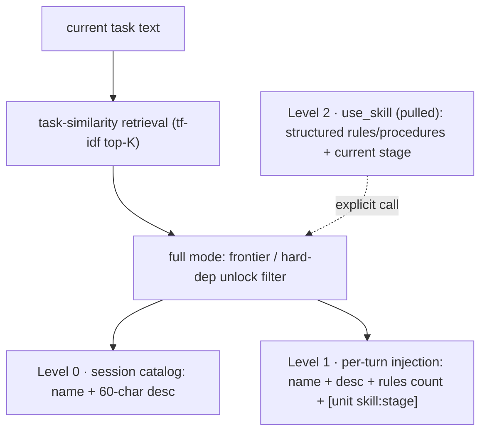
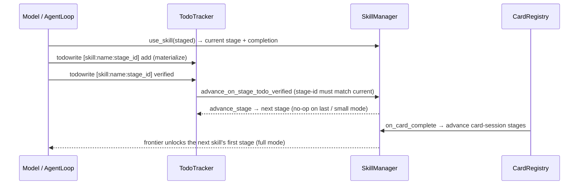
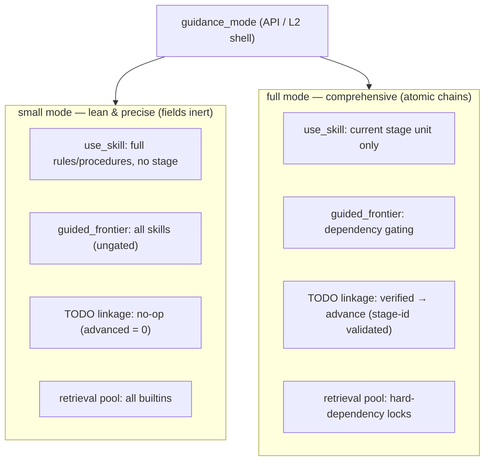

# Skill System — Complete Architecture

The skill system is the Agent OS's mechanism for capturing, evolving, and
injecting reusable procedural knowledge. It spans all five layers: a kernel
registry (L1), an evolution engine (L3 memory), retrieval/ranking (L3), three
injection consumers (L3 agent loop, L3 hook, L3 tool), and governance
surfaces (L2 shell, L4 API, VFS).

```mermaid
flowchart TB
    subgraph L1["L1 SkillManager — registry, single truth"]
        SM["registry + revision counter"]
        WG["write gate (ring/role)"]
        PG["posture gate (offensive default-deny)"]
        DP["disclosure policy (full|index|none)"]
        PP["pipeline policy (retrieval/curation knobs)"]
        GP["guidance mode (small|full)"]
        SM --- WG
        SM --- PG
        SM --- DP
        SM --- PP
        SM --- GP
    end
    PER["Persistence<br/>config/skills (builtin, RO) · evolved · lean"]
    RT["Retrieval (L3)<br/>tf-idf/embedding rank · audience routing"]
    R4["L3 R4Agent (evolution)<br/>DPO signal · lean cases · distill · prune/curate"]
    CON["Consumers<br/>① per-turn injection ② session catalog ③ use_skill"]
    R4 -->|register / persist| SM
    PER -->|SKILL.md round-trip| SM
    SM -->|read| RT
    RT -->|top-K candidates| CON
    R4 -->|inject (budgeted)| CON
```

The SkillManager registry is the single truth; the five runtime policies — write gate,
posture gate, disclosure depth, pipeline knobs and guidance mode — gate every
operation. Persistence (builtin / evolved / lean SKILL.md) round-trips through the
registry; retrieval ranks candidates for the three injection consumers; R4Agent
evolution writes back under the write gate.

## 1. Registry (L1, `src/l1/kernel/skill.py`)

### 1.1 Skill record

A skill is a dict with: `name`, `description`, `prompt` (the procedural
body), `rules` (DO/DON'T), `procedures`, `knowledge`, `tags`,
`allowed_tools`, `variables` ($VAR placeholders in prompt), `posture`
(productive|offensive), `source`, `loaded_at`, `last_used`, `useful_count`,
`inject_count`, `builtin`, `dependencies`/`dependency_kind`,
`disable_model_invocation`.

### 1.2 Write gate (`authorize_write`)

External callers (L2 shell, L4 API) MUST pass an explicit identity
(`agent_id`/`role`); identity-less writes are allowed only with
`internal=True` from system processes (boot loading, R4Agent
evolution/pruning). Policy is ring/role based (`skill.write_min_ring`,
`skill.write_roles`), runtime-overridable via `set_write_policy()`.

### 1.3 Per-Cell whitelist (`cell_skill_map`)

`bind_skill(cell_id, name)` binds a skill to a Cell; `skills_for_cell()`
returns the set. Injection paths filter by `cell_id`; unbound Cells fall
back to the global pool. Evolved skills are auto-bound to their originating
Cell ("演化即回灌").

### 1.4 Posture gate (offensive/productive)

Default-deny: `SKILL_OFFENSIVE_ENABLED=True` + `SKILL_OFFENSIVE_AUTHORIZED_NATURES=("offensive",)`.
`offensive_authorized(nature)` consulted by all three injection consumers
and `use_skill`. `_normalize_posture()` maps invalid values to the safe
default — neither LLM output, frontmatter, nor callers can escalate.

**System-posture linkage (security.mode × harness.mode):** the skill posture
gate is only one layer of a five-layer attack-authorization chain. The
constitution (§9.2 `skill.offensive_posture` rule) additionally requires
**full_power** (attack classification + detection-bypass confirmed) before an
offensive skill's `skill.use` / `use_skill` action passes — the provider is
injected at boot (`set_posture_provider(get_posture)`), never imported from
L3. Gate decisions are recorded into StatsCenter via the injected L1 metric
sink (`security.gate.skill_use.blocked`, `security.gate.use_skill.blocked`,
`security.gate.injection.blocked/allowed`) and the SkillCatalogHook skips the
§9.2 check for offensive skills when the skill-layer policy is disabled
(soft bypass stays consistent end to end).

### 1.5 Revision & audit

Every structural mutation bumps `revision()` (R4Agent cache invalidation)
and emits `EVENT_SKILL_MUTATED` via `get_bus().emit_event` (best-effort,
never breaks the mutation).

## 2. Persistence & round-trip

- **SKILL.md**: YAML frontmatter (`name/description/tags/allowed_tools/
  variables/posture/dependencies/dependency-kind/disable-model-invocation`)
  + body as the prompt. `_load_markdown()` restores ALL fields;
  `_persist_skill_md()` writes them back — never add a persisted field to
  one side without the other, or skills degrade to tag-less form after
  reboot.
- **Sources**: `config/skills/` (21 built-in, read-only), evolved dirs
  (project: `.praxis/skills/evolved/`; global: `data_dir/skills/evolved/`),
  lean dir (`.praxis/skills/lean/`, failure traces).
- **Built-in contract** (`tests/infra/test_skill_contracts.py`): ≥7 skills,
  full frontmatter, 12 universal-principle sections, no project-specific
  path literals, no constitutional violations, `disable-model-invocation:
  true` (user-invoked only), explicit valid posture. Built-ins are
  immutable even for internal processes.

## 3. Evolution engine (L3 R4Agent)

Driven by `tick()` (background loop, gated by GateChain identity +
constitution). Skill-relevant steps:

1. **Failure traces → lean cases**: `tool_pipeline` records failures via
   `track_tool_failure(agent_id, tool, args, error, turn_log, domain, nature)`
   → JSON traces in lean dir → `_process_failure_traces()` creates
   `lean_<agent>_<tool>_<err>` skills tagged `[lean_case, failure, agent,
   tool, card:<nature>]` (dedup: exact name or `dedup_key_` prefix). Each
   lean case carries a **structured `knowledge` field** — `{tool, args,
   error, domain, nature, turn_count, pattern_hint}` (truncated to
   `R4_LEAN_KNOWLEDGE_MAX`) — so distillation sees real failure detail,
   not the flattened prompt template.
2. **Generalization**: ≥`R4_LEAN_GENERALIZE_THRESHOLD` cases for one tool →
   `lean_<tool>_lessons` (rule-based baseline or LLM summary; idempotent via
   case fingerprint). The digest is built by `_sample_digest` (see batch 4
   below).
3. **LLM evolution**: `evolve_skill(intent, cell_id, scope, extra_tags)` —
   skill-architect prompt → JSON skill def → `sm.create()` (with posture
   normalization) → bind to Cell → archive pre-version (`fonds="skills",
   series="evolved"`) → persist SKILL.md → R5 graph edges (`refines` old→new,
   `type_chain` via `remember_hook`). Fails safe to rule-based fallbacks
   (e.g. `agents_md._fallback_generic_skill`).
4. **TTL prune** (`_prune_stale_skills`): evolved skills past
   `SKILL_TTL_DAYS` (7d) → archive (`series="pruned"`) + delete. Each
   recorded use (`useful_count`) extends the effective TTL by
   `SKILL_TTL_EXTEND_PER_USE` (1h), and injection refreshes `last_used` —
   active skills survive the prune.
5. **Curation** (`_curate_skills`): `contrib = useful_count /
   max(inject_count, 1)`; retire under-performers (≥`R4_CONTRIB_MIN_TRIALS`
   trials, contrib < `R4_CONTRIB_MIN_RATIO`), archive
   (`series="retired"`/`"evicted"`), enforce `SKILL_LIBRARY_MAX` cap.
   Never touches built-in or lean_case skills.
6. **Reflexion** (`reflect_failure`): LLM distills why/fix/pattern per tool
   into the reference channel (non-blocking).
7. **Content contract on evolved skills** (`validate_skill_content` in L1):
   LLM-evolved skills are scrubbed/rejected when their prompt+description
   carry constitutional-violation instructions or project-specific path
   literals — parity with the built-in catalog contract, so a malformed LLM
   response cannot register an invalid skill.
8. **Lesson distillation** (`_distill_lessons_skill`): after a plain lesson
   summary, the skill architect upgrades it into a structured definition
   (rules + procedures) with an independent per-tool cooldown
   (`R4_DISTILL_COOLDOWN`); falls back to the summary/baseline on failure.
9. **Conflict detection** (`_detect_skill_conflicts`): per-tool consistency
   pass flags duplicate evolved skills (prompt Jaccard ≥
   `SKILL_CONFLICT_SIMILARITY`) and contradictory rules (DO vs DON'T on the
   same topic); surfaced in tick results, read-only.

### 3.1 DPO-style rule preference (batch 2)

Card outcomes are attributed back to the lessons rules that were in play:

- **Signal collection**: `AgentLoop` tracks `_card_skills_used` (bounded by
  `R4_CARD_SKILL_SIGNAL_MAX`) — every `use_skill` invocation and every
  injected evolved skill rides the driving card. At card completion,
  `cell_execute` gathers the per-agent skill sets into
  `result["card_skills_used"]`.
- **Preference update**: `record_card_skill_signal(skills_used, success)`
  adjusts each lessons rule's DPO metadata —
  success → `verified++` / `preferred` up (`REP_TASK_SUCCESS`);
  failure → `hit++` / `preferred` down (`REP_TASK_FAILURE`). Rules below
  `R4_RULE_MIN_PREFERRED` are marked `deprecated`.
- **Targeted re-distillation**: `_generalize_lean_cases` carries
  verified (non-deprecated) rules into the next digest as keep-context, so
  the LLM retains what worked and rewrites only the deprecated ones.

### 3.2 Rejection sampling + heuristic verifier (batch 3)

`_distill_lessons_skill` samples up to `R4_DISTILL_SAMPLES` (1-3,
configurable) candidate definitions per digest and keeps the best-scoring
one. `_score_distill_candidate` is a three-signal heuristic verifier:
- **operability** — share of rules that are actionable (DO/DON'T/CHECK/
  VERIFY/ALWAYS/NEVER prefixes)
- **coverage** — share of the digest's error terms present in prompt+rules
- **structure** — procedures present add a bonus

### 3.3 Semantic clustering + curriculum digest (batch 4)

- `_cluster_lean_cases`: 3-gram shingle Jaccard clustering on the error
  text — same-root-cause failures written differently merge above
  `R4_CLUSTER_SIMILARITY` (0.6, tuned for 3-gram shingles).
- `_sample_digest`: curriculum-style digest — clusters ordered by size
  (frequent failure modes first), each capped at `R4_CLUSTER_SAMPLE_MAX`
  representative cases, difficulty ramp within a cluster (simple → complex
  by error word count), `[complex]` marker for patterns ≥
  `R4_DIFFICULTY_WORDS` words. The fingerprint is computed over the
  sampled digest, keeping a stable case set idempotent.

## 4. Retrieval & ranking (L3, `skill_retriever.py` + `r4_skill_feedback.py`)

- **`get_evolved_skills(agent_id, cell_id, limit, graph_diffusion, tags)`**:
  filters agent tag (strict membership), Cell whitelist, card-tag OR-match
  (`_passes_card_tags`: untagged universal, `card:*`-tagged gated); graph
  diffusion (BFS along R5 edges) with linear fallback; cached on
  `revision()`.
- **`retrieve_skills(query, ..., tags)`**: tfidf (or embedding backend)
  rank of candidates by description+prompt cosine similarity, min-score
  floor, fallback to loaded-at order. Backends pluggable:
  `set_backend()` / config `skill.retriever_backend`; unknown names degrade
  to tfidf.
- **`get_lean_cases(agent_id, tool_name, cell_id)`**: lean-case injection,
  Cell-whitelist filtered, shared cache with `get_lean_case_names()`.

## 5. Injection consumers

### 5.1 AgentLoop (`_inject_extra_context`)

Token-budgeted (`LOOP_CONTEXT_BUDGET_SKILL`), gated by
`prompt.inject.skills`:
1. lean cases (`get_lean_cases`, budgeted, truncated fallback)
2. evolved skills (`retrieve_skills` with `self.task` + card-tag boost +
   `card:<nature>` tags from the driving card, `LOOP_EVOLVED_SKILLS_LIMIT`)
   — filtered by `skill_visible` (audience) and posture gate
3. injection feedback: `last_used` refresh + `inject_count` bump (feeds
   curation denominators)

### 5.2 SkillCatalogHook (`session_start`)

Injects up to `SKILL_CATALOG_HOOK_LIMIT` skill summaries into the session
system prompt; hides offensive-posture skills while the gate is enabled;
built-ins take priority (auto-activation toggleable via
`skill.auto_activate_builtin`, default `SKILL_AUTO_ACTIVATE_BUILTIN`).

### 5.3 `use_skill` tool (`_skills.py`)

Explicit invocation: audience check → posture gate (reads `_card_nature`
from tool args, injected by `AgentLoop._wrap_handler`) → prompt expansion
of `$VARIABLES`. Refuses offensive skills without authorized card nature.

### 5.4 Manual surfaces

- **VFS**: `/skills` virtual mount (`skill_vfs_content`, per-skill read).
- **worker_pool boot**: loads up to 20 skills into the agent's context
  register as a "manual".
- **L3A `agents_md`**: handbook generation evolves a reusable skill via
  `evolve_generic_skill` (global scope, rule-based fallback).

### 5.5 Content-push decision chain



The system pushes pointers and summaries — never raw bodies. The current task
text drives retrieval (tf-idf top-K); full guidance mode narrows the pool to
frontier-unlocked skills (hard-dependency locks only). Level 0 (catalog) and
Level 1 (per-turn injection, token-budgeted) are pushed automatically; the
structured body — rules/procedures and the active atomic unit
(`skill:stage_id`) — is pulled by the model via `use_skill`.

## 6. Governance surfaces

- **L2 shell `/skills`**: list/lean/get (public); create/update/delete/
  reload/evolve/permissions/retriever/distill (developer-gated via
  `--role`). `/skills distill [status|set <field> <on|off>]` toggles the
  distillation/DPO master + sub switches at runtime.
- **L4 API** `/api/v2/skills/*`: list/get/create/update/delete/reload/
  permissions/retriever/offensive-policy/distill-policy (GET+POST,
  developer-gated).
- **Config**: `params/` defaults ← `settings_center` L2 ← `praxis.yaml`
  `skill:` section (retriever_backend, evolve_scope, offensive_enabled,
  offensive_natures, distill_enabled, dpo_signal_enabled,
  distill_sub.{generalize,llm_distill,clustering,sampling}, cell.skills).

### 6.1 Distillation/DPO master switches (API-controlled)

The batch 1-4 pipeline is kill-switchable per stage, not all-or-nothing:

- **Masters**: `distill` (whole pipeline) and `dpo_signal` (card→skill
  preference weighting); `dpo_signal=False` also disables
  `record_card_skill_signal`.
- **Sub-switches** under `distill`: `generalize` (rule generalization),
  `llm_distill` (LLM distillation + rejection sampling), `clustering`
  (shingle clustering), `sampling` (frequency/difficulty digest).
- **Degradation chain** (disabling one notches down, never hard-fails):
  - `clustering=False` → plain by-tool grouping
  - `sampling=False` → flat digest of all cases (knowledge-consistent)
  - `llm_distill=False` → rule baseline only, zero LLM calls (cheapest)
  - `generalize=False` → the whole pipeline is skipped
- **Policy state** on the SkillManager: `distill_policy()` returns
  `{distill, dpo_signal, sub{4}, updated, source}` — `source` tracks the
  last mutator (params/config/api/shell) for auditability.
- **Control surfaces** share one state: `POST /api/v2/skills/distill-policy`
  (body: `{distill?, dpo_signal?, sub?}`), `/skills distill set`, and the
  `skill.*` config keys; runtime changes mirror into SettingsCenter L2.

## 7. Feedback loop (self-improvement)

```
inject (5.1) → inject_count++, last_used refresh
    → use_skill / catalog exposure → _card_skills_used (per card)
    → card completes → card_skills_used + success/failure
    → record_card_skill_signal → rule verified/hit/preferred ±
    → deprecated rules (< R4_RULE_MIN_PREFERRED) → targeted re-distill
    → tool failure → trace file → lean_case skill (structured knowledge)
    → ≥5 per tool → cluster (shingle) + sample (frequency/difficulty)
    → LLM distill (rejection sampling + verifier) → lessons skill
    → TTL prune / curation retire (archived) → loop
```

The three-table linkage (TODO × skill × card) closes the loop at stage
granularity:



Every stage advances only when its OWN completion criterion is verified — the
todo content carries `[skill:<name>:<stage_id>]`, and the bridge refuses stale
or future-stage confirmations (review-hardened). Card completion advances the
same session-scoped stage state, and the guidance frontier then unlocks the
next skill's first atomic unit.

## 8. Key invariants

1. Round-trip integrity: frontmatter ↔ registry fields stay in sync.
2. Write gate: never weaken — it protects Cell bindings + TTL prune deletes.
3. Default-deny posture; `_normalize_posture` blocks escalation.
4. Built-in skills are immutable and user-invoked only.
5. All graph/archive calls are non-blocking (graph defaults off).
6. Injection refreshes `last_used` so active skills survive TTL prune.
7. Revision-based caching: SkillManager revision is the cache key for all
   R4Agent injection caches.
8. Distillation never hard-fails: each stage degrades one notch (clustering
   → grouping, sampling → flat, llm_distill → baseline) under its switch.
9. Rule preference metadata is runtime-only: SKILL.md persists rule text,
   DPO counters are rebuilt from card signals on the next distillation.
10. Stage integrity: only the CURRENT stage's verified TODO advances — the
    stage id in `[skill:<name>:<stage_id>]` must match the active stage;
    stale or future-stage confirmations are no-ops and the last stage has
    nothing to advance.
11. Soft dependencies are advisory: `dependency-kind: soft` never locks a
    skill out of the retrieval pool or the guidance frontier; only hard
    dependencies gate progression.
12. Guidance mode gates every consumer consistently: small mode makes the
    guidance fields (stages/next/dependencies) inert across use_skill,
    guided_frontier, the TODO linkage and the retrieval pool.

## 9. Skill file format (normalized contract)

`SKILL.md` is the **human-readable canonical document**; the loader projects it
into a structured runtime view. The format is enforced by
`tests/infra/test_skill_schema.py` (fields / enums / references / body layout /
round-trip) and `tests/infra/test_skill_contracts.py` (shared-principles layer).

### 9.1 Frontmatter schema

```yaml
---
name: <kebab-case, must match the directory>
description: "Use when <trigger> — <value>"   # trigger-oriented; the first ~60
                                              # chars surface in session catalogs
tags: [strategy | execution | review, ...]    # strategy/execution are AUDIENCE tags
disable-model-invocation: true                # user-invoked only (all builtins)
posture: productive | offensive               # offensive = default-deny injection
disclosure: full | index | none               # progressive-disclosure depth
allowed-tools: [tool, ...]                    # tool whitelist
dependencies: [skill, ...]                    # prerequisite skills (guidance DAG)
dependency-kind: soft | hard
next: [skill, ...]                            # forward guidance (quest-style chain)
stages:                                       # quest-style staged skills (optional)
  - id: red
    name: RED
    instructions: <active-stage prompt>
    completion: <verifiable completion criterion>
---
```

**Required fields** (schema gate): `name`, `description`, `tags`,
`disable-model-invocation`, `posture`, `allowed-tools`, `disclosure`.
**Enums**: `posture ∈ {productive, offensive}`,
`disclosure ∈ {full, index, none}`; at most one audience tag per skill.
`next` / `dependencies` must reference skills that exist (dangling references
fail the gate); the guidance graph must stay **acyclic**
(`validate_guidance_graph`).

### 9.2 Body layout contract

```
<intro paragraph>
## Constitution Binding     # MUST — constitutional sections this skill operates under
## Rules                    # MUST — `- **DO**: ...` / `- **DON'T**: ...` items
## Procedures               # MUST — `- **N**: <desc>` items
```

- The 12 universal principles do **not** live in per-skill files — they are
  normalized into `config/skills/_shared/principles.md` and injected by the
  loader at load time (`_strip_universal_principles` + shared-layer injection).
  Editing a principle touches one file, not 21.
- `rules` are parsed by `_extract_rules` (DO/DON'T); `procedures` by
  `_extract_procedures` (`{step, description}` — symmetric with the LLM
  SkillArchitect contract `{step, action, description}`).

### 9.3 Disclosure depth (`disclosure`)

| value | Level 0 index (catalog) | Level 1 content (inject) | explicit use_skill |
|-------|:---:|:---:|:---:|
| `full` (default) | ✓ | ✓ | ✓ |
| `index` | ✓ (name+desc only) | ✗ | ✓ |
| `none` | ✗ | ✗ | ✓ (known name) |

Session catalogs and task-similarity retrieval filter `none`; `index` skills
surface as existence-only hints.

### 9.4 Staged skills + guidance engine

- `stages` make a skill quest-style: `current_stage(name, session)` /
  `advance_stage(name, session)` track **per-session** progression;
  `use_skill` discloses only the active stage; stage `completion` feeds the
  card/TODO linkage (`on_card_complete` advances the card session's stage).
- `dependencies` (prerequisites) + `next` (forward guidance) build the
  guidance DAG: `guided_frontier(completed)` returns the unlocked quest-log,
  `guided_path(target)` reverse-chains prerequisites, `validate_guidance_graph`
  fails on cycles.

In full guidance mode the chain progresses at ATOMIC granularity — each stage
acts as a skill unit (`skill:stage_id`), unlocking the next one as stages are
completed; completing a skill's last stage unlocks the next skill's first
stage via its dependencies:


### 9.5 Runtime views (human vs agent)

| surface | content | layer |
|---------|---------|-------|
| `SkillManager.get()` / API / L2 `get` / R4Agent | full markdown | human/review + evolution |
| `SkillManager.structured_skill(name, session)` | rules/procedures/stages/allowed-tools/deps/next — **no body** | agent runtime |
| `list_skills()` (external surfaces) | slim catalog — `prompt` dropped unless `include_prompt=True` | agent runtime |
| `use_skill` default | structured view (`structured=true`) | agent runtime |
| `use_skill(full=true)` | raw body — **write-gated** (privileged read) | human/review |

### 9.6 Round-trip invariants

Loader (`_load_markdown`) ↔ persister (`_persist_skill_md` / `evolve_skill`) ↔
`list_skills` output must keep every persisted field in sync
(`disclosure` / `stages` / `next` included) — enforced by
`TestSchemaRoundTrip`. The builtin catalog is immutable at runtime (write gate
rejects mutations; only R4Agent evolution/pruning with `internal=True` writes
to the evolved layer).

## 10. Guidance operating mode (small | full)

The guidance fields (stages / next / dependencies) always exist in the skill
files — the **minimal dependency architecture**. A runtime policy decides
whether the guidance machinery activates them:



- **small** treats the guidance fields as inert: skills execute as plain
  skills (no stage view, no unlock gating, no stage linkage, no hard-dep
  locks in retrieval).
- **full** (default) activates the atomic stage-granularity chains: stage
  disclosure, frontier unlocking, TODO-verified stage advancement and
  hard-dependency locks in the retrieval pool.

Switch at runtime: `POST /api/v2/skills/guidance` (`{"mode": "small"|"full"}`)
or `/skills guidance set small|full`; the current mode is readable via
`GET /api/v2/skills/guidance` / `/skills guidance status`.
