# Praxis Agent OS — Technical Architecture

> NOMOS Praxis v0.3.0 codename "Aether"  
> Based on `src/` (commit: current working tree).  
> All references are to `src/l1/`, `src/l2/`, `src/l3/`, `src/l4/`, `src/l5/`.

---

## 0. Architecture Overview

Praxis Agent OS maps to traditional computer architecture across five layers:

```mermaid
flowchart TB
    subgraph L5["L5 — User Layer (src/l5/)"]
        CLI["cli.py\nREPL interface"]
        AR["agent_runtime.py\nRuntime loop"]
    end

    subgraph L4["L4 — Bridge Layer (src/l4/)"]
        API["api_gateway.py\nHTTP/WS API"]
        APIH["api_handlers/\nREST handlers"]
        LLM["llm.py\nLLM Engine"]
        MCP["mcp_bridge.py\nMCP protocol"]
        SANDBOX["sandbox/\nProcess isolation"]
        RPC["rpc/\nInter-process"]
        ADAPT["adapters/\nPort impls"]
    end

    subgraph L3["L3 — Cell Layer (src/l3/)"]
        CELL["cell/\nAgent collaboration"]
        AGENT["agent_terminal/\nWorker threads"]
        MEMORY["memory.py\n3-ring memory"]
        CARDS["card*.py\nCard lifecycle"]
        TOOLS["tools/\n35+ tool impls"]
        PLANNER["htn_planner.py\nIntent decomposer"]
        MONITOR["monitor_bus.py\nEvent monitoring"]
        ERROR["error_bus/\nError logging"]
        BOOT["boot.py\nSystem bootstrap"]
    end

    subgraph L2["L2 — Shell Layer (src/l2/)"]
        SHELL["l2_shell/\nCommand dispatch"]
        I18N["i18n.py\nInternationalization"]
        SEL["selector.py\nAgent selection"]
    end

    subgraph L1["L1 — Kernel Layer (src/l1/kernel/)"]
        PARAMS["params/\nConstants"]
        SYNC["sync.py\nMutex/Semaphore/Barrier"]
        PROCESS["process.py\nProcessTable"]
        ALLOC["allocator.py\nToken allocator"]
        GATE["gatechain.py\nG1-G5 gates"]
        CONST["constitution.py\nRules engine"]
        EVENT["event.py\nEventBus"]
        VFS["vfs.py\nVirtual FS"]
        NET["net.py\nNetwork mesh"]
        SWAP["swapper.py\nRing swapper"]
    end

    L5 --> L4
    L4 --> L3
    L3 --> L2
    L2 --> L1
```

| Computer Concept | Praxis Equivalent |
|---|---|
| CPU instruction set (ISA) | ToolSpec (name / params / handler) |
| CPU core | Cell (card queue + AgentTerminal + AgentLoop) |
| Operating system | 10 Central Control Systems |
| Memory hierarchy L1/L2/L3 | Memory rings R1/R2/R3 |
| MMU / page tables | Territory (constitution) + GateChain G3 |
| System calls | tool_pipeline.execute() (7 gates) |
| Device drivers | tool_spec.py middleware + plugin system |
| Interrupt controller | EventBus SignalType |
| Multi-core interconnect | L3B cross-cell routing |

---

## 1. Layered Architecture

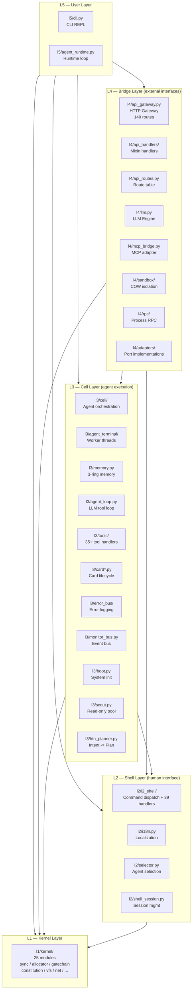

---

## 2. Boot Sequence

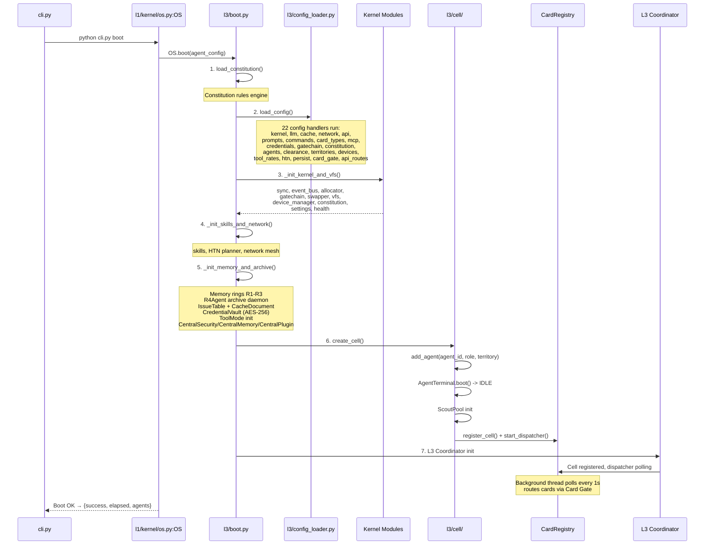

---

## 3. Agent Execution Flow

### 3a. Agent Execution Flow (`tool_pipeline.execute()`)

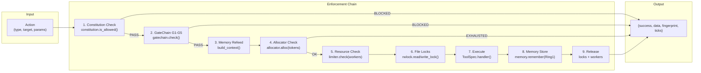
### 3b. AgentLoop Multi-Turn (`l3/agent_loop.py`)

The AgentLoop wraps `LLMEngine.tool_use()` with four self-correction and verification mechanisms:

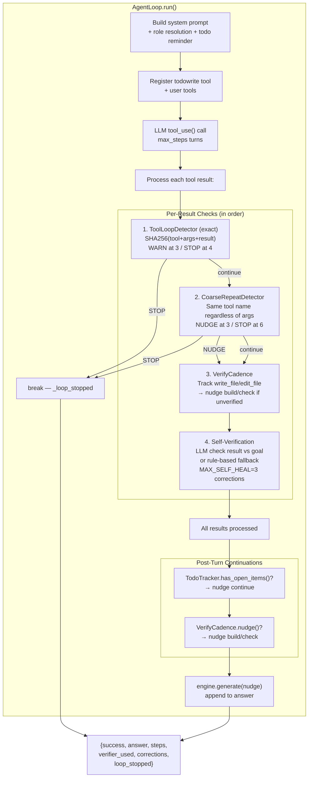

#### Inner Components

| Component | Lines | Trigger | Action |
|-----------|-------|---------|--------|
| **ToolLoopDetector** | `agent_loop.py:29` | Consecutive identical (tool+args+result) ×3 | WARN: inject course-correction nudge |
| | | Consecutive identical ×4 | STOP: terminate turn, `_loop_stopped=true` |
| **CoarseRepeatDetector** | `agent_loop.py:72` | Same tool_name ×3 | NUDGE: "you have issued N multiple times" |
| | | Same tool_name ×6 | STOP: terminate turn |
| **TodoTracker** | `agent_loop.py:101` | Open items exist after LLM responds | Inject continuation nudge, continue loop |
| | | All items completed | No nudge, turn ends normally |
| **VerifyCadence** | `agent_loop.py:154` | write_file/edit_file without following build cmd | Nudge: "Run a fast check" (at most once per edit) |

#### Todo In-Context Reminder

Every AgentLoop call injects:
```
>> You are currently ON task 'add input validation'
Current task list:
  [✓] 1. Parse config file
  [→] 2. Add input validation
  [ ] 3. Write tests

Update ONE item at a time using 'todowrite' with status: pending|in_progress|completed
Do NOT stop while ANY item is still pending or in_progress.
```

Model manages this list via the built-in `todowrite` tool.

#### Provider Retry Layers (`l4/llm.py:_call_api`)

| Layer | Detection | Backoff | Max |
|-------|-----------|---------|-----|
| Overflow | HTTP 413/400 + "too long" | compact memory + retry | 3 |
| Rate limit | HTTP 429 | Retry-After header or 60s | 5 |
| Transient | timeout/reset/refused/5xx | Linear 3/6/9s | 3 |
| Empty | 200 OK, no content, no tool_calls | 1/1/2/2/3s | 5 |

---

## 4. GateChain G1-G5 Authorization

```mermaid
flowchart LR
    subgraph G1["G1: Tool Whitelist"]
        direction TB
        G1_IN["Tool name in TOOL_REGISTRY?"]
        G1_PASS["PASS"]
        G1_BLOCK["BLOCK"]
        G1_IN -->|Yes| G1_PASS
        G1_IN -->|No| G1_BLOCK
    end

    subgraph G2["G2: Identity"]
        direction TB
        G2_IN["Agent in ProcessTable?\nState READY/RUNNING?"]
        G2_PASS["PASS + Ed25519?"]
        G2_BLOCK["BLOCK"]
        G2_WARN["WARN\n(no keypair)"]
        G2_IN -->|Yes + key| G2_PASS
        G2_IN -->|Yes no key| G2_WARN
        G2_IN -->|No| G2_BLOCK
    end

    subgraph G3["G3: Territory + Risk"]
        direction TB
        G3_IN["Target in Territory?\nRisk = danger + freq×0.5"]
        G3_IN -->|In territory + risk<6| G3_PASS["PASS"]
        G3_IN -->|In territory + risk>=6| G3_WARN["WARN"]
        G3_IN -->|Outside territory| G3_BLOCK["BLOCK"]
    end

    subgraph G4["G4: Escalation"]
        direction TB
        G4_IN["Danger >= 4?"]
        G4_IN -->|Yes| G4_WARN["WARN + L3 Notified"]
        G4_IN -->|No| G4_PASS["PASS"]
    end

    subgraph G5["G5: Composite Judgment"]
        direction TB
        G5_IN["Score = danger×2 + history×0.5 + freq×1.0\nReputation [0.0-1.0]"]
        G5_IN -->|rep>=0.9 + G3=WARN| G5_PASS["PASS (high tolerance)"]
        G5_IN -->|rep<0.7 + G3=WARN| G5_BLOCK["BLOCK"]
        G5_IN -->|repeated + high freq| G5_REPORT["REPORT"]
        G5_IN -->|normal| G5_PASS2["PASS"]
    end

    TOOL["Tool Call"] --> G1
    G1 -->|PASS| G2
    G1 -->|BLOCK| STOP["STOP ✗"]
    G2 -->|PASS/WARN| G3
    G2 -->|BLOCK| STOP
    G3 -->|PASS/WARN| G4
    G3 -->|BLOCK| STOP
    G4 -->|PASS/WARN| G5
    G5 -->|PASS| ALLOW["ALLOW ✓"]
    G5 -->|WARN| ALLOW
    G5 -->|BLOCK/REPORT| STOP
```

---

## 5. Tool Pipeline

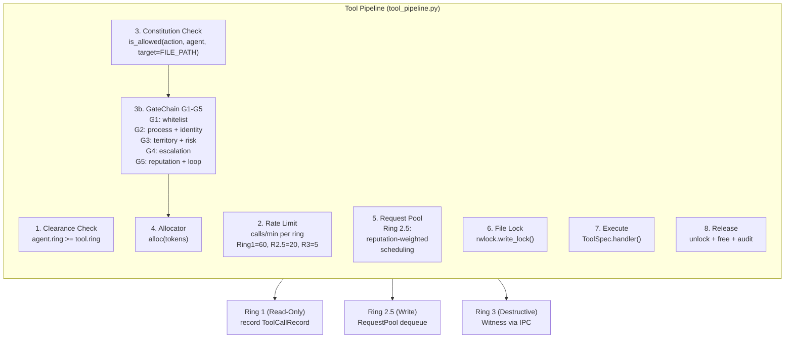

---

## 6. Tool Ring Architecture

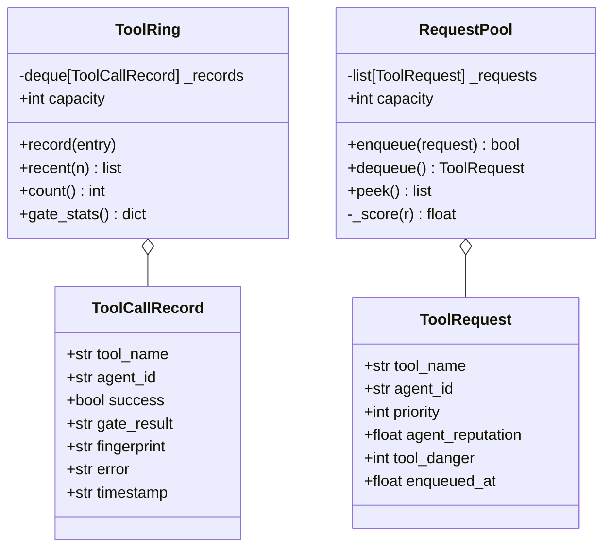

---

## 7. Tool Registry & Mute System

Tools are registered in a global `TOOL_REGISTRY: dict[str, ToolSpec]` and auto-discovered from 4 directories (`tools/base/`, `tools/cell/`, `tools/advanced/`, `tools/special/`). The mute system adds runtime disable capability at four independent levels.

### 7.1 Mute Levels

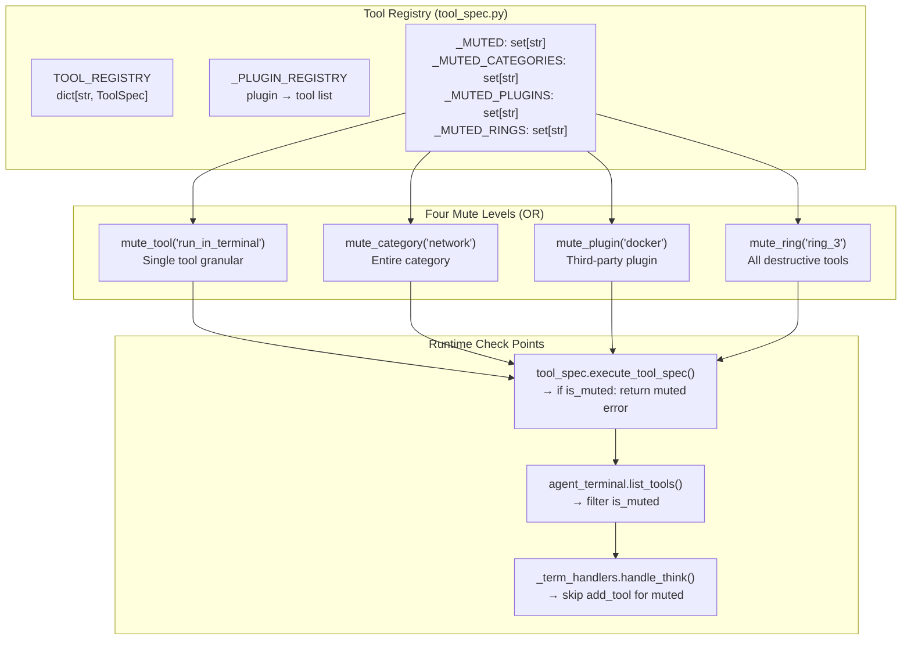

### 7.2 API

| Function | Effect |
|----------|--------|
| `mute_tool("run_in_terminal")` | Disable a single tool by name |
| `unmute_tool("run_in_terminal")` | Re-enable |
| `mute_category("network")` | Disable all tools in a category |
| `unmute_category("network")` | Re-enable |
| `mute_plugin("docker")` | Disable all tools from a plugin |
| `unmute_plugin("docker")` | Re-enable |
| `mute_ring("ring_3")` | Disable all tools at a ring level |
| `unmute_ring("ring_3")` | Re-enable |
| `is_muted(tool_name)` → bool | Check at all four levels |
| `list_muted()` → dict | Show all active mute rules |
| `clear_mutes()` | Reset all |

### 7.3 Triple-Layer Enforcement

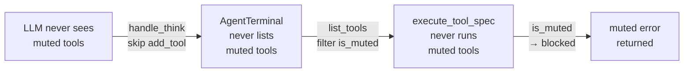

### 7.4 Tool Discovery

```python
# tool_registry_setup.py
# Auto-discovers from 4 directories:
#   tools/base/      → Ring 1 read-only tools
#   tools/cell/      → Cell collaboration & governance
#   tools/advanced/  → Ring 2.5-3 write/destructive
#   tools/special/   → Composite, archive, L3
# Each tools_*.py exports register_tools()
# Third-party: register_plugin(name, tools, pre_hook, post_hook)
```

---

## 8. Cell & Agent Architecture

The Cell is the **CPU core** of Praxis. It holds N AgentTerminals (execution units), a shared ScoutPool, and a mailbox for inter-agent messaging.

### Cell = CPU Core Analogy

| CPU Core Concept | Cell Equivalent |
|---|---|
| Instruction pipeline | Card phases/steps (sequential or parallel) |
| Register file | `agent_map` (role → agent_id) |
| Cache L1/L2/L3 | Memory rings R1/R2/R3 |
| Branch predictor | HTN Planner intent decomposition |
| Hyper-threading | Multi-agent parallel phase execution |
| Interrupt controller | EventBus SignalType subscription |
| Memory controller | CentralMemory (R1-R4 coordinator) |

### Architecture

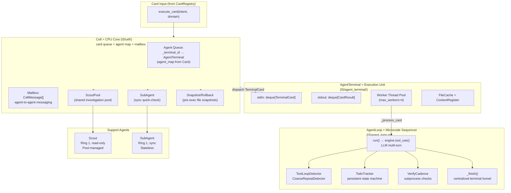

---

## 9. Card Lifecycle

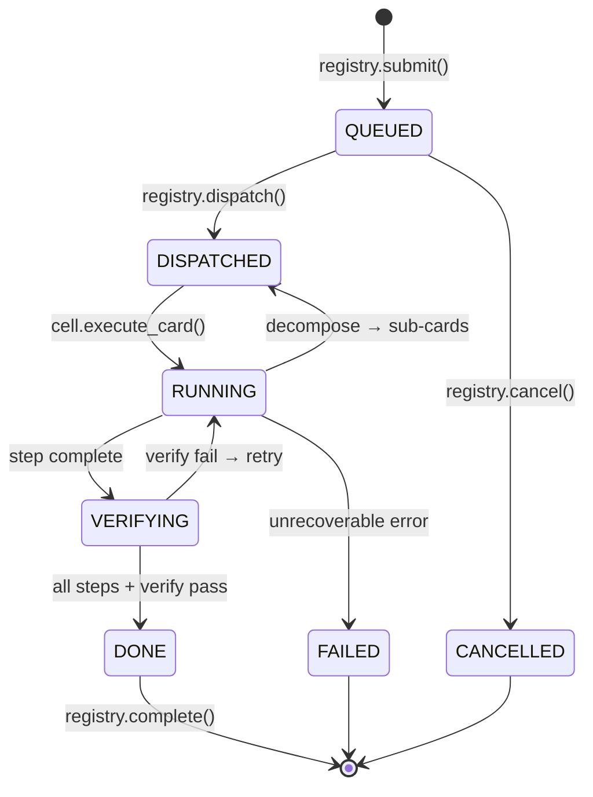

Card structure:

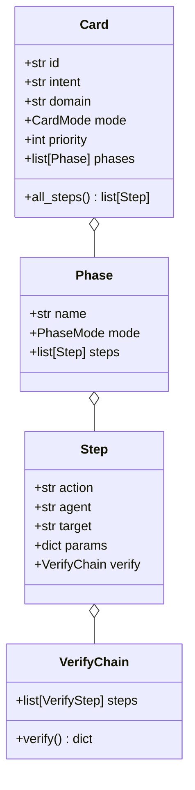

### 9a. Dual-Layer Card Queue: Dispatch Queue + Card Gate

The card queue is split into two layers:

1. **Dispatch Queue** (`CardRegistry._queue`) — priority-sorted list of card IDs waiting for Cell dispatch
2. **Card Gate** (`card_gate.py`) + **PendingQueue** (`pending_queue.py`) — human/convention approval queue for cards requiring review

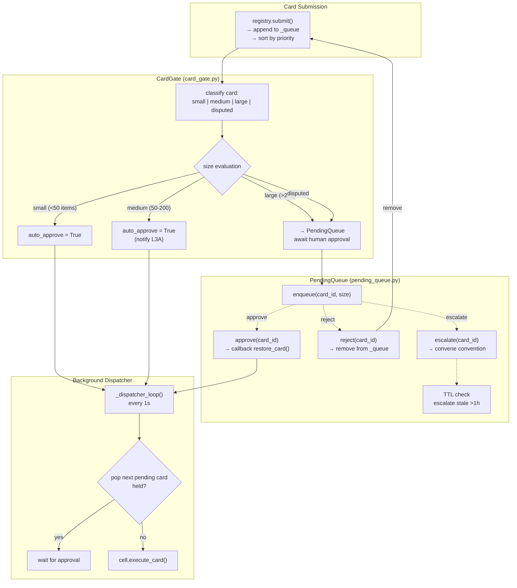

**Stateful Approval Trail** on each `CardRecord`:
- `approval_status`: pending | auto_approved | human_approved | rejected | escalated
- `approval_size`: small | medium | large | disputed
- `approval_at`: ISO timestamp
- `approval_by`: agent_id or "auto"

---

## 10. Memory System Detail

### 9.1 Three Rings + Dual Storage

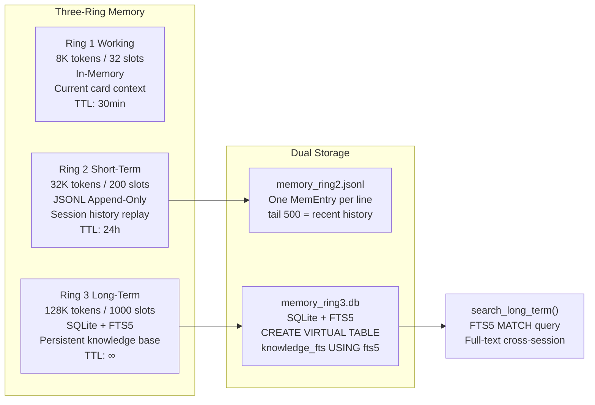

### 9.2 Memory Quality System

Auto-scores each entry 0.0–1.0 on write, rejects low-quality content:

| Criterion | Bonus/Penalty | Example |
|-----------|--------------|---------|
| Type: decision/pattern | +0.3 | "use Poetry not pip" |
| Contains file path | +0.1 | "~/code/api uses Go 1.22" |
| Contains IP/version | +0.1 | "staging at 10.0.1.50" |
| Contains port | +0.05 | "SSH port 2222 not 22" |
| Contains env var | +0.05 | "DATABASE_URL=..." |
| Too short (<30 chars) | REJECTED | "read file" |
| Too long (>2000 chars) | REJECTED | raw log dump |
| Vague pattern | REJECTED | "user has a project" |

### 9.3 Auto-Compaction + Snapshot + Resume

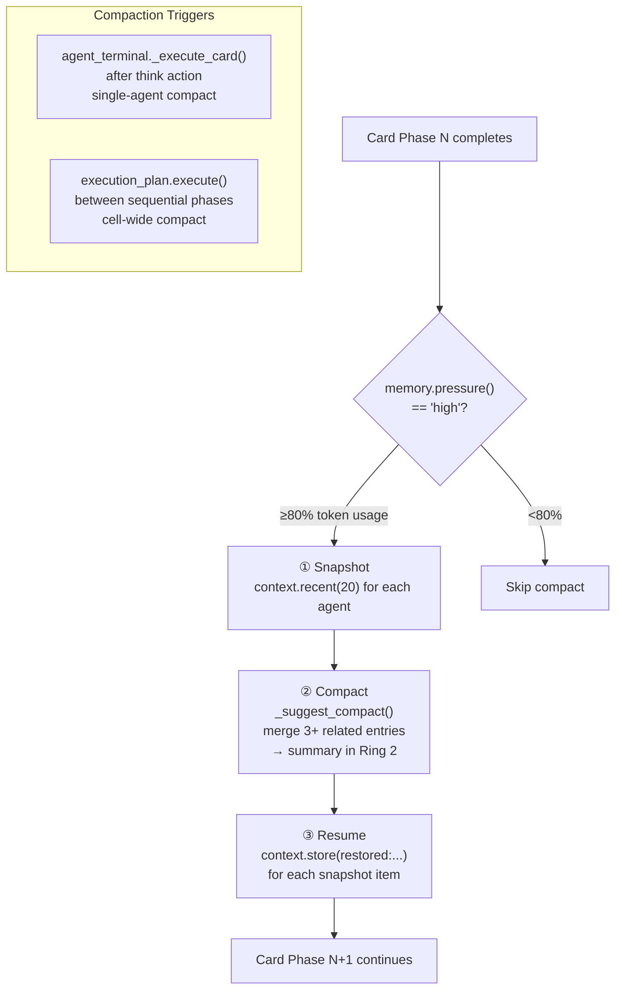

### 9.4 Memory → AgentLoop Bridge

```python
# _term_handlers.py:handle_think
# Auto-inject OS-managed context on every think
memory = get_memory()
ring_context = memory.build_context(agent_id, max_tokens=1024)
recent = term.context.recent(5)

system_prompt = f"You are {agent_id} ({role}) in NOMOS Praxis.\n"
if ring_context:
    system_prompt += f"\n--- Memory Context ---\n{ring_context}\n---"

loop = AgentLoop(task=task, agent_id=agent_id, system=system_prompt)
result = loop.run(max_steps=10)

# Result auto-stored back to memory
memory.remember(agent_id, "thought", output, ring=1)
term.context.store(key=f"think:{target}", value=output)
```

---

## 11. Dual-Layer Three-Ring Composite Architecture

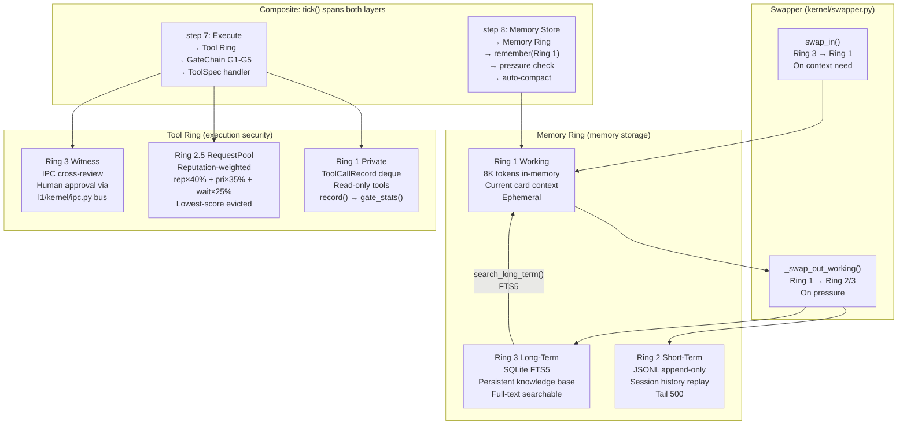

**Tool Ring** controls whether an Agent **can** perform an operation.  
**Memory Ring** controls whether an Agent **remembers** past context.  
**Composite point** is at gent_runtime.tick() steps 7-8: within the same tick, execution passes through Tool Ring approval, results store into Memory Ring.

---

## 12. Module Dependency Map

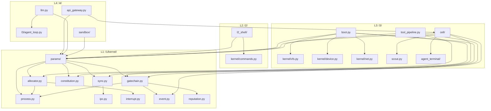

---

## 13. Key Constants (from `src/l1/kernel/params/`)

| Category | Sub-module | Examples |
|----------|-----------|----------|
| **Allocator** | `params/kernel.py` | `ALLOCATOR_DEFAULTS.{tokens=4096, ring1=32, ring2=200, ring3=1000}` |
| **Mutex** | `params/kernel.py` | `MUTEX_DEFAULT_TIMEOUT=30.0`, `MUTEX_DEFAULT_PRIORITY=5.0` |
| **Semaphore** | `params/kernel.py` | `SEMAPHORE_DEFAULT_MAX=3`, `SEMAPHORE_DEFAULT_TIMEOUT=30.0` |
| **Scout** | `params/agent.py` | `MAX_SCOUTS_PER_AGENT=3`, `SCOUT_TIMEOUT=300.0` |
| **Tool Timeouts** | `params/tool.py` | `TOOL_TERMINAL_TIMEOUT=30.0`, `TOOL_GREP_TIMEOUT=15.0` |
| **Tool Rates** | `params/tool.py` | `TOOL_RATE_RING_1=60/min`, `RING_2_5=20/min`, `RING_3=5/min` |
| **GateChain** | `params/kernel.py` | `GATECHAIN_RISK_WARN_THRESHOLD=6.0`, `GATECHAIN_REPEAT_THRESHOLD=5` |
| **Process** | `params/kernel.py` | `PROCESS_AUDIT_MAX=1000`, `PROCESS_INIT_RING=3` |
| **Network** | `params/api.py` | `BROADCAST_INTERVAL=15.0`, `PEER_TIMEOUT=60.0` |
| **Cell ID** | `params/agent.py` | `DEFAULT_CELL_ID="cell-1"` |
| **Config Dir** | `params/system.py` | `PRAXIS_CONFIG_DIR=".config/nomos-praxis"` |
| **LLM URLs** | `params/api.py` | `ANTHROPIC_DEFAULT_URL="https://api.anthropic.com/v1/messages"` |
| **Memory Budget** | `params/system.py` | `working=8192, short=32768, long=131072` |
| **Memory Pressure** | `params/kernel.py` | `PRESSURE_HIGH=0.80, PRESSURE_MEDIUM=0.60` |
| **GateChain** | `GATECHAIN_RISK_WARN_THRESHOLD=6.0`, `GATECHAIN_REPEAT_THRESHOLD=5` |
| **Process** | `PROCESS_AUDIT_MAX=1000`, `PROCESS_INIT_RING=3` |
| **Network** | `BROADCAST_INTERVAL=15.0`, `PEER_TIMEOUT=60.0` |
| **Cell ID** | `DEFAULT_CELL_ID="cell-1"` |
| **Config Dir** | `PRAXIS_CONFIG_DIR=".config/nomos-praxis"` |
| **LLM URLs** | `ANTHROPIC_DEFAULT_URL="https://api.anthropic.com/v1/messages"` |
| **Memory Budget** | `working=8192, short=32768, long=131072` |
| **Memory Pressure** | `PRESSURE_HIGH=0.80, PRESSURE_MEDIUM=0.60` |

---

## 14. File Layout

```
praxis/
├── pyproject.toml              # Project config
├── praxis.yaml                  # System config
├── .nomos-rules.md              # Constitution rules
├── .gitignore
├── commands.yaml                # L2 Shell command definitions
├── tools.yaml                   # Tool metadata registry
│
├── src/
│   ├── __init__.py              # Package root (exports KERNEL_VERSION)
│   │
│   ├── l1/                      # === KERNEL LAYER ===
│   │   └── kernel/              # OS primitives (35 files)
│   │       ├── __init__.py      # Syscall dispatcher + audit trail
│   │       ├── params/          # Constants package (5 sub-modules)
│   │       │   ├── __init__.py   # Docs only — no re-exports
│   │       │   ├── kernel.py    # Allocator, Mutex, GateChain, Process, VFS...
│   │       │   ├── agent.py     # Agent configs, roles, terminal, card, convention
│   │       │   ├── tool.py      # Tool timeouts, rates, danger, HTN
│   │       │   ├── api.py       # API, LLM, network, IPC constants
│   │       │   └── system.py    # Cache, persistence, data paths, sandbox
│   │       ├── sync.py          # Mutex, Semaphore, Barrier, RWLock
│   │       ├── process.py       # ProcessTable
│   │       ├── allocator.py     # Token allocator + OOM
│   │       ├── event.py         # EventBus publish/subscribe
│   │       ├── gatechain.py     # G1-G5 authorization
│   │       ├── constitution.py  # Constitutional rules engine
│   │       ├── vfs.py           # Virtual file system
│   │       ├── ipc.py           # LockChannel + LockBus
│   │       ├── device.py        # Device manager + rate limiting
│   │       ├── persist.py       # SQLite event store
│   │       ├── reputation.py    # Agent reputation scoring
│   │       ├── tool_chain.py    # HMAC-SHA256 fingerprint chain
│   │       ├── swapper.py       # Memory ring swapper
│   │       ├── settings.py      # Key-value config store
│   │       ├── skill.py         # Skill manager
│   │       ├── interrupt.py     # Interrupt table
│   │       ├── net.py           # Network mesh (UDP/TCP)
│   │       ├── net_transport.py # Transport layer + TLS
│   │       ├── ports.py         # Port interfaces (adapter pattern)
│   │       ├── registry.py      # Central system registry
│   │       ├── health.py        # Kernel health check
│   │       ├── resource.py      # Resource limiter
│   │       ├── prompts.py       # YAML-driven prompt registry
│   │       ├── commands.py      # YAML-driven command registry
│   │       ├── os.py            # OS lifecycle coordinator
│   │       ├── rule_descriptor.py  # Constitution rule format
│   │       ├── errors.py        # Error codes + catalog
│   │       └── platform.py      # Cross-platform detection
│   │
│   ├── l2/                      # === SHELL LAYER ===
│   │   ├── l2_shell/            # Command dispatch package
│   │   │   ├── __init__.py      # dispatch(), _direct_message()
│   │   │   ├── state.py         # ShellState singleton
│   │   │   ├── commands.py      # 39 _cmd_* handlers + _pipeline
│   │   │   ├── completer.py     # autocomplete
│   │   │   └── output_guard.py  # guard_output
│   │   ├── i18n.py              # Internationalization
│   │   ├── selector.py          # Agent preselect
│   │   ├── shell.py             # Shell entry
│   │   ├── shell_session.py     # Session lifecycle
│   │   └── shell_completer.py   # Tab completion
│   │
│   ├── l3/                      # === CELL LAYER ===
│   │   ├── cell/                # Cell orchestration package
│   │   │   └── __init__.py      # Cell class + factory
│   │   ├── agent_terminal/      # AgentTerminal package
│   │   │   └── __init__.py      # AgentTerminal + worker loop
│   │   ├── error_bus/           # ErrorBus package
│   │   │   ├── __init__.py      # ErrorBus, error_boundary, capture
│   │   │   └── api.py           # API handlers for error queries
│   │   ├── resource_buffer/     # Ring file buffer
│   │   │   ├── __init__.py
│   │   │   ├── ring.py          # RingBuffer
│   │   │   ├── manager.py       # ResourceBufferManager
│   │   │   └── api.py           # /api/buffer/* handlers
│   │   ├── tools/               # Tool implementations (35+ handlers)
│   │   │   ├── _files.py        # File ops (via buffer)
│   │   │   ├── _code.py         # Code review
│   │   │   ├── _search.py       # Search tools
│   │   │   ├── _build.py        # Build tools
│   │   │   ├── _git.py          # Git tools
│   │   │   ├── _comm.py         # Communication
│   │   │   └── ... (35+ files)
│   │   ├── boot.py              # System bootstrap
│   │   ├── agent_loop.py        # LLM tool-calling loop
│   │   ├── memory.py            # 3-ring memory
│   │   ├── memory_init.py       # Memory lifecycle
│   │   ├── central_memory.py    # R1-R4 coordinator
│   │   ├── memory_quality.py    # Quality scoring
│   │   ├── memory_ring.py       # RingLayer implementation
│   │   ├── card.py              # Card data model
│   │   ├── card_unified.py      # Unified card types
│   │   ├── card_registry.py     # Card queue + status
│   │   ├── card_builder.py      # Intent→Card compiler
│   │   ├── card_gate.py         # Human approval gate
│   │   ├── card_state.py        # Card state machine
│   │   ├── card_yaml.py         # YAML card loader
│   │   ├── card_pool.py         # Remote card registry
│   │   ├── card_registry_protocol.py  # Net protocol
│   │   ├── scout.py             # Scout pool
│   │   ├── context.py           # Context register
│   │   ├── context_pool.py      # Context manager pool
│   │   ├── cell_token_merger.py # Token accumulator
│   │   ├── monitor_bus.py       # Unified event bus
│   │   ├── message_gate.py      # Message policy engine
│   │   ├── tool_spec.py         # ToolSpec registry
│   │   ├── tool_pipeline.py     # Ring-gated execution
│   │   ├── tool_config.py       # Tool config from YAML
│   │   ├── tool_policy.py       # Tool policy rules
│   │   ├── tool_mode.py         # Global read/write mode
│   │   ├── htn_planner.py       # HTN planner
│   │   ├── execution_plan.py    # Card→Plan compiler
│   │   ├── execution_engine.py  # Step execution
│   │   ├── execution_verify.py  # Verification chain
│   │   ├── l3a.py               # L3A: Human→Card
│   │   ├── l3.py                # L3 coordinator
│   │   ├── l3b.py               # L3B: Cross-cell routing
│   │   ├── central_security.py  # 6-gate unified check
│   │   ├── central_plugin.py    # Plugin lifecycle
│   │   ├── central_collector.py # Token aggregation
│   │   ├── scheduler.py         # Unified scheduler
│   │   ├── scheduler_rate.py    # Rate scheduler
│   │   ├── scheduler_scope.py   # Scope scheduling
│   │   ├── scheduler_time.py    # Time-slice scheduler
│   │   ├── scheduler_router.py  # Intent routing
│   │   ├── scheduler_types.py   # Dataclasses
│   │   ├── convention.py        # Convention meetings
│   │   ├── convergence.py       # Convergence detection
│   │   ├── faulty_tolerance.py  # Checkpoint + recovery
│   │   ├── dialouge_session.py  # Dialogue persistence
│   │   ├── session_export.py    # Session export
│   │   ├── session_snapshot.py  # Snapshot lifecycle
│   │   ├── approval_gate.py     # Human approval
│   │   ├── pending_queue.py     # Approval queue
│   │   ├── reference_channel.py # Event capture
│   │   ├── log.py               # Log service
│   │   ├── config_loader.py     # praxis.yaml loader
│   │   ├── config_handlers.py   # Config migration
│   │   ├── settings_center.py   # 3-layer settings
│   │   ├── identity.py          # Ed25519 keys + proofs
│   │   ├── wiring.py            # Port→adapter wiring
│   │   ├── service_manager.py   # Service lifecycle
│   │   ├── acb.py               # Agent Control Block
│   │   ├── r4_agent.py          # R4 archivist
│   │   ├── subagent.py          # Lightweight sub-agent
│   │   ├── subagent_framework.py # Subagent framework
│   │   ├── pager.py             # Context paging
│   │   ├── pal_router.py        # LLM cost router
│   │   ├── stagnation.py        # Deadlock detection
│   │   ├── stagnation_detectors.py # Loop detection
│   │   ├── counter.py           # Token/tool/turn counters
│   │   ├── cache.py             # Multi-level cache
│   │   ├── cache_doc.py         # Meeting doc cache
│   │   ├── cache_strategy.py    # LLM prefix cache
│   │   ├── result_store.py      # Tool result cache
│   │   ├── sequence_monitor.py  # Anomaly detection
│   │   ├── file_editor.py       # Semantic file editing
│   │   ├── archive_orchestrator.py  # Archive
│   │   ├── process.py           # Process manager
│   │   ├── task_bus.py          # Task dispatch
│   │   ├── todo.py              # Task queue
│   │   ├── todo_tracker.py      # Todo state machine
│   │   ├── issue.py             # Issue tracking
│   │   ├── transaction_area.py  # Card staging
│   │   ├── verifier.py          # Result verification
│   │   ├── verify_cadence.py    # Check cadence
│   │   ├── review.py            # Peer review
│   │   ├── vspace.py            # Virtual space
│   │   ├── workspace.py         # Workspace manager
│   │   ├── statecharts.py       # 5-region state machine
│   │   ├── observability_bus.py # Alert/health/metric
│   │   ├── assembly.py          # Constitutional assembly
│   │   ├── prompt_engine.py     # Prompt building
│   │   ├── template.py          # Jinja2 templates
│   │   ├── package_manager.py   # Package management
│   │   ├── fs.py                # Filesystem ops
│   │   ├── network.py           # HTTP client
│   │   ├── _base.py             # BaseService
│   │   ├── _pool.py             # Worker pool
│   │   ├── _term_types.py       # Terminal data types
│   │   ├── _term_handlers.py    # Terminal action handlers
│   │   ├── _term_convention.py  # Terminal convention
│   │   ├── _term_lifecycle.py   # Terminal lifecycle
│   │   └── _persistable.py      # Persistable mixin
│   │
│   ├── l4/                      # === BRIDGE LAYER ===
│   │   ├── api_handlers/        # API handler mixin
│   │   │   └── __init__.py      # ApiHandlers class
│   │   ├── sandbox/             # Process isolation
│   │   │   ├── __init__.py
│   │   │   ├── manager.py       # SandboxManager
│   │   │   └── server.py        # Sandbox server
│   │   ├── rpc/                 # Inter-process RPC
│   │   │   ├── __init__.py
│   │   │   ├── protocol.py      # RpcMessage type
│   │   │   └── transport.py     # RpcTransport
│   │   ├── adapters/            # Port implementations
│   │   │   ├── bus_memory.py    # MemoryBusAdapter
│   │   │   ├── monitor_bus.py   # MonitorBusAdapter
│   │   │   ├── card_registry.py # CardRegistryAdapter
│   │   │   ├── channel_ring.py  # RingChannel
│   │   │   ├── i18n_yaml.py     # YamlI18nAdapter
│   │   │   └── worker_thread.py # ThreadPoolWorker
│   │   ├── llm_worker/          # LLM worker process
│   │   │   ├── __init__.py
│   │   │   └── server.py        # LLMWorkerServer
│   │   ├── api_gateway.py       # HTTP/WS API gateway
│   │   ├── api_routes.py        # 149 route definitions
│   │   ├── api_middleware.py     # Middleware chain
│   │   ├── api_handlers_cards.py # Card API handlers
│   │   ├── api_handlers_monitor.py # Monitor API handlers
│   │   ├── api_handlers_agent.py # Agent API handlers
│   │   ├── api_handlers_config.py # Config API handlers
│   │   ├── llm.py               # LLM Engine + tool_use()
│   │   ├── llm_base.py          # LLMProvider ABC
│   │   ├── llm_providers.py     # Mock/OpenAI/Anthropic
│   │   ├── mcp_bridge.py        # MCP protocol adapter
│   │   ├── lsp_manager.py       # LSP integration
│   │   ├── lsp.py               # LSP client
│   │   ├── sse_bridge.py        # SSE event stream
│   │   ├── sandbox.py           # Sandbox interface
│   │   ├── supervisor.py        # Process supervisor
│   │   ├── cron_scheduler.py    # Cron scheduling
│   │   ├── notify.py            # Webhooks/notifications
│   │   ├── auth.py              # Authentication
│   │   ├── user_session.py      # User sessions
│   │   ├── credential_vault.py  # AES-256 credential store
│   │   ├── net_client.py        # HTTP client
│   │   ├── ops_console.py       # Operations dashboard
│   │   ├── search.py            # Text search
│   │   ├── search_engine.py     # Full-text search
│   │   ├── git.py               # Git operations
│   │   └── ci.py                # CI pipeline
│   │
│   ├── l5/                      # === USER LAYER ===
│   │   ├── cli.py               # Typer-based CLI
│   │   └── agent_runtime.py     # Runtime loop
│   │
│   └── services/                # (empty — all files migrated to l2/l3/l4/
│       └── __pycache__/
│
├── tests/                       # pytest suite
│   ├── test_params_integrity.py # 17 tests — constant integrity
│   ├── test_kernel.py           # 26 tests — all kernel modules
│   ├── test_services_core.py    # 21 tests — core services
│   ├── test_api_routes.py       # 19 tests — route matching
│   ├── test_layer_imports.py    # 1 test — layer constraint enforcement
│   └── ... (total ~73+ passing)
│
└── docs/
    └── design/
        └── praxis-architecture-actual.md  # This document
```

---

## 15. Fault Tolerance & Checkpoint Recovery

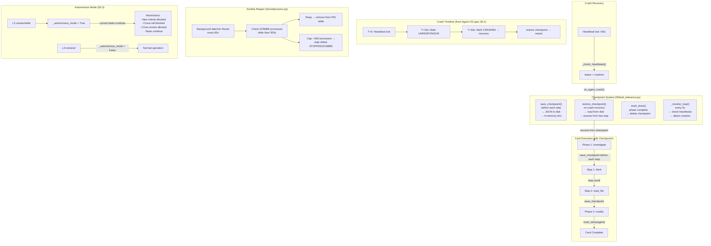

### Checkpoint in Execution Plan

Each step boundary saves a checkpoint:

```python
# execution_plan.py
for ps in phase_steps:
    save_checkpoint(agent_id=ps.agent, 
                    task_id=f"{card.id}:{ps.step_id}",
                    progress={"phase": ps.phase, "step": ps.step_id})
    r = execute_step(ps, timeout)
    # ...
mark_done(agent_id)  # phase complete
```

### Constants

| Constant | Value | Description |
|----------|-------|-------------|
| `HEARTBEAT_TIMEOUT` | 15s | Time before agent marked UNRESPONSIVE |
| `CRASH_TIMEOUT` | 30s | Time before agent marked CRASHED |
| `FAULT_CHECK_INTERVAL` | 5s | Background monitor check interval |
| `FAULT_RETRY_INTERVAL` | 1s | Retry delay before recovery |
| `TOOL_HANDLER_TIMEOUT` | 60s | Max seconds per tool handler in tool_use() |
| Zombie reap age | 300s | ZOMBIE processes older than 5min are reaped |
| Process cap | 500 | Max processes before GC reaps oldest |

### Emergency Stop & Rollback

| API Endpoint | Description |
|-------------|-------------|
| `POST /api/cell/stop {cell_id}` | Set emergency flag, pause all agents, block new cards |
| `POST /api/cell/resume {cell_id}` | Clear flag, resume agents |
| `POST /api/card/rollback {card_id, cell_id}` | Restore checkpoint + discard sandbox changes |

Rollback restores from `fault_tolerance` checkpoint and discards `pending/staged` sandbox files. Already-`flushed` files are not reverted — full git-level rollback is a future enhancement.


## 16. Settings Center

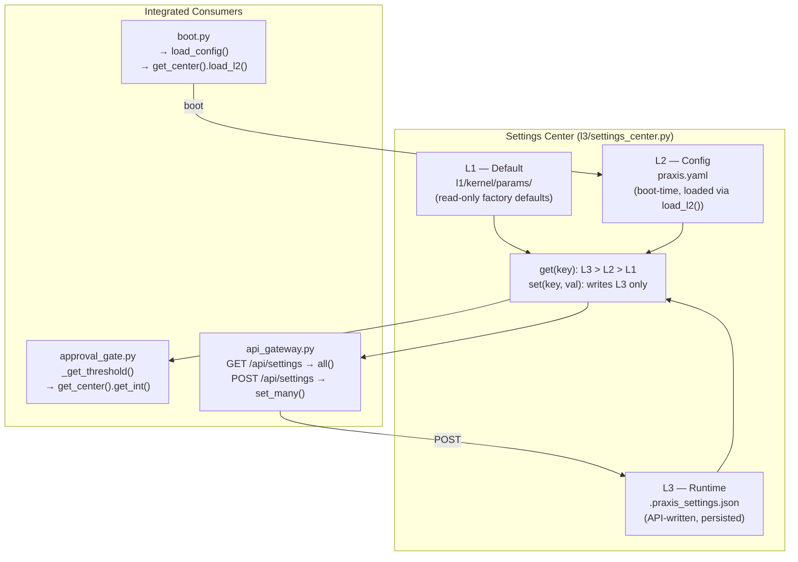

### Three-Layer Priority

| Layer | Source | Persisted | Effect | Priority |
|-------|--------|-----------|--------|----------|
| L1 — Default | `params.py` L1 map | No (code) | Compile-time | Lowest |
| L2 — Config | `praxis.yaml` | Yes (file) | Boot-time | Medium |
| L3 — Runtime | API (`POST /api/settings`) | Yes (JSON) | **Immediate** | **Highest** |

### Runtime-Overridable Keys

| Key | Default | Description |
|-----|---------|-------------|
| `approval.danger_threshold` | 3 | Tools with danger >= this require human approval |
| `memory.working_budget` | 8192 | Ring 1 token budget |
| `memory.short_budget` | 32768 | Ring 2 token budget |
| `memory.long_budget` | 131072 | Ring 3 token budget |
| `scout.max_total` | 16 | Scout pool capacity |
| `scout.max_per_agent` | 4 | Scouts per agent |
| `terminal.max_workers` | 4 | AgentTerminal worker threads |
| `scheduler.default_quantum` | 15.0 | Time slice in seconds |
| `scheduler.max_preempt` | 60.0 | Max execution before force preempt |
| `cache.max_entries` | 500 | File cache entry limit |
| `gatechain.risk_warn_threshold` | 6.0 | G3 risk score threshold |
| `gatechain.repeat_threshold` | 5 | G5 repeat detection |
| `llm.max_tokens` | 2048 | LLM output token limit |
| `llm.temperature` | 0.3 | LLM temperature |
| `llm.reasoning_effort` | "none" | OpenAI o-series reasoning (none/low/medium/high) |
| `llm.thinking_budget` | 0 | Anthropic extended thinking (0=off) |

### API

```bash
# Read all (three layers merged)
curl http://localhost:8080/api/settings

# Override a setting (immediate, persists to .praxis_settings.json)
curl -X POST http://localhost:8080/api/settings \
  -H "Content-Type: application/json" \
  -d '{"approval.danger_threshold": 5}'

# Reset an override
curl -X POST http://localhost:8080/api/settings \
  -d '{"approval.danger_threshold": null}'
```


## 17. Observability & Counters

```mermaid
flowchart TB
    subgraph Hooks["LLM Lifecycle Hooks (l4/llm.py)"]
        PRE["@on_llm_call('pre')\nbefore generate()\nlogging, audit, prompt injection"]
        POST["@on_llm_call('post')\nafter generate()\ntoken counting, cost tracking"]
        LLM["LLMEngine.generate()"]
        PRE --> LLM --> POST
    end

    subgraph Counter["Cell Counter (l3/counter.py)"]
        TOKENS["record_token()\ninput/output/cache_hit/cache_miss\nper-agent, with timestamps"]
        TOOLS["record_tool()\ntool name + success/failure\nper-agent"]
        LOOPS["record_loop()\nturns + steps + elapsed\nper AgentLoop run"]
    end

    subgraph API["TUI-ready Endpoints"]
        T1["GET /api/tokens?window=60\n→ tokens_per_min real-time rate\n→ by_agent breakdown"]
        T2["GET /api/tools\n→ calls/success/failure per tool\n→ avg_elapsed per tool"]
        T3["GET /api/loops\n→ avg_turns_per_loop\n→ avg_steps_per_turn"]
    end

    POST -->|"auto-wired hook"| TOKENS
    TOOL_EXEC["tool_spec.py\nexecute_tool_spec()"] -->|"post-exec"| TOOLS
    AGENT_LOOP["agent_loop.py\nrun()"] -->|"post-run"| LOOPS
    TOKENS --> T1
    TOOLS --> T2
    LOOPS --> T3
```

### Auto-Wired Integration

| Counter | Trigger | Integration Point |
|---------|---------|-------------------|
| Token | Every LLM API call | `llm.py:@on_llm_call("post")` — no manual calls needed |
| Tool call | Every tool execution | `tool_spec.py:execute_tool_spec()` — auto-recorded |
| AgentLoop turn | Every `think` action | `agent_loop.py:run()` — auto-recorded |

### LLM Hook Decorator

```python
from services.llm import on_llm_call

@on_llm_call("pre")
def log_prompt(prompt, system, max_tokens, user_id, **kwargs):
    logger.info("LLM call: user=%s tokens=%d", user_id, max_tokens)

@on_llm_call("post")
def log_result(result, prompt="", **kwargs):
    logger.info("LLM done: %d tokens", result.get("tokens", 0))
```

### Real-Time Dashboard Data

```bash
# Token consumption rate (last 60s) — TUI polls every 5s
GET /api/tokens?window=60
→ {"rate": {"tokens_per_min": 45230, "calls_in_window": 8,
    "by_agent": {"agent-reader": {"tokens_per_min": 28000}}}}

# Tool call statistics
GET /api/tools
→ {"agent-reader": {"total": 42,
    "by_tool": {"read_file": {"calls": 20, "success": 20, "avg_elapsed": 0.02}}}}

# AgentLoop statistics
GET /api/loops
→ {"agent-reader": {"total": 12, "avg_turns_per_loop": 3.2, "avg_elapsed_per_loop": 8.5}}
```


## 18. Security Architecture

```mermaid
flowchart LR
    subgraph OuterRing["Outer Ring — Constitution"]
        CONST_RULES["Constitution Rules\n(.nomos-rules.md)\nTerritory / Audit / Scout"]
    end

    subgraph MiddleRing["Middle Ring — GateChain G1-G5"]
        G1["G1: Tool Whitelist"]
        G2["G2: Identity (Ed25519)"]
        G3["G3: Territory + Risk"]
        G4["G4: Escalation (L3)"]
        G5["G5: Composite Judgment\n(Reputation + History)"]
    end

    subgraph InnerRing["Inner Ring — Execution"]
        TOOL["Tool Execution"]
        SANDBOX["Sandbox\n(Copy-on-Write)"]
        AUDIT["Audit Trail\n(Syscall Log)"]
        FINGERPRINT["Fingerprint Chain\n(HMAC-SHA256)"]
    end

    TOOL --> AUDIT
    TOOL --> FINGERPRINT
    SANDBOX --> AUDIT
```

---

## 19. Data Flow: Intent → Execution

```mermaid
sequenceDiagram
    participant H as Human
    participant L3A as L3A (Agent)
    participant REG as CardRegistry
    participant CELL as Cell
    participant PLAN as ExecutionPlan
    participant MEM as Memory (3-ring)
    participant AGT as AgentTerminal
    participant RT as AgentRuntime
    participant TOOL as Tool

    H->>L3A: "fix bug in login"
    L3A->>L3A: parse intent (LLM + rule) → TaskCard
    L3A->>REG: submit(card)
    REG->>CELL: dispatch(card_id)
    CELL->>PLAN: execute_card(card)

    loop for each phase
        loop for each step
            PLAN->>AGT: dispatch (TerminalCard)
            AGT->>RT: tick(Action)

            RT->>RT: 1. constitution.check()
            RT->>RT: 2. gatechain.check() (G1-G5)
            RT->>RT: 3. memory.build_context() → system prompt
            RT->>RT: 4. allocator.alloc()
            RT->>RT: 5. limiter.check()
            RT->>RT: 6. lock.acquire()
            RT->>TOOL: 7. execute_tool_spec()
            TOOL-->>RT: result
            RT->>MEM: 8. memory.remember(Ring 1)
            MEM-->>RT: pressure check
            RT->>RT: 9. lock.release()
            RT-->>AGT: CardResult
            AGT-->>PLAN: step result
        end

        alt memory.pressure() == "high"
            PLAN->>MEM: snapshot context → compact → restore
        end
    end

    PLAN-->>CELL: aggregated result
    CELL->>REG: complete(card_id, result)
    REG-->>L3A: status
    L3A-->>H: result summary
```


## 20. Central Control Systems (Overview)

The Agent OS is governed by ten central control systems ("十大中心主控系统"):

```mermaid
flowchart TB
    subgraph Centers["Ten Central Control Systems"]
        CC["① CentralController\nl3.py\nIntent Lifecycle\nParse → Queue → Dispatch → Complete"]
        CS["② CentralScheduler\nscheduler.py\n5D Scheduling\nRoute/Pool/Time/Rate/Scope"]
        OB["③ ObservabilityBus\nobservability_bus.py\nUnified Observability\nAlert/Health/Metric/Audit"]
        R4["④ R4Agent\nr4_agent.py\nArchive Management\nConsistency + Lean Cases"]
        CM["⑤ CellMonitor\ncell_monitor.py\nCell Health Monitor\nRing Buffer Event Log"]
        L3B["⑥ L3B\nl3b.py\nCross-Cell Coordinator\nRouting + Conflict Arbitration"]
        CSEC["⑦ CentralSecurity\ncentral_security.py\nUnified Security Engine\nConstitution + GateChain + Auth\n+ ToolMode + Rate + Clearance"]
        CMEM["⑧ CentralMemory\ncentral_memory.py\nMemory Lifecycle\nRemember/Recall/Compact/Archive\nAcross Ring 1-4"]
        CPLUG["⑨ CentralPlugin\ncentral_plugin.py\nPlugin Lifecycle\nTool/MCP/Service\nInstall/Remove/List"]
        CCOL["⑩ CentralCollector\ncentral_collector.py\nToken Aggregation\nCross-Cell Usage Tracking"]
    end

    subgraph Managed["Managed Subsystems"]
        CR["CardRegistry"]
        SCHED["TimeScheduler\nRateScheduler\nRequestPool"]
        HEALTH["Health\nCounter\nOpsConsole"]
        MEM["Memory Rings 1-4"]
        AGENTS["AgentTerminal\nScoutPool"]
        TOOLS["ToolRegistry\nMCPBridge"]
        SEC["Constitution\nGateChain\nAuth\nToolMode"]
    end

    CC --> CR
    CS --> SCHED
    OB --> HEALTH
    R4 --> MEM
    CM --> AGENTS
    L3B --> CC
    CSEC --> SEC
    CMEM --> MEM
    CPLUG --> TOOLS
```

### Center Details

| # | Center | File | Primary Role | Subsystems Coordinated |
|---|--------|------|-------------|----------------------|
| 1 | **CentralController** | `l3.py` | Intent lifecycle controller | CardRegistry, L3A, Dispatcher |
| 2 | **CentralScheduler** | `scheduler.py` | 5D scheduling matrix | RouteScheduler, RateScheduler, TimeScheduler, RequestPool, ScopeScheduler |
| 3 | **ObservabilityBus** | `observability_bus.py` | Unified observability | OpsConsole, Health, Counter, Audit |
| 4 | **R4Agent** | `r4_agent.py` | Background archive management | Memory Ring 4, ArchiveOrchestrator |
| 5 | **CellMonitor** | `cell_monitor.py` | Cell health event log | AgentTerminal, ScoutPool |
| 6 | **L3B** | `l3b.py` | Cross-cell routing & arbitration | CentralController, Cell |
| 7 | **CentralSecurity** | `central_security.py` | 6-gate unified security check | Constitution, GateChain, Auth, ToolMode, RateLimiter |
| 8 | **CentralMemory** | `central_memory.py` | 4-ring memory lifecycle | Memory, MemoryRing, MemoryQuality, R4Agent, ArchiveOrchestrator |
| 9 | **CentralPlugin** | `central_plugin.py` | Plugin lifecycle management | ToolSpec, MCPBridge, BaseService |
| 10 | **CentralCollector** | `central_collector.py` | Cross-Cell token aggregation | Token usage events, per-Cell summaries |

---

## 21. OpenCoder Bridge (TBD)

> Reserved for OpenCoder IDE integration specification.

---

## 22. Multi-Cell Federation (TBD)

> Reserved for multi-Cell deployment, cross-Cell Card routing, and Cell mesh protocol specification.

---

## Appendix A: Convention & Deliberation Protocol

The Assembly/Convention protocol enables multi-agent deliberation before execution. L3A produces an IssueCard, broadcasts it to all Peer Agents, who respond by territory, propose supplementary issues, and participate in sequential cross-examination.

### Flow

```
L3A → IssueCard 
  → Cell.execute_card() detects IssueCard → Cell.convene()
  → ConventionProtocol.start() → broadcasts CONVENE to all agents
  → Each Agent answers issues by territory match
  → Agents propose supplementary issues (PROPOSE_ISSUE)
  → Sequential cross-examination (CONVENTION_MAX_ROUNDS=2 rounds)
  → ConventionProtocol.close() → CacheDocument + Archive (Ring 4)
  → converge() → rule/LLM summary
  → to_execution_card() → Card → CardRegistry
```

### Message Types

| Type | Direction | Purpose |
|------|-----------|---------|
| `CONVENE` | L3A → All | Start deliberation |
| `CROSS_EXAMINE` | Agent → Agent | Cross-examination |
| `REBUT` | Agent → All | Rebuttal |
| `PROPOSE_ISSUE` | Agent → Table | Propose new issue |
| `CONVENE_CLOSE` | Convention → All | Close deliberation |

### Key Data Structures

| Component | File | Description |
|-----------|------|-------------|
| `IssueStatus` | `issue.py` | PENDING / ANSWERED / SUPPLEMENTED / RESOLVED / WITHDRAWN |
| `IssueCard` | `issue.py` | Agenda card with multiple IssueItems, status lifecycle |
| `IssueTable` | `issue.py` | Central registry — L3A/Agents operate on the same table |
| `CacheDocument` | `cache_doc.py` | Buffer-addressed meeting document (buffer_id, Archive ref) |
| `ConventionTranscript` | `convention.py` | Per-round speaker statements |
| `ConventionProtocol` | `convention.py` | Engine: rounds, speaker order, document builder |
| `Convergence` | `convergence.py` | L3A summary (LLM or rule-based) → ExecutionCard |

### Converged → Execution Card

```python
from services.convergence import converge, to_execution_card

result = converge(issue_card_id)          # LLM/rule summary
exec_card = to_execution_card(issue_card, summary)  # Card with phases/steps
CardRegistry.submit(intent=exec_card.intent, ...)
```


## Appendix B: Credential Vault

LLM API keys are encrypted at rest using AES-GCM and loaded into memory at boot.

### Architecture

```mermaid
flowchart LR
    subgraph Storage["Disk (encrypted)"]
        FILE["credential_vault.enc\nAES-GCM ciphertext"]
    end
    subgraph Memory["Memory (decrypted)"]
        DICT["dict[provider][key_name] = value"]
    end
    subgraph Fallback["Env Fallback"]
        ENV["OPENAI_API_KEY\nANTHROPIC_API_KEY\n..."]
    end

    FILE -->|"boot: init_vault()"| DICT
    DICT -->|"get_credential()"| LLM["LLM Providers"]
    ENV -->|"fallback"| LLM
    YAML["praxis.yaml → credentials:"] -->|"cfg_credentials()"| DICT
    API["POST /api/credentials"] -->|"set_credential()"| DICT
    DICT -->|"export (no values)"| API_GW["GET /api/credentials"]
```

### Key Features

| Feature | Implementation |
|---------|---------------|
| Encryption | AES-256-GCM via `cryptography.hazmat.primitives.ciphers.aead.AESGCM` |
| Key Derivation | SHA256(PRAXIS_DATA_DIR + hostname + "praxis-v1") |
| Storage Path | `{PRAXIS_DATA_DIR}/credential_vault.enc` |
| Env Fallback | `get_credential("openai", "api_key", env_fallback="OPENAI_API_KEY")` |
| Runtime Update | `POST /api/credentials  {"provider": "openai", "key": "api_key", "value": "sk-..."}` |
| YAML Import | `praxis.yaml → credentials: { openai: { api_key: "..." } }` |


## Appendix C: Extensibility Architecture

The codebase uses registry patterns to allow external code to add functionality without modifying core files.

### Boot Step Registry

```python
from services.boot import register_boot_step

def my_init() -> dict:
    # Custom initialization
    return {"success": True}

register_boot_step("my_custom_init", my_init, depends_on=["init_services"])
```

Dependencies are resolved via topological sort at boot time.

### API Route Registry

```python
# Code registration
gateway.register_route("GET", "/api/v1/my/endpoint", my_handler, "My endpoint")

# YAML configuration (praxis.yaml)
# api_routes:
#   - method: GET
#     path: /api/v1/external/doc
#     handler: "services.cache_doc:get_store.get_content"
#     description: "Get document"
```

Handler strings use dot-path resolution: `"module.path:attr.subattr"` → `import module.path; obj = attr.subattr`.

### Tool Handler Registry

```python
from services._term_handlers import register_func_handler

def my_handler(term, card, phases):
    return "output", [], True

register_func_handler("my_tool", my_handler)
```

### Rollback Strategy Registry

```python
from services.execution_engine import register_rollback

def undo_my_tool(step, plan, executor):
    path = step.params.get("path", "")
    if path:
        os.remove(path)

register_rollback("my_tool", undo_my_tool)
```

### Config Handler Registry

```python
from services.config_loader import register_config_handler

def cfg_my_section(data, settings, results):
    # Apply config section
    results["my_section"] = True

register_config_handler("my_section", cfg_my_section)
```

### Summary of Extension Points

| Registry | File | API | Purpose |
|----------|------|-----|---------|
| Boot steps | `boot.py` | `register_boot_step()` | Custom initialization |
| API routes | `api_gateway.py` | `register_route()` + YAML | Custom HTTP endpoints |
| Tool handlers | `_term_handlers.py` | `register_func_handler()` | Custom agent tools |
| Rollback | `execution_engine.py` | `register_rollback()` | Custom undo logic |
| Config | `config_loader.py` | `register_config_handler()` | Custom YAML sections |
| HTN methods | `htn_planner.py` | `register_method()` | Custom task decomposition |
| Card detectors | `card_builder.py` | `register_detector()` | Custom intent builders |
| LLM lifecycle | `llm.py` | `@on_llm_call` | Pre/post LLM hooks |


## 23. Config-Driven Architecture

The Agent OS uses YAML-driven configuration for three key subsystems, following the same pattern:

```mermaid
flowchart LR
    subgraph YAML["praxis.yaml"]
        PROMPTS["prompts:\n  agent_loop.system:\n  l3a.parse_system:"]
        COMMANDS["commands:\n  mode:\n  connect:\n    args:"]
        CACHE["llm:\n  cache:\n    openai:\n    anthropic:"]
    end

    subgraph Code["Python Code"]
        PP["kernel/prompts.py\n_DEFAULTS + _overrides"]
        PC["kernel/commands.py\n_DEFAULTS + _overrides"]

        PS["l3/cache_strategy.py\nload_cache_config(cfg)\n→ ConfigCacheStrategy"]
    end

    subgraph Resolution["Resolution Order"]
        R1["Override > Default\n(deep merge)"]
        R2["Per-provider > defaults"]
    end

    PROMPTS --> PP
    COMMANDS --> PC
    CACHE --> PS
    PP --> R1
    PC --> R1
    PS --> R2
```

### Prompt Templates (`praxis.yaml → prompts:`)

```yaml
prompts:
  agent_loop.system: "You are an agent. Complete: {task}"
  agent_loop.system.reader: "You are the reader agent."
  scout.system: "Custom scout prompt..."
```

Keys: 17 built-in (agent_loop, l3a, convention, verifier, review, agent_terminal, convergence, llm).
Resolution: `get_prompt(key) → override > built-in > passed default`.

### Shell Commands (`praxis.yaml → commands:`)

```yaml
commands:
  mode:
    help: "Switch mode"
    aliases: ["m"]
  connect:
    args:
      - name: agent_id
        optional: false
```

Resolution: `get_command(name) → merged {**default, **override}`.
Handler registration in code: `register_command(name, handler_fn)`.

### Cache Strategies (`praxis.yaml → llm.cache`)

```yaml
llm:
  cache:
    defaults:
      optimize_prompt: true
      forward_user_id: false
      anthropic_format: false
    openai:
      optimize_prompt: true
      forward_user_id: true
    anthropic:
      optimize_prompt: false
      anthropic_format: true
    ollama:
      optimize_prompt: false
```

The `ConfigCacheStrategy` class reads these flags and applies them dynamically — no per-provider Python classes needed.
New providers are added by simply adding a YAML section; no code change required.
Plugins can still `register_strategy("custom", CustomStrategy())` for special cases.

---

## 24. ResultStore & Cache Architecture

### ResultStore (`services/result_store.py`)

AtomCode-style deterministic tool result cache:

```mermaid
flowchart LR
    subgraph Execute["Tool Execution"]
        FP["ResultStore.fingerprint(tool_name, args)\n→ SHA256(tool_name + canonical_json(args))[:16]"]
        FP --> CHECK{"ResultStore.get(fp)?"}
        CHECK -->|"HIT"| RETURN["Return cached result\n(skip execution)"]
        CHECK -->|"MISS"| RUN["execute_tool_spec()"]
        RUN --> STORE["ResultStore.set(fp, result)\nLRU eviction at max_entries"]
        RUN --> INVAL["write tool → invalidate_for_tool()\nclear matching path entries"]
    end
```

| Feature | Detail |
|---------|--------|
| Key | SHA256(tool_name + canonical JSON args) — 16 hex chars |
| Eviction | LRU via `OrderedDict.move_to_end()`, `popitem(last=False)` |
| TTL | `RESULT_STORE_TTL` (default 300s) |
| Write-invalidation | `invalidate_for_tool()` clears entries matching write tool path |
| Integration | Wired into `execute_tool_spec()` — automatic for all tools |

### Cache Strategy Per-Provider (`l3/cache_strategy.py`)

Single `ConfigCacheStrategy` class driven by YAML config, not an ABC hierarchy:

| Provider | optimize_prompt | forward_user_id | anthropic_format |
|----------|----------------|-----------------|------------------|
| OpenAI | Yes → `[System]/[Task]` | Yes | No |
| DeepSeek | Yes | Yes (KV isolation key) | No |
| Anthropic | No (uses top-level system field) | Yes | Yes → cache_control injection |
| Ollama | No | No | No |
| Unknown | Yes (falls back to defaults) | No | No |

---

## Appendix D: Ten Central Control Systems (Complete)

The Agent OS is governed by ten central control systems:

| # | Center | File | Role | Key API |
|---|--------|------|------|---------|
| 1 | CentralController | `l3.py` | Intent lifecycle | `process_intent()` |
| 2 | CentralScheduler | `scheduler.py` | 5D scheduling | `evaluate_all()` |
| 3 | ObservabilityBus | `observability_bus.py` | Unified observability | `observe(kind, source, data)` |
| 4 | R4Agent | `r4_agent.py` | Archive management | `tick()` |
| 5 | CellMonitor | `cell_monitor.py` | Cell health | `register_cell()`, `report_agent()` |
| 6 | L3B | `l3b.py` | Cross-cell routing | `route(card_id, cell_a, cell_b)` |
| 7 | **CentralSecurity** | `central_security.py` | 6-gate unified check | `check_all(action, agent_id)` |
| 8 | **CentralMemory** | `central_memory.py` | R1-R4 lifecycle | `remember()`, `recall()`, `compact()` |
| 9 | **CentralPlugin** | `central_plugin.py` | Plugin lifecycle | `install_tool_plugin()`, `list_plugins()` |
| 10 | **CentralCollector** | `central_collector.py` | Cross-Cell token aggregation | `collect(agent_id, tokens)` — listens to `TOKEN_USAGE` events |
